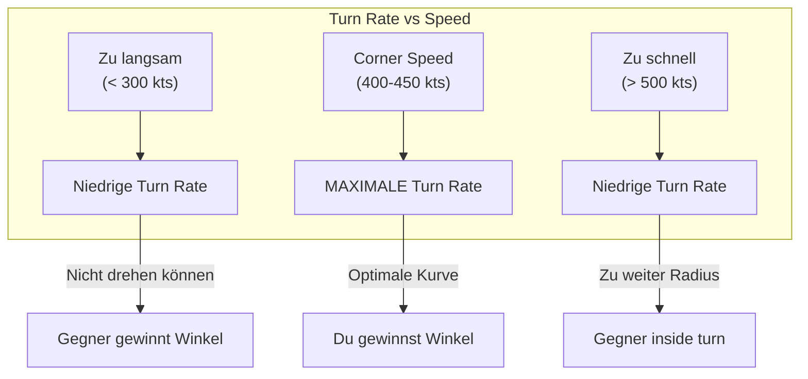
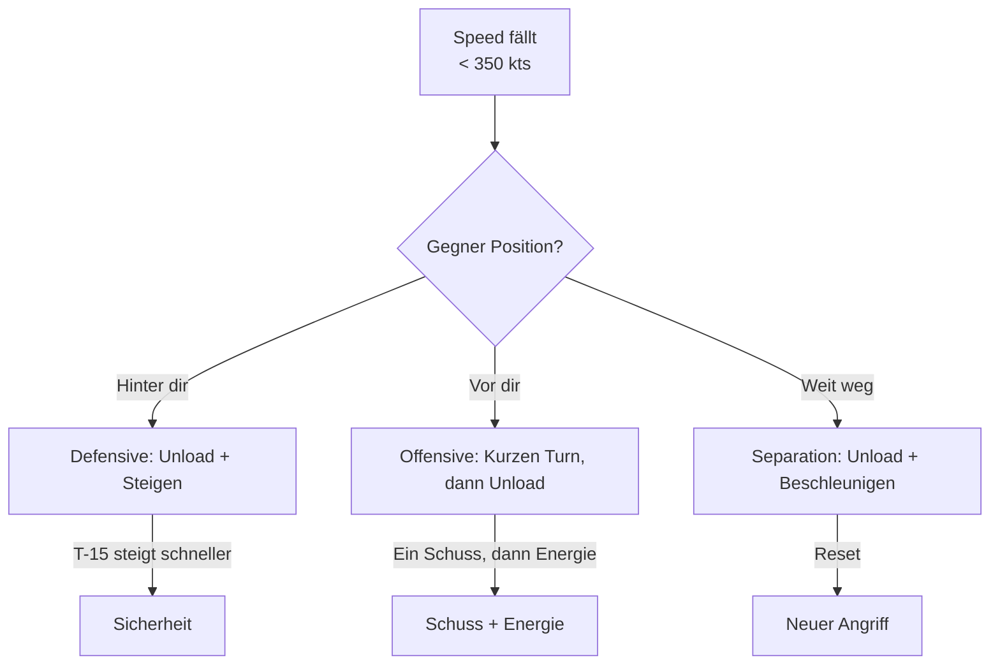

# Energy Management

Energie ist die wichtigste Ressource im Luftkampf. Für die T-15 Excalibur als Energy Fighter ist das Verständnis von Energie-Management überlebenswichtig.

## Was ist Energie?

Energie = **Höhe** + **Geschwindigkeit**

```
Totale Energie = Potenzielle Energie (Höhe) + Kinetische Energie (Speed)
```

Du kannst Energie **umwandeln**:
- Steigen → Speed wird zu Höhe
- Sturzflug → Höhe wird zu Speed

Aber Energie geht **verloren** durch:
- Turns (Widerstand)
- Luftwiderstand
- Manöver

## Corner Speed

Die **Corner Speed** ist die Geschwindigkeit, bei der dein Flugzeug die **maximale Turn Rate** erreicht.

| Flugzeug | Corner Speed | Optimaler Bereich |
|----------|--------------|-------------------|
| T-15 Excalibur | ~425 kts | 400-450 kts |
| T-16 Falchion | ~400 kts | 380-420 kts |
| T-18 Cutlass | ~275 kts | 250-300 kts |

### Warum Corner Speed wichtig ist



::: tip T-15 TAKTIK
Halte dich bei **400-450 kts** für optimale Turn-Performance. Nicht langsamer, nicht viel schneller.
:::

## Unloading (Entlasten)

::: tip DAS GEHEIMNIS ERFAHRENER DCS-PILOTEN
Unloading ist die Technik, die Anfänger von Experten unterscheidet!
:::

**Unloading** bedeutet: Den Stick neutral oder leicht nach vorne stellen (0-0.5G) um Energie zurückzugewinnen.

### Das Konzept

Widerstand (Drag) wird primär durch **G-Kräfte** (Anstellwinkel) erzeugt. Um schnell zu beschleunigen, musst du den Widerstand minimieren.

### Wann Unloaden?

- Nach einem harten Turn
- Wenn Energie niedrig ist
- Beim Repositionieren
- **Zwischen jedem Manöver!**

### Wie Unloaden?

1. Stick **leicht nach vorne** drücken (0-0.5G erreichen)
2. Die Flügel müssen "entlastet" sein
3. **Afterburner** aktivieren
4. **Leicht steigen** oder level fliegen
5. Warten bis Speed steigt

### Der Effekt

Die T-15 beschleunigt im "Unloaded"-Zustand **extrem schnell** - fast wie eine Rakete!

### Der Kampf-Rhythmus

::: warning WER PERMANENT ZIEHT, VERLIERT
Kämpfe im Rhythmus: **Pull - Unload - Pull**

1. **Pull**: Ziehen für die Schussposition
2. **Unload**: Sofort entlasten um verlorene Energie zurückzugewinnen
3. **Pull**: Dann erneut ziehen

Wer permanent zieht ("Gluing the stick back"), verliert!
:::


## Das E-M Diagramm (vereinfacht)

Das Energy-Maneuverability-Diagramm zeigt, wo dein Flugzeug Energie gewinnt oder verliert.

### T-15 Excalibur E-M Profil

| Zone | Beschreibung | Energie-Status |
|------|--------------|----------------|
| **High Speed + Low G** | Cruise | Energie-Gewinn |
| **Corner Speed + Medium G** | Optimal | Energie-Neutral |
| **Low Speed + High G** | Gefahr | Energie-Verlust |
| **Any Speed + Max G** | Turn | Energie-Verlust |

::: warning GEFÄHRLICHE ZONE
Unter 300 kts mit hohem G-Load = rapider Energie-Verlust = Tod
:::

## Praktische Anwendung

### Szenario: Du verlierst Energie im Kampf



### Die goldene Regel

> **Energie die du heute sparst, rettet dein Leben morgen.**

Jeder unnötige Turn, jede Sekunde bei Max-G kostet dich Energie. Die T-15 gewinnt durch Energie-Überlegenheit - verschwende sie nicht!

## Zusammenfassung

| Konzept | T-15 Anwendung |
|---------|----------------|
| Corner Speed | 400-450 kts halten |
| Unloading | Regelmäßig Energie aufbauen |
| Energie-Budget | Nur ausgeben wenn nötig |
| Vertikale Flucht | Wenn Energie niedrig → Steigen! |
