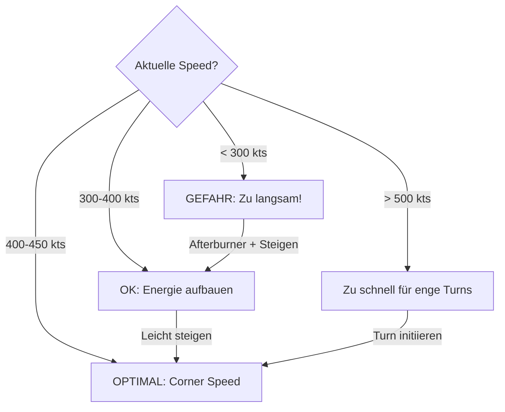

# T-15 Excalibur

> Das "Energie-Monster" - Ein Instrument der vertikalen Dominanz.

## Übersicht

Die T-15 Excalibur, modelliert nach der **F-15C Eagle**, definiert sich durch ihre zweistrahlige Konfiguration und die gekappten Deltaflügel. Sie ist kein Flugzeug für den engen "Telefonzellen-Kampf", sondern ein **Energy Fighter** - ein Instrument der vertikalen Dominanz.

::: info REALES VORBILD
| VFM | DCS/Real |
|-----|----------|
| T-15 Excalibur | F-15C Eagle |
:::

## Leistungsdaten

| Parameter | Wert | Bewertung |
|-----------|------|-----------|
| **Corner Speed** | 400-450 kts | Optimal für Turn Rate |
| **Sustained Turn Rate** | Gut | Leicht unter T-16 |
| **Instantaneous Turn Rate** | Mittel | Nicht die beste |
| **Turn Radius** | Groß | Schwäche im One-Circle |
| **Schub/Gewicht (TWR)** | **Beste im Spiel** | Vertikale Dominanz |
| **Endgeschwindigkeit** | **Höchste** | Mach 0.9+ möglich |
| **Energieerhalt** | Sehr gut | Schnelle Erholung |

## Stärken

::: tip PRIMÄRE VORTEILE
- **Höchster Schub**: Zwei Triebwerke = beste Beschleunigung
- **Höchste Endgeschwindigkeit**: Kann Gegner davonfliegen
- **Vertikale Überlegenheit**: Steigt schneller als T-16 und T-18
- **Energie-Erholung**: Kann im "Unloaded"-Zustand (0-1G) extrem schnell beschleunigen
- **Energieerhalt vertikal**: Konserviert Energie in vertikalen Manövern besser als einstrahlige Konkurrenten
:::

## Schwächen

::: warning KRITISCHE NACHTEILE
- **Großer Turn Radius**: Aufgrund der Masse und Flügelgeometrie größerer Radius als T-18
- **Sustained Turn Rate**: Geringfügig schlechter als T-16 im horizontalen Kurvenkampf
- **Slow-Speed-Handling**: Unter 300 kts träge, unter 250 kts fast unsteuerbar
- **Größe**: Größeres Ziel als T-16/T-18
:::

## Taktischer Archetyp: Energy Fighter

Die T-15 gewinnt, indem sie die **vertikale Ebene (Z-Achse)** kontrolliert und sich **weigert**, in einen flachen, horizontalen Kurvenkampf einzutreten.

::: danger FUNDAMENTALER FEHLER
Der Versuch, die T-15 wie einen "Angles Fighter" (T-18) oder "Rate Fighter" (T-16) zu fliegen, führt **zwangsläufig zur Niederlage**. Ein flacher Kampf ist ein verlorener Kampf!
:::

## Die goldenen Regeln

1. **Energie ist Leben** - Werde niemals langsam
2. **Vertikal kämpfen** - Die T-15 dominiert in der Vertikalen
3. **Two-Circle erzwingen** - Gegen T-18 niemals One-Circle fliegen
4. **Corner Speed halten** - 400-450 kts ist dein Sweet Spot
5. **Unloading beherrschen** - Zwischen Manövern entlasten

## Geschwindigkeits-Management

### Das Stick-Problem

::: warning HÄUFIGER VR-FEHLER
Viele VR-Piloten ziehen den Stick bis zum Anschlag. Dies führt zu:
- Massiver Anstieg des Anstellwinkels (AoA)
- T-15 wirkt wie eine riesige **Luftbremse**
- Geschwindigkeit fällt rapide unter 300 kts
- Unterhalb Corner Speed wird die T-15 **träge**

**Lösung:** Stick-Druck dosieren! Wenn Speed unter 380 kts fällt: **Stick lockern!** Opfere Winkel für Geschwindigkeit.
:::

## Gegen andere Flugzeuge

| Gegner | Strategie | Gefahr | Link |
|--------|-----------|--------|------|
| T-16 Falchion | Vertikal, Boom & Zoom | Out-Rating | [Details](/playbook/t15-vs-t16) |
| T-18 Cutlass | Two-Circle, Speed halten | Nose Authority | [Details](/playbook/t15-vs-t18) |
| T-15 Excalibur | Energie-Vorteil aufbauen | Spiegelkampf | [Details](/playbook/t15-vs-t15) |

## Notfall-Prozeduren

::: danger WENN DU ZU LANGSAM WIRST (< 300 kts)
1. **Vollgas (Afterburner)** sofort aktivieren
2. **Unload** - Stick leicht nach vorne (0-0.5G)
3. **Nase 20-30° unter Horizont** drücken
4. **Rollen** um Schusslinien zu brechen
5. Erst wieder kämpfen wenn **380+ kts** erreicht
:::

## Vergleichstabelle

| Merkmal | T-15 Excalibur | T-16 Falchion | T-18 Cutlass |
|---------|----------------|---------------|--------------|
| DCS Analog | F-15C Eagle | F-16C Viper | F/A-18C Hornet |
| Hauptstärke | Schub, Top Speed, Vertikale | Beste Wenderate | Bester Radius, High AoA |
| Bevorzugter Kampf | Vertikal, Boom & Zoom | Horizontal, 2-Circle | Langsam, 1-Circle |
| E-M Kategorie | Energy Fighter | Rate Fighter | Radius/Angles Fighter |
