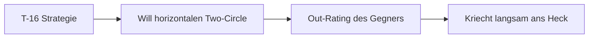
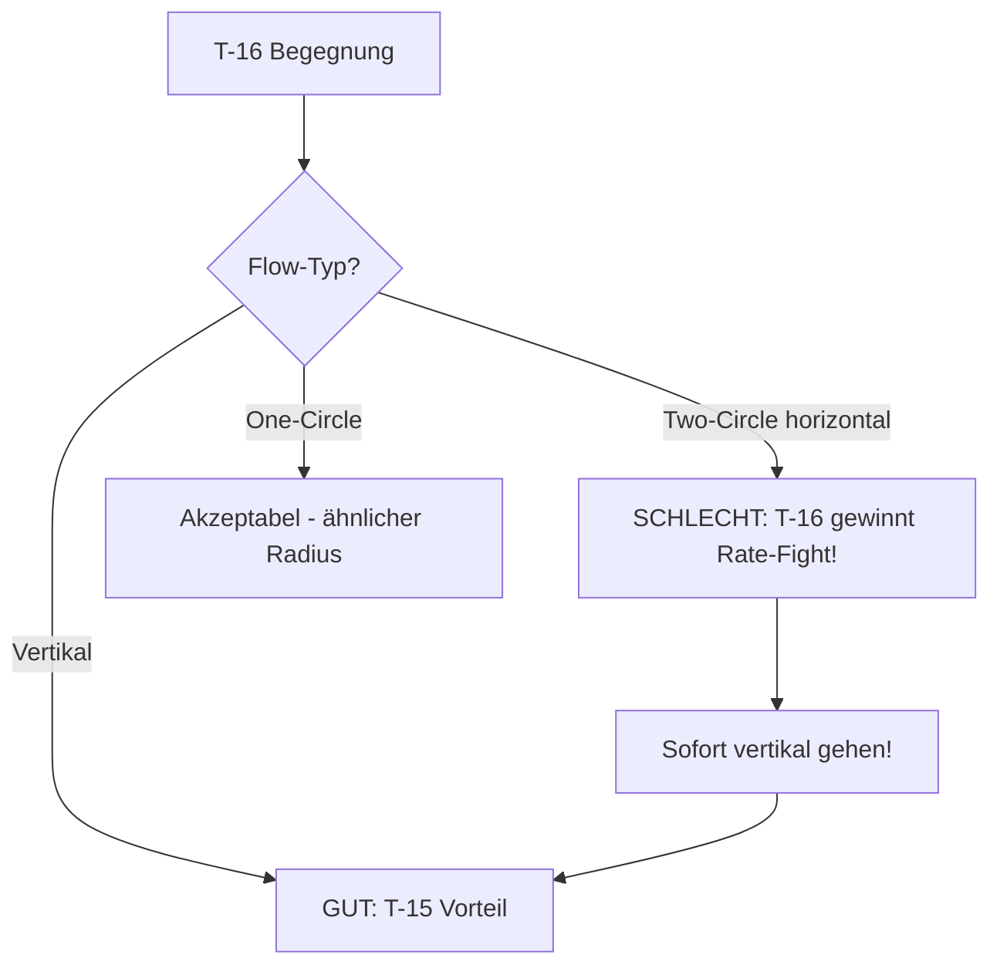

# T-16 Falchion

> Der "König der Rate" - Horizontal unschlagbar.

## Übersicht

Die T-16 Falchion, analog zur **F-16C Viper**, ist ein leichtes, einstrahliges Kampfflugzeug, das für hohe G-Belastungen und minimale Energieverluste in der Kurve optimiert ist.

::: info REALES VORBILD
| VFM | DCS/Real |
|-----|----------|
| T-16 Falchion | F-16C Viper |
:::

## Leistungsdaten

| Parameter | Wert | Bewertung |
|-----------|------|-----------|
| **Corner Speed** | ~380-420 kts | Etwas niedriger als T-15 |
| **Sustained Turn Rate** | **Beste im Spiel** | Horizontale Dominanz |
| **Instantaneous Turn Rate** | Gut | Schnelle Nase |
| **Turn Radius** | Mittel | Ausgewogen |
| **Schub/Gewicht (TWR)** | Gut | Solide, aber unter T-15 |
| **Energieerhalt** | Sehr gut | Minimaler Verlust in Kurven |

## Stärken

::: tip PRIMÄRER VORTEIL: SUSTAINED RATE
In einem **Two-Circle-Kampf** (Nase-auf-Heck-Verfolgung) kann die T-16 eine **höhere Anzahl Grad pro Sekunde** drehen als die T-15, ohne dabei signifikant Geschwindigkeit zu verlieren.

Sie ist der **"King of Sustained Turn Rate"**.
:::

**Weitere Vorteile:**
- Beste Turn Rate im Hochgeschwindigkeits-Kurvenkampf
- Geringer aerodynamischer Widerstand
- Gute Nose Authority bei mittleren Geschwindigkeiten
- Ausgewogene Performance ohne extreme Schwächen

## Schwächen

::: warning NACHTEILE
- **Vertikale Schwäche**: Kann T-15 nicht in die Vertikale folgen (ein Triebwerk vs. zwei)
- **Energie-Bluten vertikal**: Verliert Energie wenn sie gegen Schwerkraft kämpft
- **One-Circle**: Verliert gegen T-18 im Radius-Fight
:::

## Taktischer Archetyp: Rate Fighter

Die T-16 möchte den Gegner in einen **Hochgeschwindigkeits-Kurvenkampf** locken, in dem sie ihre überlegene Aerodynamik ausspielen kann, um den Gegner **"auszukurven" (Out-Rate)**.

## Gefahr für T-15 Piloten

::: danger OUT-RATING
Wenn eine T-15 versucht, **horizontal mit einer T-16 zu kreisen**, wird die T-16 dank ihres geringeren Widerstands und hohen TWRs enger drehen.

**Ergebnis:** Die T-16 kriecht langsam aber sicher auf das Heck der T-15.
:::

## T-15 Doktrin gegen T-16

### Was die T-16 will
- Horizontalen Two-Circle-Fight erzwingen
- Dich in einen Sustained Turn ziehen
- Ihre überlegene Rate nutzen um ans Heck zu kommen

### Deine Antwort (als T-15)

### Die Anti-T-16 Strategie: Boom and Zoom

1. **Merge**: Gehe mit hoher Geschwindigkeit (Mach 0.9+) in den Merge
2. **Erster Zug**: Wenn die T-16 horizontal dreht, ziehe sofort **vertikal** (Oblique Loop)
3. **Die Falle**: Die T-16 wird versuchen, die Nase hochzuziehen. Da sie gleichzeitig eng kurvt, **blutet sie massive Energie**
4. **Der Schlag**: Du steigst mit zwei Triebwerken höher. Wenn die T-16 langsam wird/stallt:
   - Kippe über den Flügel (Hammerhead/Stall Turn)
   - Stürze auf sie herab
   - Feuere und ziehe sofort wieder hoch (Zoom Climb)
5. **Disziplin**: Lass dich **nicht** auf einen Kurvenkampf ein. Hacke auf sie ein ("Slash Attacks")

::: tip MERKE
Die T-16 ist horizontal überlegen. Aber du bist **vertikal** überlegen. Kämpfe auf deinem Terrain!
:::

## Vergleichstabelle

| Merkmal | T-15 Excalibur | T-16 Falchion | T-18 Cutlass |
|---------|----------------|---------------|--------------|
| DCS Analog | F-15C Eagle | F-16C Viper | F/A-18C Hornet |
| Hauptstärke | Schub, Vertikale | **Beste Wenderate** | Bester Radius |
| Bevorzugter Kampf | Vertikal | **Horizontal, 2-Circle** | Langsam, 1-Circle |
| Gefahr für T-15 | - | **Out-Rating** | Nose Authority |
