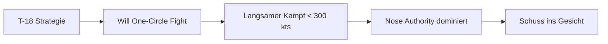
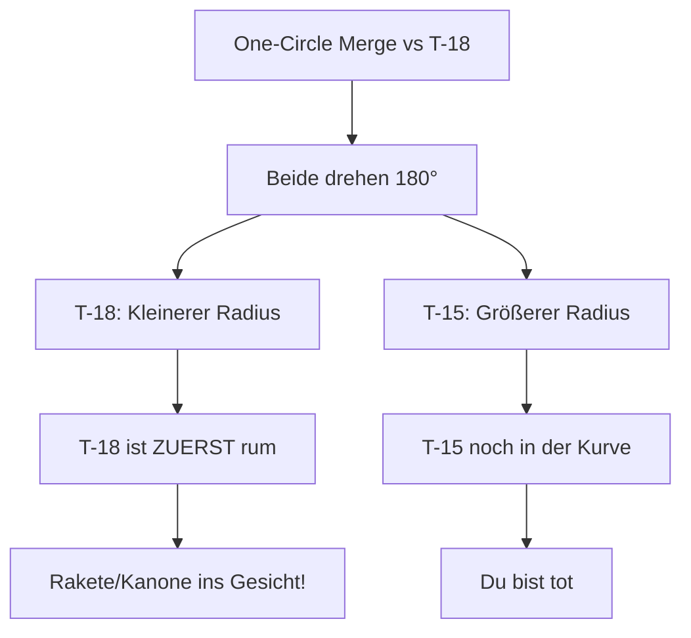
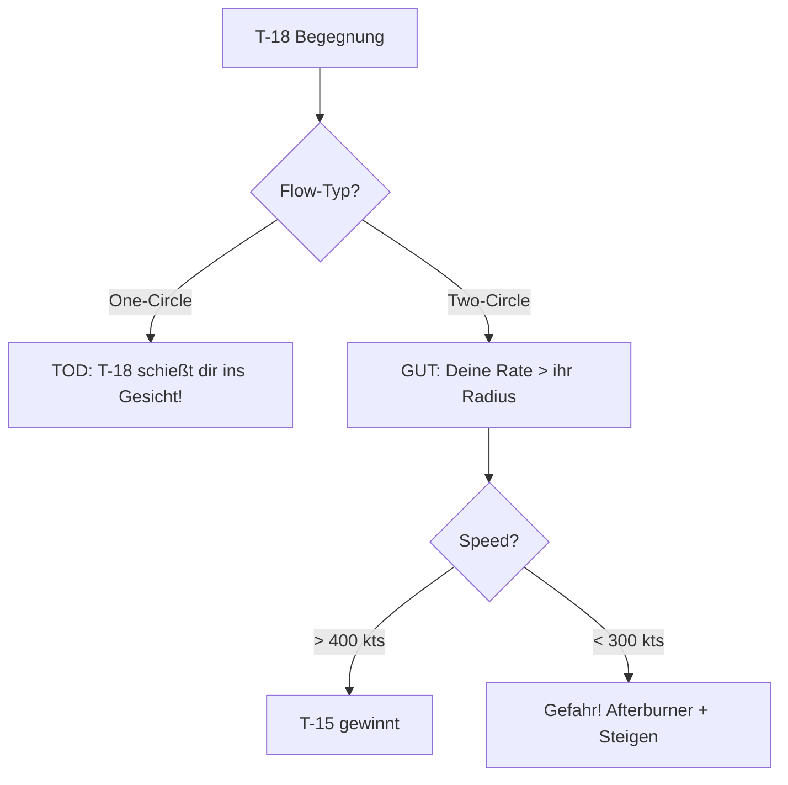

# T-18 Cutlass

> Der "Radius-Kämpfer" - Der Boogeyman im Nahkampf.

## Übersicht

Die T-18 Cutlass, basierend auf der **F/A-18C Hornet**, ist ein Marine-Jagdflugzeug, das für extreme Anstellwinkel (High Alpha / High AoA) bei niedrigen Geschwindigkeiten ausgelegt ist.

::: info REALES VORBILD
| VFM | DCS/Real |
|-----|----------|
| T-18 Cutlass | F/A-18C Hornet |
:::

## Leistungsdaten

| Parameter | Wert | Bewertung |
|-----------|------|-----------|
| **Corner Speed** | ~250-300 kts | Sehr niedrig! |
| **Sustained Turn Rate** | Niedrig | Verliert Rate schnell |
| **Instantaneous Turn Rate** | **Beste im Spiel** | Extrem gefährlich! |
| **Turn Radius** | **Kleinste** | Dominiert One-Circle |
| **Schub/Gewicht (TWR)** | Schwach | Schlechte vertikale Performance |
| **Energieerhalt** | Schlecht | "Dreckige" Flügel = hoher Widerstand |
| **High AoA Fähigkeit** | **Exzellent** | Unter 150 kts noch steuerbar |

## Stärken

::: tip PRIMÄRER VORTEIL: NOSE AUTHORITY & RADIUS
Die T-18 kann ihre Nase auch bei **extrem niedrigen Geschwindigkeiten (unter 150 Knoten)** noch auf den Gegner richten.

Sie dominiert den **One-Circle-Kampf** (Nase-auf-Nase), da sie den **engsten Kurvenradius** fliegen kann.
:::

**Weitere Vorteile:**
- Beste Instantaneous Turn Rate
- Kann fast unabhängig von Flugrichtung die Nase auf Ziel richten
- Gefährliche Snapshot-Fähigkeit
- Low-Speed-Monster bei 250 kts

## Schwächen

::: warning KRITISCHE NACHTEILE: BLEED RATE
Um diese Nose Authority zu erreichen, induziert die T-18 **massiven aerodynamischen Widerstand**.

- Eine harte Kurve (Baton Turn) kann das Flugzeug **fast augenblicklich stoppen**
- Beraubt das Flugzeug seiner kinetischen Energie
- Einmal langsam ("slow and low"), hat die T-18 **Schwierigkeiten**, Energie wieder aufzubauen
- Besonders gegen eine T-15 mit zwei Triebwerken
:::

**Weitere Schwächen:**
- "Dreckige" Flügel = hoher Widerstand (High Drag)
- Kann nicht steigen - verliert vertikal gegen T-15
- Sustained Fight = Niederlage (wird immer schwächer)

## Taktischer Archetyp: Radius/Angles Fighter

Die T-18 will den Kampf in einen **langsamen "Messerkampf"** zwingen, in dem der Schub der T-15 irrelevant wird und nur noch der **Wenderadius** zählt.

## Gefahr für T-15 Piloten

::: danger NOSE AUTHORITY - DER "BOOGEYMAN"
Die T-18 ist der **gefährlichste Gegner im Nahkampf**.

Sie kann die Nase **fast unabhängig von ihrer Flugrichtung** auf dich richten. Ein One-Circle-Merge ist **Selbstmord**!
:::

### Das One-Circle Problem visualisiert

## T-15 Doktrin gegen T-18

### Was die T-18 will
- One-Circle-Fight (Nase auf Nase)
- Langsamer Kampf unter 300 kts
- Dich in ihren "Angles Bubble" ziehen
- Schneller Snapshot

### Deine Antwort (als T-15)

### Die Anti-T-18 Strategie: Two-Circle und Energieerhaltung

1. **Merge**: Erzwinge einen **Two-Circle-Fight** (drehe zum Heck, nicht zur Nase)
2. **Disziplin**: Halte deine Geschwindigkeit **über 400-450 kts**
3. **Beobachtung**: Die T-18 wird hart ziehen für schnellen Schuss. Dabei fällt ihre Speed auf 250 kts
4. **Der Sieg**: Du fliegst einen weiten, schnellen Kreis. Die T-18 fliegt einen engen, langsamen Kreis.

**Die Mathematik:**
| | T-15 (bei 450 kts) | T-18 (bei 250 kts) |
|---|---|---|
| Turn Radius | Groß | Klein |
| **Winkelgeschwindigkeit** | **Höher!** | Niedriger |

Deine **Winkelgeschwindigkeit (Grad/Sekunde)** bei 450 kts ist höher als die der T-18 bei 250 kts - trotz ihres engeren Radius!

### Notfall: T-18 hat Nase auf dich

::: danger SOFORTMASSNAHMEN
1. **Vollgas (Afterburner)** - SOFORT!
2. **Steigen!** - Gerade hoch oder leichte Spirale
3. Die T-18 mit ihren "dreckigen" Flügeln (High Drag) **kann dir nicht folgen** ohne stehen zu bleiben
4. Separation aufbauen, dann neu engagen
:::

## Speed-Zonen gegen T-18

| Deine Speed | Status | Aktion |
|-------------|--------|--------|
| 450+ kts | **Optimal** | Two-Circle dominieren |
| 400-450 kts | Gut | Weiter kämpfen |
| 300-400 kts | **Warnung** | Unloaden, Speed aufbauen |
| < 300 kts | **GEFAHR** | SOFORT vertikal! |

::: info DIE GOLDENE REGEL
Die T-18 bei 250 kts ist ein **Monster**. Bei 450 kts bist **DU** das Monster.
:::

## Vergleichstabelle

| Merkmal | T-15 Excalibur | T-16 Falchion | T-18 Cutlass |
|---------|----------------|---------------|--------------|
| DCS Analog | F-15C Eagle | F-16C Viper | F/A-18C Hornet |
| Hauptstärke | Schub, Vertikale | Beste Wenderate | **Bester Radius, High AoA** |
| Bevorzugter Kampf | Vertikal | Horizontal, 2-Circle | **Langsam, 1-Circle** |
| Gefahr für T-15 | - | Out-Rating | **Nose Authority** |
