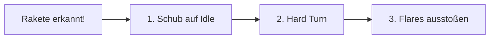
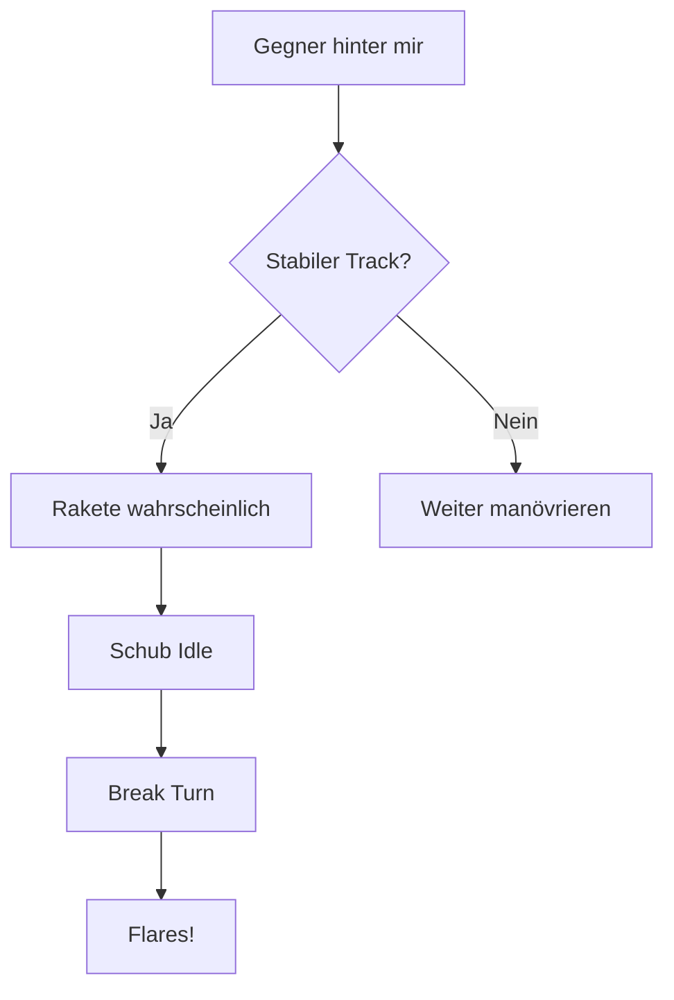

# Gegenmaßnahmen

> Flares gegen wärmesuchende Raketen.

In VFM sind **Flares** die einzige Gegenmaßnahme gegen feindliche Raketen. Da nur wärmesuchende (IR) Raketen existieren, sind Flares hocheffektiv - wenn richtig eingesetzt.

---

## Flares

Heiße Täuschkörper, die IR-Suchköpfe ablenken.

### Funktionsweise

Flares brennen heißer als dein Triebwerk und ziehen den Raketen-Suchkopf an.

```
    Rakete → 🔥 ← Flare (heißer!)
              ↘
               ↘
                ✈️ Du (kälter)
```

| Eigenschaft | Beschreibung |
|-------------|--------------|
| **Typ** | Magnesium-Täuschkörper |
| **Wirkung** | Erzeugt Wärmequelle, die heller ist als Triebwerk |
| **Vorrat** | Begrenzt (je nach Flugzeug) |

---

## Richtiger Einsatz

### Die drei Schritte



### 1. Schub reduzieren

::: danger KRITISCH
Dies ist der wichtigste Schritt! Flares funktionieren NUR wenn dein Triebwerk kälter ist als die Flares.
:::

| Schub | Triebwerks-Signatur | Flare-Effektivität |
|-------|---------------------|-------------------|
| **Nachbrenner** | Extrem heiß | Flares nutzlos! |
| **Mil Power** | Heiß | Flares kaum wirksam |
| **Idle** | Kühl | Flares effektiv |

### 2. Hard Turn

Drehe weg von der Rakete, um:
- Entfernung zur Flare-Wolke zu schaffen
- Die Rakete zu zwingen, ihre Flugbahn zu ändern
- Mehr Zeit zu gewinnen

### 3. Flares ausstoßen

| Situation | Anzahl | Timing |
|-----------|--------|--------|
| **Früh erkannt** | 2-3 Flares | Verteilt während Turn |
| **Spät erkannt** | 4-5 Flares | Schnelle Salve |
| **Sehr nah** | Alles | Last-Ditch |

---

## Timing

### Zu früh

- Flares sind weg bevor Rakete da ist
- Suchkopf re-acquired dich

### Zu spät

- Rakete ist zu nah für Reaktion
- Keine Zeit für Manöver

### Optimal

- Flares wenn Rakete in 1-2 km Entfernung
- Manöver beginnen bei Erkennung
- Schub SOFORT auf Idle

::: tip FAUSTREGEL
Schub runter → Turn einleiten → Flares während des Turns
:::

---

## Häufige Fehler

### Fehler 1: Schub nicht reduziert

```
❌ Flares + Nachbrenner = Verschwendung
```

Dein Triebwerk überstrahlt die Flares. Die Rakete ignoriert sie.

### Fehler 2: Nur Flares, kein Manöver

```
❌ Flares ohne Turn = Rakete findet dich wieder
```

Du musst dich von der Flare-Wolke entfernen.

### Fehler 3: Zu wenige Flares

```
❌ 1 Flare = Hoffnung, nicht Taktik
```

Moderne Suchköpfe brauchen mehrere Täuschkörper.

---

## Vorrat-Management

| Flugzeug | Flares |
|----------|--------|
| **T-15** | 60 |
| **T-16** | 40 |
| **T-18** | 50 |

::: warning SPAREN
Du hast genug Flares für mehrere Engagements, aber nicht für Verschwendung. Nutze sie nur bei echten Bedrohungen!
:::

---

## Defensive Situation erkennen

### Woher weißt du, dass eine Rakete kommt?

| Hinweis | Beschreibung |
|---------|--------------|
| **Visuell** | Raketenrauch, Blitz beim Launch |
| **Gegner-Verhalten** | Plötzliches Abdrehen nach stabilem Tracking |
| **Instinkt** | Wenn jemand hinter dir ist UND Ton hatte |

### Reaktionskette



---

## Zusammenfassung

| Schritt | Aktion | Warum |
|---------|--------|-------|
| **1** | Schub auf Idle | Triebwerk muss kälter sein als Flares |
| **2** | Hard Turn | Weg von Rakete und Flare-Wolke |
| **3** | Flares × 3-5 | Mehrere Täuschkörper für Sicherheit |

::: tip MERKSATZ
**"Throttle - Turn - Flares"** - In dieser Reihenfolge, jedes Mal.
:::

---

## Was VFM NICHT hat

Im Gegensatz zu komplexeren Simulationen verzichtet VFM auf:

- **Chaff** (Radar-Täuschkörper) - nicht nötig, keine Radar-Raketen
- **Elektronische Gegenmaßnahmen** - kein ECM/ECCM
- **Notching** - kein Doppler-Radar zu täuschen

::: info FOKUS
VFM konzentriert sich auf Flugkönnen. Die Abwehr ist simpel: Flares richtig nutzen, besser fliegen als der Gegner.
:::
