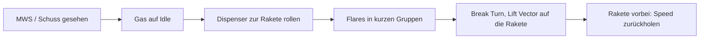

# Gegenmaßnahmen

> Flares, Idle und der richtige Turn: So schlägst du die IR-Rakete.

VFM hat **Flares** (Täuschkörper, heißer als dein Triebwerk), aber kein Chaff, und braucht es auch nicht, weil es keine Radar-Raketen gibt. Gegen die IR-Rakete hast du drei Mittel: **weniger Wärme** (Gas raus), **Flares** (falsche Ziele) und **Manöver** (die Rakete kurven lassen, bis sie es nicht mehr schafft).

## Wann du reagieren musst

| Auslöser | Bedeutung |
|---|---|
| **MWS-Warnung** | Eine Rakete fliegt auf dich zu. Sofort reagieren. |
| **Raketenstart gesehen** | Rauchspur oder Abschuss beim Gegner. Sofort reagieren. |
| **Gegner in Fox-2-Position** | Hinter dir oder Nase auf dir, in Reichweite. Rechne mit einem Schuss, auch ohne Warnung. |

Der RWR hilft dir hier **nicht**, die IR-Rakete braucht kein Radar (siehe [RWR & MWS](/avionik/rwr)).

## Der Ablauf

Community-Empfehlung, deckt sich mit realer IR-Raketenabwehr:

```mermaid
flowchart LR
    A[MWS / Schuss gesehen] --> B[Gas auf Idle]
    B --> C[Dispenser zur Rakete rollen]
    C --> D[Flares in kurzen Gruppen]
    D --> E[Break Turn, Lift Vector auf die Rakete]
    E --> F[Rakete vorbei: Speed zurückholen]
```

1. **Gas auf Idle.** Vollgas und Nachbrenner machen dich heiß, mit Idle wirken die Flares relativ attraktiver. Nie mit Nachbrenner verteidigen.
2. **Dispenser zur Rakete rollen,** damit die Flares zwischen dir und dem Suchkopf landen.
3. **Flares in kurzen Gruppen** statt Dauerstrom. Ein Dauerstrom leert den Vorrat, ohne besser zu wirken.
4. **Break Turn:** Lift Vector auf die Bedrohung, ziehen, nahe Corner Speed für maximale Drehrate. Die Rakete muss stark nachkurven, verliert Energie und muss sich zwischen dir und den Flares entscheiden. Ein gut getimter Break schlägt sie manchmal auch ohne Flares. Details: [Break Turn](/grundlagen/defensiv/break-turn).
5. **Danach:** Du bist langsam und meist defensiv, der Gegner setzt wahrscheinlich mit der Kanone nach (siehe [Guns Defense](/grundlagen/defensiv/guns-defense)). Speed zurückholen, aber nicht blind unloaden, solange er in Schussposition ist.

## Timing

- **Zu spät:** Die Rakete ist zu nah, um noch abgelenkt zu werden.
- **Zu früh ohne Bedrohung:** Flares verbrannt, die du später brauchst.
- **Vorbeugend:** Ist der Gegner klar in Fox-2-Position, kann eine kurze Gruppe **vor** dem Schuss sinnvoll sein. Kombiniere sie mit einem Manöver, das ihm die Lösung nimmt.

::: warning IDLE KOSTET ENERGIE
Idle und harter Break kosten viel Speed. Das ist der Preis fürs Überleben. Plane danach bewusst, wie du Energie zurückholst (siehe [Energie-Management](/grundlagen/energie-management)).
:::

## Training

- **Lobby mit Raketen und Infinite Ammo:** Ein Freund schießt von hinten, seitlich und vorne, du übst den Ablauf und siehst dir im Debrief an, wann die Rakete abgelenkt wurde.
- **Ohne Flares:** Teste, ob ein reiner Break eine Rakete aus kurzer und mittlerer Entfernung schlägt.
- Mehr Setups: [Trainingsplan](/grundlagen/uebungen).

::: info IM SPIEL PRÜFEN
- Wie viele Flares hat jeder Jet, und ist die Anzahl in der Lobby einstellbar?
- Wo sitzen die Dispenser, und wirft ein Tastendruck eine Flare oder eine Gruppe?
- Wie stark wirkt Idle gegenüber Vollgas auf die Flare-Wirkung?
:::

::: tip MERKE
- Nur Flares, kein Chaff: Gegen IR-Raketen helfen Idle, Flares und Manöver.
- Ablauf: Idle → Dispenser zur Rakete → Flares in kurzen Gruppen → Break Turn.
- Kein Nachbrenner während der Raketenabwehr.
- Der RWR warnt nicht vor IR-Raketen; reagiere auf MWS, Schuss oder Fox-2-Position.
- Nach der Abwehr kommt meist die Kanone: Guns Defense bereithalten.
:::

Weiter: [Break Turn](/grundlagen/defensiv/break-turn)
