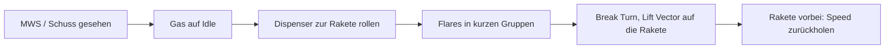

# Gegenmaßnahmen

> Flares, Idle und der richtige Turn: So schlägst du die IR-Rakete.

In VFM gibt es **Flares** (Täuschkörper, die heißer brennen als dein Triebwerk). **Chaff** (Radar-Täuschkörper) gibt es nach allem, was bekannt ist, nicht – und braucht es auch nicht, weil es keine Radar-Raketen gibt. Deine Gegenmaßnahmen gegen die IR-Rakete sind also:

1. **Weniger Wärme** – Gas raus
2. **Flares** – falsche Ziele anbieten
3. **Manöver** – die Rakete zum Kurven zwingen, bis sie es nicht mehr schafft

## Wann du reagieren musst

| Auslöser | Bedeutung |
|---|---|
| **MWS-Warnung** | Eine Rakete fliegt auf dich zu. Sofort reagieren. |
| **Gegner in Fox-2-Position** | Er ist hinter dir oder hat die Nase auf dich, in Reichweite. Rechne mit einem Schuss, auch ohne Warnung. |
| **Raketenstart gesehen** | Rauchspur oder Abschuss beim Gegner. Sofort reagieren. |

Der RWR hilft dir hier **nicht**: Die IR-Rakete braucht kein Radar (siehe [RWR & MWS](/avionik/rwr)).

## Die Technik

Die Community empfiehlt folgenden Ablauf. Er deckt sich mit realer IR-Raketenabwehr:

```mermaid
flowchart LR
    A[MWS / Schuss gesehen] --> B[Gas auf Idle]
    B --> C[Dispenser zur Rakete rollen]
    C --> D[Flares in kurzen Gruppen]
    D --> E[Break Turn, Lift Vector auf die Rakete]
    E --> F[Rakete vorbei: Speed zurückholen]
```

### 1. Gas auf Idle

Vollgas oder Nachbrenner machen dein Triebwerk heiß – heißer als nötig. Mit Idle senkst du deine Signatur, die Flares wirken relativ attraktiver. Nicht mit Nachbrenner verteidigen.

### 2. Dispenser zur Rakete rollen

Roll so, dass die Flare-Auswerfer zur Rakete zeigen. Dann landen die Flares zwischen dir und dem Suchkopf. Wo die Dispenser am Jet sitzen, prüfst du im Spiel.

### 3. Flares in kurzen Gruppen

Wirf **Gruppen von Flares in kurzen Abständen** statt eines Dauerstroms. Ein Dauerstrom leert deinen Vorrat, ohne besser zu wirken.

### 4. Break Turn

Ein **Break Turn** ist eine sofortige maximale Defensivkurve: Lift Vector auf die Bedrohung, ziehen (nahe Corner Speed = maximale Drehrate). Gegen die Rakete hat das zwei Effekte:

- Die Rakete muss stark nachkurven und verliert dabei Energie.
- Du entfernst dich schnell von den Flares, die Rakete muss sich entscheiden – idealerweise für die Flares.

Ein gut getimter Break kann eine Rakete auch **ohne Flares** kinematisch schlagen, wenn sie die Kurve nicht mehr schafft. Mehr dazu: [Break Turn](/grundlagen/defensiv/break-turn).

### 5. Danach

Ist die Rakete vorbei, bist du langsam und meist defensiv. Rechne damit, dass der Gegner jetzt mit der Kanone nachsetzt (siehe [Guns Defense](/grundlagen/defensiv/guns-defense)). Speed zurückholen, aber nicht blind unloaden, solange er in Schussposition ist.

## Timing

- **Zu spät:** Die Rakete ist zu nah, um noch abgelenkt zu werden oder dem Break zu folgen.
- **Zu früh, ohne Bedrohung:** Flares verbrannt, die du später brauchst.
- **Vorbeugende Flares:** Ist der Gegner klar in einer Fox-2-Position (hinter dir, Nase auf dir, in Reichweite), kann eine kurze Gruppe Flares **vor** einem möglichen Schuss sinnvoll sein. Sie stört seinen Suchkopf oder lenkt eine Rakete ab, die gerade startet. Kombiniere das mit einem Manöver, das ihm die Lösung nimmt.

::: warning IDLE KOSTET ENERGIE
Idle und harter Break kosten viel Speed. Das ist der Preis fürs Überleben. Plane danach bewusst, wie du Energie zurückholst – siehe [Energie-Management](/grundlagen/energie-management).
:::

## Training

- **Lobby mit Raketen und Infinite Ammo:** Ein Freund schießt aus verschiedenen Positionen (hinten, seitlich, vorne), du übst den Ablauf. Danach im Debrief ansehen, wann und wie die Rakete abgelenkt wurde.
- **Ohne Flares:** Teste, ob ein reiner Break Turn eine Rakete aus kurzer und mittlerer Entfernung schlagen kann.
- Mehr Setups: [Übungen](/grundlagen/uebungen).

::: info IM SPIEL PRÜFEN
- Wie viele Flares hat jeder Jet, und ist die Anzahl in der Lobby einstellbar?
- Wo sitzen die Flare-Dispenser am Jet (oben, unten, hinten)?
- Wirft ein Tastendruck eine Flare oder eine Gruppe? Gibt es einstellbare Programme?
- Wie stark wirkt Idle im Vergleich zu Vollgas auf die Flare-Wirkung?
- Gibt es eine Speedbrake, die den Break unterstützt?
:::

::: tip MERKE
- Nur Flares, kein Chaff – gegen IR-Raketen helfen Idle, Flares und Manöver.
- Ablauf: Idle → Dispenser zur Rakete rollen → Flares in kurzen Gruppen → Break Turn.
- Kein Nachbrenner während der Raketenabwehr.
- Der RWR warnt nicht vor IR-Raketen; reagiere auf MWS, Schuss oder Fox-2-Position.
- Nach der Abwehr kommt meist die Kanone: Guns Defense bereithalten.
:::

Weiter: [Break Turn](/grundlagen/defensiv/break-turn)
