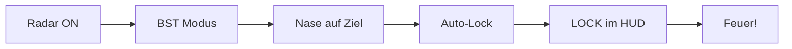

# Radar-System

> Zielerfassung und Luftraumüberwachung im Nahkampf.

Das Radar in VFM dient zur Zielerfassung und liefert den Gunpiper für präzise Kanonenschüsse. Es hat mehrere Modi, die für verschiedene Kampfsituationen optimiert sind.

---

## Radar einschalten

Das Radar muss zunächst aktiviert werden:

| Element | Beschreibung |
|---------|--------------|
| **RADAR PWR** | Kippschalter links am Display |
| **OFF** | Radar sendet nicht (RADAR OFF erscheint) |
| **ON** | Radar aktiv, Modi verfügbar |

::: warning WICHTIG
Wenn "RADAR OFF" rot auf dem Display erscheint, ist der Schalter auf OFF. Du kannst keine Ziele erfassen!
:::

---

## Radar-Modi

Das Radar bietet drei Modi, auswählbar am unteren Rand des Displays:

### SCAN (Suchmodus)

Der normale Suchmodus zur Luftraumüberwachung.

| Eigenschaft | Beschreibung |
|-------------|--------------|
| **Funktion** | Scannt einen breiten Bereich |
| **Nutzung** | Ziele finden, Überblick verschaffen |
| **Wann nutzen** | Vor dem Merge, Situational Awareness |

---

### BST (Boresight)

Nahkampf-Modus für schnelle Zielerfassung.

| Eigenschaft | Beschreibung |
|-------------|--------------|
| **Funktion** | Radar schaut stur geradeaus |
| **Lock** | Automatisch auf erstes Ziel vor der Nase |
| **Wann nutzen** | Dogfight, wenn Ziel vor dir ist |

::: tip DOGFIGHT-MODUS
Boresight ist perfekt für den Merge. Nase auf Gegner → automatischer Lock!
:::

---

### VERT (Vertical)

Vertikaler Scan-Modus.

| Eigenschaft | Beschreibung |
|-------------|--------------|
| **Funktion** | Scannt einen vertikalen Streifen |
| **Nutzung** | Ziele über oder unter dir finden |
| **Wann nutzen** | Vertikale Manöver, Gegner auf anderer Höhe |

---

## Display-Elemente

```
    ┌─────────────────────────┐
    │              10 +       │ ← Reichweite (nm)
    │     ╭───────────╮       │
    │     │           │       │
    │  EL │     ✈     │       │ ← Eigenes Flugzeug
    │  ↕  │           │       │
    │     ╰───────────╯       │
    │  SCAN  [BST]  VERT      │ ← Modi
    └─────────────────────────┘
```

| Element | Bedeutung |
|---------|-----------|
| **Reichweite (10+)** | Radar-Maßstab in nautischen Meilen |
| **EL (Elevation)** | Höhenwinkel des Radarstrahls |
| **Eigenes Flugzeug** | Deine Position (Mitte) |
| **Modi** | Aktiver Modus ist markiert [BST] |
| **Ziel-Symbole** | Erkannte Kontakte erscheinen als Symbole |

### Reichweite einstellen

| Reichweite | Einsatz |
|------------|---------|
| **10 nm** | Nahkampf, Dogfight |
| **20-40 nm** | Anflug, Situational Awareness |
| **80+ nm** | Fernüberwachung |

::: tip NAHKAMPF
Im Dogfight: Kurze Reichweite (10 nm) für bessere Detailauflösung!
:::

---

## Lock-On Prozess

1. **Radar einschalten** (RADAR PWR → ON)
2. **Modus wählen** (BST für Dogfight)
3. **Ziel erfassen** (Nase auf Gegner richten)
4. **Lock bestätigen** (LOCK erscheint im HUD)
5. **Waffe einsetzen** (Gunpiper oder Rakete)



---

## Zusammenfassung

| Modus | Funktion | Beste Situation |
|-------|----------|-----------------|
| **SCAN** | Breite Suche | Vor dem Kampf |
| **BST** | Geradeaus-Lock | Dogfight |
| **VERT** | Vertikaler Scan | Höhenunterschiede |

::: info EINFACHHEIT
VFM hält das Radar simpel. Im Dogfight: BST an, Nase drauf, fertig.
:::
