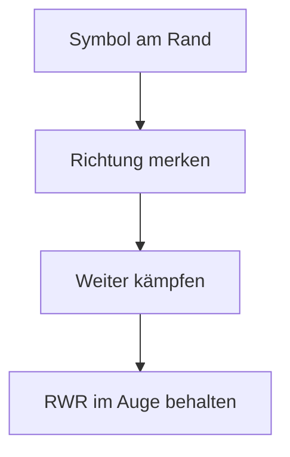
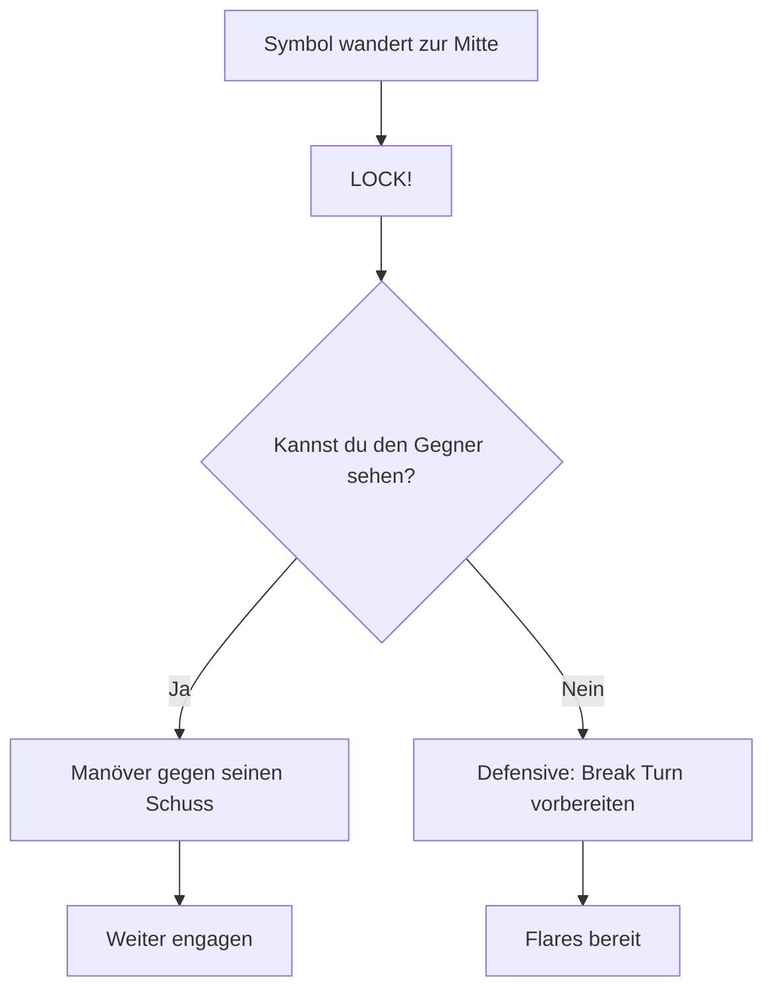
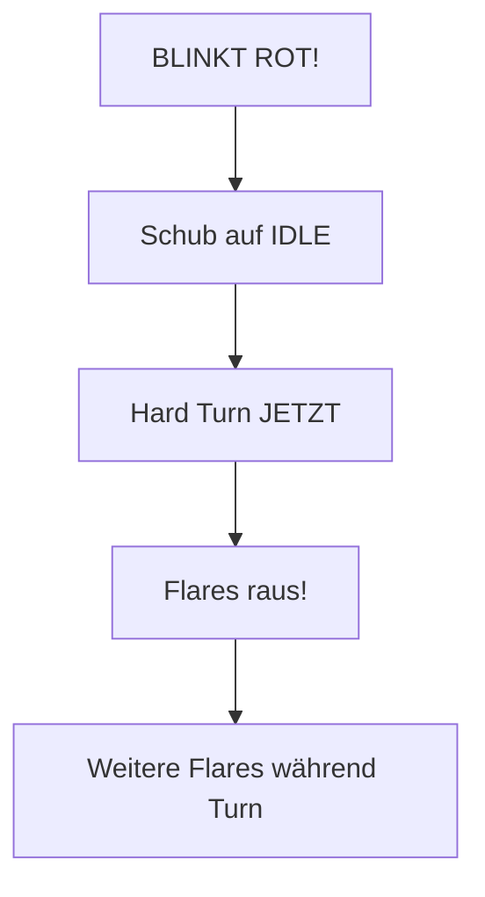

# Radar Warning Receiver (RWR)

> Wissen, wenn der Gegner dich auf dem Korn hat.

Der RWR ist ein **passives** Verteidigungssystem. Er sendet nichts aus, sondern "hört" auf feindliche Radarwellen. Wenn dich jemand anstrahlt, siehst du es hier.

---

## Das Display

```
        ┌───────────────────┐
        │                   │
        │     ╭───────╮     │
        │    ╱    │    ╲    │  ← Äußerer Ring
        │   │     │     │   │
        │   │ ────┼──── │   │  ← Mitte = Du
        │   │     │     │   │
        │    ╲    │    ╱    │
        │     ╰───────╯     │  ← Innerer Ring
        │                   │
        └───────────────────┘
```

| Element | Bedeutung |
|---------|-----------|
| **Mitte** | Dein Flugzeug |
| **Ringe** | Entfernung/Bedrohungsstufe |
| **Symbole** | Feindliche Radare |

---

## Display lesen

### Leeres Display

```
        ╭───────╮
       ╱    │    ╲
      │     │     │
      │ ────┼──── │
      │     │     │
       ╲    │    ╱
        ╰───────╯
```

**Bedeutung:** Niemand strahlt dich an. Du bist "unsichtbar" oder keine aktiven Radare in Reichweite.

::: tip SICHER
Leeres RWR = Aktuell keine Radar-Bedrohung. Aber Augen offen halten!
:::

---

### Symbol erscheint

Wenn ein feindliches Radar dich erfasst, erscheint ein Symbol:

| Position | Bedeutung |
|----------|-----------|
| **Äußerer Ring** | Weit weg, oder nur Suchmodus |
| **Mittlerer Bereich** | Näher, erhöhte Aufmerksamkeit |
| **Innerer Ring / Mitte** | Sehr nah oder LOCK |

### Richtung

Die Position des Symbols zeigt die **Richtung** der Bedrohung:

```
              12 Uhr (Vorne)
                   ↑
        10 ╲       │       ╱ 2
            ╲      │      ╱
              ╲    │    ╱
    9 ─────────── ┼ ─────────── 3
              ╱    │    ╲
            ╱      │      ╲
        8  ╱       │       ╲ 4
                   ↓
              6 Uhr (Hinten)
```

---

## Bedrohungsstufen

### Stufe 1: Suchmodus (Search)

| Merkmal | Beschreibung |
|---------|--------------|
| **Symbol** | Am äußeren Rand |
| **Bedeutung** | Jemand scannt die Gegend |
| **Gefahr** | Gering |
| **Aktion** | Awareness, keine Panik |

---

### Stufe 2: Aufgeschaltet (Lock)

| Merkmal | Beschreibung |
|---------|--------------|
| **Symbol** | Wandert zur Mitte |
| **Bedeutung** | Jemand hat dich gelockt! |
| **Gefahr** | Hoch - Rakete könnte kommen |
| **Aktion** | Defensive vorbereiten |

::: warning LOCK
Wenn ein Symbol zur Mitte wandert: Der Gegner hat dich im Visier. Erwarte eine Fox-2!
:::

---

### Stufe 3: Rakete unterwegs

| Merkmal | Beschreibung |
|---------|--------------|
| **Symbol** | Blinkt rot in der Mitte |
| **Bedeutung** | Rakete wurde abgefeuert! |
| **Gefahr** | Kritisch |
| **Aktion** | Sofort: Throttle - Turn - Flares! |

::: danger MISSILE!
Rotes Blinken = SOFORT reagieren! Schub auf Idle, Hard Turn, Flares raus!
:::

---

## Reaktionen

### Bei Search (Äußerer Ring)



Keine sofortige Gefahr, aber jemand ist da draußen.

---

### Bei Lock (Mitte)



Du bist das Ziel. Der Gegner wird wahrscheinlich gleich schießen.

---

### Bei Rakete (Blinkt)



Keine Zeit zum Nachdenken. Sofort reagieren!

---

## RWR in VFM

### Was der RWR dir sagt

| Information | Nutzen |
|-------------|--------|
| **Richtung** | Wo ist die Bedrohung? |
| **Entfernung (grob)** | Wie nah ist sie? |
| **Lock-Status** | Bin ich das Ziel? |

### Was der RWR NICHT hat (in VFM)

- Keine Unterscheidung von Radar-Typen (alle Gegner haben ähnliche Radare)
- Keine Radar-Raketen-Warnung im klassischen Sinn (nur IR-Raketen im Spiel)

::: info VEREINFACHT
Da VFM nur IR-Raketen (Fox-2) hat, zeigt der RWR primär: "Jemand hat mich gelockt" = "Gleich kommt eine Sidewinder!"
:::

---

## Zusammenfassung

| RWR-Status | Bedeutung | Aktion |
|------------|-----------|--------|
| **Leer** | Niemand sieht dich | Weiter kämpfen |
| **Symbol außen** | Jemand sucht | Awareness |
| **Symbol Mitte** | Du bist gelockt | Defensive bereit |
| **Blinkt rot** | Rakete kommt! | Throttle-Turn-Flares! |

::: tip GEWOHNHEIT
Checke den RWR regelmäßig - besonders wenn du einen Gegner nicht siehst. "Lose sight, lose fight" - aber der RWR hilft dir, Bedrohungen zu erkennen.
:::
