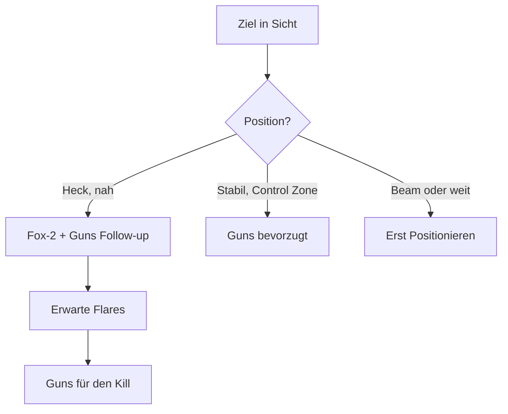

# Waffensysteme

> Bordkanone und wärmesuchende Raketen in VFM.

VFM simuliert klassischen Nahkampf mit zwei Waffensystemen: der Bordkanone für präzise Schüsse und wärmesuchenden Raketen (Fox-2) für schnelle Kills. Die Bewaffnung ist bewusst limitiert und einfach gehalten.

---

## Bordkanone (Guns)

Die Standardwaffe für Nahkampf-Engagements.

### Eigenschaften

| Aspekt | Beschreibung |
|--------|--------------|
| **Reichweite** | Effektiv bis ~1 km |
| **Munition** | Begrenzt, aber ausreichend |
| **Zielhilfe** | Gunpiper im HUD |
| **Stärke** | Nicht durch Flares abwehrbar |

### Gunpiper-Nutzung

Der Gunpiper zeigt die berechnete Auftreffstelle:

1. **Ziel aufschalten** - Lock für Radar-Unterstützung
2. **Manövrieren** - Pipper auf das Ziel bringen
3. **Feuern** - Kurze, kontrollierte Salven

::: tip AMMO-MANAGEMENT
Feuere in kurzen Bursts (1-2 Sekunden). Lange Salven verschwenden Munition und überhitzen die Waffe.
:::

### Tracking Shot vs Snapshot

| Typ | Beschreibung | Wann nutzen |
|-----|--------------|-------------|
| **Tracking Shot** | Pipper stabil auf Ziel halten | Stabile Verfolgung, gute Position |
| **Snapshot** | Kurzer Burst bei Kreuzung | Schnelle Gelegenheit, Angles Fight |

---

## Fox-2: Wärmesuchende Raketen

Infrarot-gelenkte Raketen, analog zur AIM-9 Sidewinder.

### Bewaffnung

| Flugzeug | Anzahl |
|----------|--------|
| **T-15** | 4 × AIM-9 |
| **T-16** | 4 × AIM-9 |
| **T-18** | 4 × AIM-9 |

::: warning LIMITIERT
Nur 4 Raketen pro Sortie. Jeder Schuss zählt!
:::

### Funktionsweise

Der Suchkopf erkennt Wärmequellen (Triebwerksabgase) und folgt ihnen autonom nach Abschuss.

```
    Suchkopf → 🔥 Triebwerk
         ╲    ↗
          ╲  ↗
           ╲↗
    Rakete folgt der Wärme
```

### Suchkopf-Ton ("Growl")

Der Suchkopf gibt charakteristische Töne von sich:

| Ton | Bedeutung | Aktion |
|-----|-----------|--------|
| **Leises Rauschen** | Keine Erfassung | Weiter manövrieren |
| **Lautes Brummen** | Ziel erfasst | Schussbereit |
| **Hoher, klarer Ton** | Starke Erfassung | Optimaler Schussmoment |

::: tip WARTE AUF DEN TON
Schieße erst bei starkem Growl. Schwache Erfassung = wahrscheinlicher Fehlschuss.
:::

### Schussparameter

| Aspekt | Optimal | Akzeptabel | Schlecht |
|--------|---------|------------|----------|
| **Winkel** | Heck (0°) | Beam (90°) | Frontal |
| **Distanz** | 500m - 1.5km | 300m - 2km | >2km |
| **Ziel-Status** | Nachbrenner an | Mil Power | Idle |

### Schwächen

Fox-2 Raketen sind **leicht durch Flares abzuwehren**:

- Begrenzte Reichweite
- Keine All-Aspect-Fähigkeit bei frühen Modellen
- Flares ziehen den Suchkopf ab
- Einfache IR-Suchköpfe

::: warning ERWARTE FLARES
Dein Gegner wird Flares werfen. Schieße nur bei guter Position und kurzer Distanz!
:::

---

## Resupply

In Lobbies stehen **Reload-Zonen** zur Verfügung:

| Was | Beschreibung |
|-----|--------------|
| **Position** | Markierte Bereiche in der Lobby |
| **Effekt** | Raketen und Munition auffüllen |
| **Nutzung** | Hineinfliegen und warten |

---

## Taktische Empfehlungen

### Wann Guns?

- Stabile Verfolgungsposition (Control Zone)
- Gegner ist langsam und vorhersehbar
- Raketen aufgebraucht
- Gegner hat gerade Flares geworfen

### Wann Fox-2?

- Gute Heck-Position
- Kurze Distanz (< 1.5 km)
- Gegner hat Nachbrenner an
- Schnelle Gelegenheit ohne Zeit für Guns-Lösung

### Kombination



::: tip ZUSAMMENSPIEL
Erfahrene Piloten nutzen Fox-2 um den Gegner zu Flares zu zwingen, dann Guns für den eigentlichen Kill.
:::

---

## Zusammenfassung

| Waffe | Stärke | Schwäche |
|-------|--------|----------|
| **Guns** | Nicht abwehrbar, unlimitiert* | Erfordert präzises Zielen |
| **Fox-2** | Schneller Kill, "Fire and Forget" | Leicht durch Flares besiegt |

*Munition ist begrenzt, aber großzügig bemessen.

::: info PHILOSOPHIE
VFM fokussiert auf Flugkönnen, nicht Waffensysteme. Die Waffen sind einfach, aber effektiv - der bessere Pilot gewinnt.
:::
