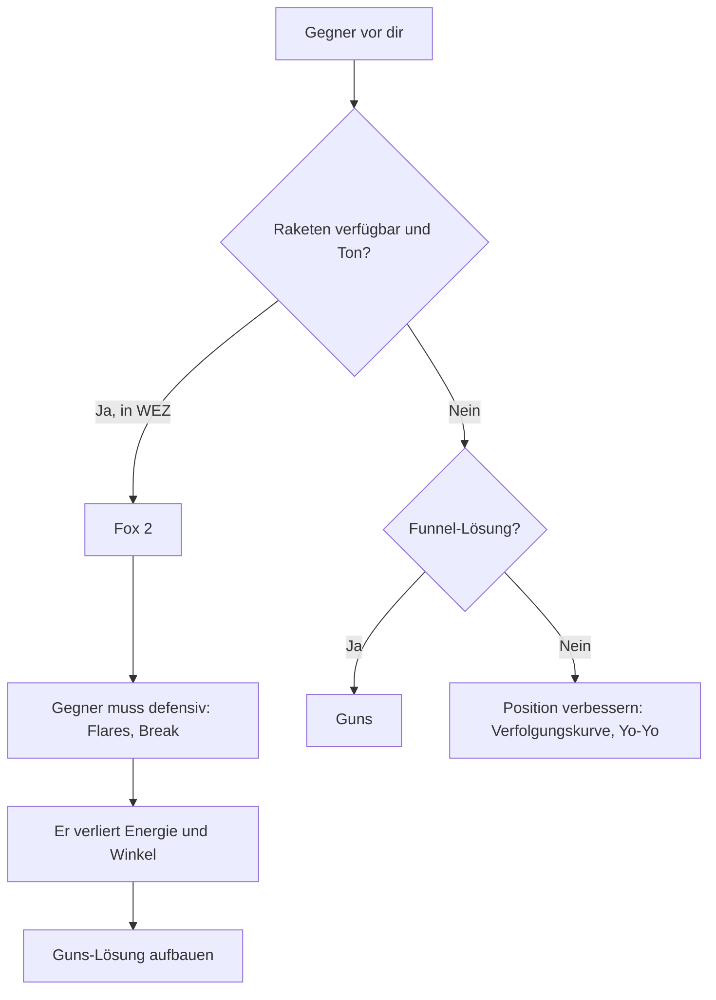

# Waffen

> Kanone und IR-Rakete: was du hast, was die Lobby-Einstellungen ändern und wann du welche Waffe nutzt.

Alle drei Jets haben dieselbe Bewaffnung:

| Waffe | Beschreibung |
|---|---|
| **Bordkanone** ("Guns") | Zielhilfe über den EEGS-artigen Gun-Funnel im HUD |
| **IR-Rakete** ("Heater", Funkruf **Fox 2**) | Wärmesuchend, ein einziger Raketentyp |

Es gibt **keine Radar-Raketen**. Den genauen Namen der Rakete im Spiel kennen wir nicht – sie heißt hier einfach "Heater" bzw. IR-Rakete.

## Match-Einstellungen

Was du dabeihast, legt die Lobby fest (siehe [Spielmodi](/einstieg/spielmodi)):

| Einstellung | Wirkung |
|---|---|
| **Raketen an/aus** | Aus = Guns-only |
| **Anzahl Raketen** | Einstellbar |
| **Infinite Ammo** | Unbegrenzte Munition |
| **Head-on Guns** | Frontalschüsse beim Merge erlaubt oder verboten |
| **Ranked 1v1** | Laut Community Guns-only |

Munition und Treibstoff haben **Gewicht** (Store-Beschreibung). Ein leichter Jet dreht besser – das Gewicht der Raketen und Munition macht aber nur einen Teil aus; wie stark sich ein Abschuss auf die Leistung auswirkt, ist nicht dokumentiert.

## Leere Stores: Selbstzerstörung

Hast du keine Munition und keine Raketen mehr, startet ein **Selbstzerstörungs-Countdown**. Es gibt kein Nachladen und keine Reload-Zonen.

**Was das heißt:** Lange Dauerfeuer-Salven ohne echte Lösung kosten dich im Zweifel die Runde. Schieß, wenn der Funnel passt, nicht "auf gut Glück".

::: info IM SPIEL PRÜFEN
- Wie viele Schuss hat die Kanone, und wie lange reicht das in Sekunden Dauerfeuer?
- Wie lang ist der Selbstzerstörungs-Countdown?
- Wie viele Raketen sind voreingestellt?
:::

## Bordkanone

Die Kanone kann nicht durch Flares abgewehrt werden – gegen sie hilft nur Manövrieren (siehe [Guns Defense](/grundlagen/defensiv/guns-defense)).

- **Zielen:** mit dem Gun-Funnel. Mit Radar-Lock ist die Lösung genauer, ohne Lock rechnet der Funnel mit einer durchschnittlichen Spannweite (siehe [HUD](/avionik/hud)).
- **Schusstypen:** **Tracking Shot** = in seiner Ebene, kleiner Winkel, Funnel bleibt auf ihm. **Snapshot** = großer Winkel, er läuft durch den Funnel, du feuerst kurz vorher.
- **Feuerstöße:** kurze, gezielte Bursts, solange die Lösung passt. Hört die Lösung auf, hörst du auf zu schießen.

::: info IM SPIEL PRÜFEN
- Effektive Reichweite der Kanone (z.B. mit einem Freund in einer Infinite-Ammo-Lobby testen: ab welcher Entfernung zeigen Treffer Wirkung?).
- Wie viele Treffer braucht ein Abschuss?
:::

## IR-Rakete (Heater / Fox 2)

Die Rakete sucht die Wärme des gegnerischen Jets. Sie braucht **kein Radar** – der Gegner sieht auf seinem RWR also nichts, wenn du ohne Radar schießt; er wird nur vom MWS gewarnt (siehe [RWR & MWS](/avionik/rwr)).

- **Suchkopf-Ton:** Es gibt einen Ton, wenn der Suchkopf ein Ziel hat. Wie er sich genau anhört und verändert, prüfst du am besten in Free Flight/gegen Bots.
- **Aspect:** Laut Community trifft die Rakete auch frontal (All-Aspect). Offiziell bestätigt ist das nicht.
- **Abwehr:** Der Gegner kann sie mit Flares und Manöver schlagen (siehe [Gegenmaßnahmen](/avionik/gegenmassnahmen)).

::: info IM SPIEL PRÜFEN
- Wie klingt der Suchkopf-Ton ohne Ziel und mit Ziel?
- Funktioniert ein Schuss von vorne (All-Aspect) zuverlässig?
- Mindest- und Maximalreichweite, maximaler Winkel neben der Nase (Off-Boresight).
- Hilft ein Radar-Lock der Rakete (z.B. durch Ausrichten des Suchkopfs)?
- Reagiert der Suchkopf auf den Schubzustand des Ziels (Idle vs. Vollgas/Nachbrenner)?
:::

## WEZ: Wann trifft die Waffe?

Die **WEZ** (Weapons Engagement Zone) ist der Bereich, aus dem eine Waffe treffen kann. Sie hängt ab von:

- **Mindest- und Maximalreichweite** – zu nah kann die Rakete nicht mehr lenken, zu weit erreicht sie dich nicht.
- **Off-Boresight** – wie weit neben deiner Nase das Ziel sein darf.
- **Aspect** – von hinten ist ein IR-Ziel generell einfacher als von vorne.
- **Energie und Manöver des Ziels** – ein hart drehendes Ziel verkleinert die WEZ.

Bei der IR-Rakete sind diese Grenzen für VFM nicht veröffentlicht. Lern sie im Spiel kennen und merke dir Bilder ("so groß sah er aus, als die Rakete getroffen hat").

## Kanone oder Rakete?

Grundlogik (ausführlich in [Schusslösung](/grundlagen/offensiv/schussloesung)):

```mermaid
flowchart TD
    A[Gegner vor dir] --> B{Raketen verfügbar und Ton?}
    B -->|Ja, in WEZ| C[Fox 2]
    C --> D[Gegner muss defensiv: Flares, Break]
    D --> E[Er verliert Energie und Winkel]
    E --> F[Guns-Lösung aufbauen]
    B -->|Nein| G{Funnel-Lösung?}
    G -->|Ja| H[Guns]
    G -->|Nein| I[Position verbessern: Verfolgungskurve, Yo-Yo]
```

- **Fox 2 erzwingt Reaktion.** Auch eine Rakete, die vorbeigeht, zwingt den Gegner meist zu Flares und einem harten Break – das kostet ihn Energie. Danach kommst du leichter zur Kanonenlösung.
- **Dicht hinter ihm in seiner Ebene:** Guns. Die Kanone lässt sich nicht mit Flares abwehren.
- **One-Circle-Kampf:** Kann die Mindestreichweite der Rakete unterlaufen. Dann bleibt nur die Kanone.

::: tip MERKE
- Zwei Waffen: Kanone (Funnel) und eine IR-Rakete ("Heater", Fox 2). Keine Radar-Raketen.
- Raketen, Anzahl, Infinite Ammo und Head-on Guns legt die Lobby fest; Ranked 1v1 gilt als Guns-only.
- Leere Stores = Selbstzerstörungs-Countdown. Kein Nachladen – nur mit Lösung schießen.
- Die IR-Rakete braucht kein Radar: Der Gegner bekommt nur eine MWS-Warnung.
- Fox 2 zwingt ihn in die Defensive, die Kanone holt den Abschuss.
:::

Weiter: [Gegenmaßnahmen](/avionik/gegenmassnahmen)
