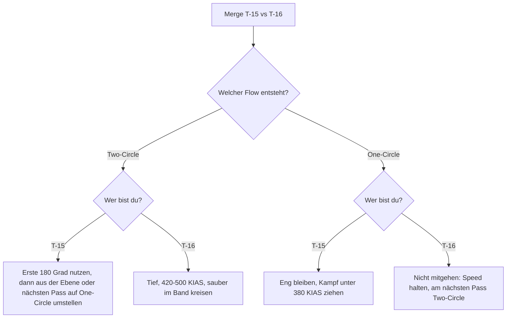

# T-15 vs. T-16

> Allrounder mit Kraft gegen Rate-Spezialisten: Wer das Speedband 420–500 KIAS in Bodennähe kontrolliert, kontrolliert diesen Kampf.

::: info DATENSTAND
Alle Zahlen stammen aus der Ingame-"Aircraft Performance Analysis", **Stand Okt 2026**. Die Werte der T-15 sind Zahl für Zahl dieselben wie in den Screenshots von Dez 2025. Die T-16 ist durch −20 % Treibstoffgewicht (v1.4.1) etwas leichter und minimal besser geworden; an der Reihenfolge der Stärken ändert das nichts. Details und Diagramm-Lesehilfe: [Flugzeugvergleich](/flugzeuge/vergleich).
:::

## Die Daten im direkten Vergleich

| Wert | T-15 Excalibur | T-16 Falchion | Vorteil |
|---|---|---|---|
| Gewicht (10.000 ft, 50 % Fuel) | 37.615 lbs | 24.417 lbs | – |
| Max Instant Rate (10.000 ft, 50 %) | **24 °/s** @ 360 KIAS | 21 °/s @ 409 KIAS | T-15 |
| Max Instant Rate (0 ft, 50 %) | **29 °/s** @ 337 | 26 °/s @ 378 | T-15 |
| Max Instant Rate (20.190 ft, 49 %) | **20 °/s** @ 380 | 18 °/s @ 434 | T-15 |
| Corner Speed (10.000 ft, 50–100 % Fuel) | **~360–385 KIAS** | ~409–421 KIAS | T-15 (niedriger) |
| Max Sustained Rate (10.000 ft, 50 %) | 17 °/s @ 495 | **18 °/s** @ 470 | T-16 |
| Max Sustained Rate (0 ft, 50 %) | 20 °/s @ 475 | **22 °/s** @ 447 | T-16 |
| Max Sustained Rate (20.190 ft, 49 %) | 13 °/s @ 412 | **14 °/s** @ 423 | T-16 (knapp) |
| Max Sustained Rate (10.000 ft, 100 %) | 15 °/s @ 495 | **16 °/s** @ 470 | T-16 (knapp) |
| Best-Sustained-Speed (Info-Karte) | ~500 KIAS | ~466 KIAS | – |
| Min Radius 0 ft | **1.138 ft** | 1.428 ft | T-15 |
| Min Radius 10.000 ft | **1.644 ft** | 2.099 ft | T-15 |
| Min Radius 20.190 ft | **2.387 ft** | 3.073 ft | T-15 |

Was du daraus mitnimmst: Die T-15 ist in fast jeder Spalte vorn – Instant Rate, Corner Speed, Radius, Sustained Rate über ~520 KIAS. Die T-16 hat genau **eine** Waffe: die bessere Sustained Rate (Ps = 0, also Kurve ohne Energieverlust) im Band ~420–500 KIAS, am stärksten in Bodennähe. Begriffe: [Kurvenphysik](/grundlagen/kurvenphysik), [Begriffe](/grundlagen/begriffe).

## Wer gewinnt wo? Das Speedband-Urteil

| Bereich | Vorteil | Warum |
|---|---|---|
| Unter ~380 KIAS | **T-15 klar** | Höhere Instant Rate, höhere Sustained Rate, kleinerer Radius. Hier ist die T-16 am schwächsten. |
| ~380–420 KIAS | Übergang | Sustained-Kurven kreuzen sich; die T-15 behält ihren Instant-Vorteil. |
| ~420–500 KIAS, tief | **T-16** | Sustained-Vorsprung 1–2 °/s, auf Meereshöhe am größten (22 vs 20 °/s). |
| Über ~500 KIAS | **T-15** | Hält 9 G bis sehr hohe Speed (10.000 ft: bis ~700+ KIAS), die T-16 fällt ab. |
| One-Circle (Radius-Kampf) | **T-15** | Kleinerer Radius in allen drei Höhen (10.000 ft: 1.644 vs 2.099 ft). |
| Höhe ~20.000 ft+ | **T-15** | Sustained fast gleich (20.190 ft, 49 %: 13 vs 14 °/s, voller und leerer Tank gleichauf), T-15 behält Instant- und Radius-Vorteil und ein flaches Sustained-Plateau (~12–13 °/s) von 350 bis ~600 KIAS. Die T-16 fällt ab ~470 KIAS unter die T-15. |
| Vertikal | vermutlich T-15 | Nur aus den T/W-Balken der Info-Karten abgeleitet (T-15 voll, T-16 ~75). Nicht gemessen. |

::: warning DIE WICHTIGSTE FEINHEIT
Vergleiche Sustained Rates **jeweils bei der Wunschgeschwindigkeit des Jets**, nicht bei gleicher Speed. Auf 10.000 ft mit halbem Tank dreht die T-16 bei 470 KIAS dauerhaft 18 °/s – die T-15 schafft dauerhaft **nirgends** mehr als 17 °/s. In einem flachen, ausgeflogenen Two-Circle gibt es also keine Speed, auf die sich die T-15 "retten" kann. Sie muss die **Art** des Kampfes ändern (One-Circle, Vertikale, Höhe), nicht nur die Speed.
:::

### Wie viel Winkel ist "1–2 °/s"?

Rechnung: Bei 18 °/s dauert ein Vollkreis 360 / 18 = 20 s, bei 22 °/s (Meereshöhe) etwa 16 s. Ein Vorsprung von 1–2 °/s bringt also **grob 20–40° pro Kreis**, auf Meereshöhe eher am oberen Ende. Das ist spürbar, aber kein Sofort-Kill: Ein Rate-Kampf entscheidet sich über mehrere Kreise – und nur, wenn beide sauber im Band fliegen. Wer in diesem Kampf zu hart zieht und unter das Band fällt, verschenkt den Vorsprung sofort.

## Aus dem Cockpit der T-15

### Dein Plan

Du bist der stärkere Jet – außer in genau einem Kampf: dem flachen, tiefen Two-Circle bei 420–500 KIAS. Deine Aufgabe ist, diesen Kampf **nicht stattfinden zu lassen**. Zwei Wege:

1. **Langsam und eng (One-Circle, unter ~380 KIAS):** Dort hast du kleineren Radius, mehr Instant **und** mehr Sustained Rate. Die T-16 ist dort am schwächsten.
2. **Schnell und vertikal (Energy Fight):** Nutze Schub und Speed über ~500 KIAS, nimm den Kampf aus der Ebene, greif aus der Höhe an, extende und komm neu rein ("Extend & Re-engage"). Ziel: Die T-16 soll nie in Ruhe im Band kreisen dürfen.

Zusätzlich: Kämpf lieber **höher**. Auf ~20.000 ft schrumpft ihr Sustained-Vorsprung auf 0–1 °/s, deiner bei Instant und Radius bleibt.

### Der Merge

- **Speed:** Richtwert ~380–450 KIAS (im Spiel testen). Das liegt zwischen deiner Corner Speed und deiner Best-Sustained-Speed und lässt dir Energie für die Vertikale. Mehr Speed bringt dir am Merge nichts außer einem größeren Radius (r ∝ V²). Grundlagen: [Der Merge](/grundlagen/neutral/der-merge).
- **Lead Turn:** Du gewinnst das Instant-Rennen (24 vs 21 °/s). Starte den Lead Turn (früh eingeleitete Kurve vor dem Passieren), wenn die Sichtlinienrate zum Gegner deutlich zunimmt – grob bei einem Wenderadius seitlichem Versatz (bei deiner Merge-Speed auf 10.000 ft grob 2.000–2.700 ft; dein Min Radius am Corner-Punkt ist 1.644 ft).
- **Flow-Wahl:** Den Flow bestimmen beide. Nach einem Links-an-Links-Vorbeiflug gilt: Dreht ihr beide links, ist es Two-Circle; dreht einer links und einer rechts, ist es One-Circle. Die T-16 wird Two-Circle wollen. Mehr: [One-Circle vs. Two-Circle](/grundlagen/neutral/one-two-circle).
  - Macht sie One-Circle mit oder dreht sie weg: gut für dich, zieh den Kampf langsam.
  - Erzwingt sie Two-Circle: Die **ersten ~180°** gehören dir (Instant Rate). Nutze sie für einen Schuss oder um Winkel zu sammeln – aber bleib danach **nicht** flach im Kreis hängen. Nimm die Nase aus der Ebene (nach oben), bevor dein Instant-Vorsprung aufgebraucht ist, oder nutze den nächsten Nose-to-Nose-Pass, um auf One-Circle umzustellen.

### Was du vermeidest

- Einen flachen, tiefen Two-Circle über mehrere Kreise bei 420–500 KIAS. Das ist ihr einziger guter Kampf.
- Am Boden zu kämpfen: Auf Meereshöhe ist ihr Vorsprung am größten (2 °/s).
- Sie im Kreis "aussitzen" zu wollen. Mit vollem Tank ist der Abstand kleiner (16 vs 15 °/s), verschwindet aber nicht.

### So nutzt du ihre Schwäche

- **Mach sie langsam.** Im One-Circle wird der Kampf von selbst langsamer. Unter ~380 KIAS hat die T-16 weder Radius noch Rate gegen dich. Jede Speed, die sie dort verliert, gewinnt sie schlecht zurück (niedrigster T/W-Balken).
- **Nimm sie mit in die Vertikale.** Wenn sie dir nach oben folgt, verliert sie wahrscheinlich schneller Energie als du. Wenn sie nicht folgt, hast du Höhe als Energiekonto für den nächsten Angriff aus überlegener Position. Siehe [Vertikal-Kampf](/grundlagen/neutral/vertikal-kampf).
- **Raketen-Lobbys:** Im Two-Circle bekommt der schneller drehende Jet den ersten Fox-2-Schuss (Fox 2 = IR-Rakete). In den ersten 180° bist du das. Nutze ihn, das zwingt sie zu Flares und Defensive. Siehe [Schusslösung](/grundlagen/offensiv/schussloesung).

### Wenn es schiefgeht

- **Sie gewinnt im Two-Circle Winkel:** Nicht noch härter ziehen – damit fällst du unter dein Band und blutest Energie. Rechtzeitig aus der Ebene: Lift Vector über den Horizont, hochziehen, Speed in Höhe tauschen. Hat sie noch keine Schusslösung, kannst du auch extenden: Du hast den stärksten Schub. Siehe [Separation](/grundlagen/defensiv/separation).
- **Sie ist hinter dir in Schussposition:** [Guns Defense](/grundlagen/defensiv/guns-defense) – unload, rollen, aus ihrer Ebene ziehen. Nicht verlangsamen, solange sie tracken kann.
- **Du bist tief und langsam:** Der langsame Bereich gehört dir, solange sie nicht schon hinter dir sitzt. Ist sie das, gilt zuerst die Defensive, dann die Energie.

## Aus dem Cockpit der T-16

### Dein Plan

Ehrlich gesagt: Die T-15 ist auf dem Papier der vielseitigere Jet. Du gewinnst diesen Kampf nur in **deinem** Band – **tief, flach, 420–500 KIAS, Two-Circle** – und nur, wenn du lange genug sauber fliegst, damit sich 1–2 °/s zu einer Schussposition summieren. Alles andere (langsam, eng, vertikal, hoch) gehört ihr.

### Der Merge

- **Speed:** Richtwert ~430–470 KIAS (im Spiel testen) – zwischen deiner Corner Speed (~409–421) und deiner Best-Sustained-Speed (~466–470). Kein Mach 0.8+, das vergrößert nur deinen ohnehin größten Radius.
- **Turning Room verweigern:** Die T-15 hat die bessere Instant Rate. Pass **eng** an ihr vorbei (wenig seitlicher Versatz), damit sie keinen Platz für einen Lead Turn hat.
- **Flow:** Dreh nach dem Pass zu ihrem Heck – Two-Circle. Versuch **nicht**, das erste Kurvenrennen zu gewinnen; die ersten ~180° gehören ihr. Nimm den kleinen Winkelverlust hin und geh sofort in deine Sustained-Kurve im Band.
- **Wenn sie One-Circle fliegt:** Geh nicht mit in die Messerstecherei. Am nächsten Nose-to-Nose-Pass ist der Flow wieder offen – wähle dort Two-Circle und halte deine Speed.

### Was du vermeidest

- **Langsam werden.** Unter ~380 KIAS ist jede Kennzahl gegen dich. Wenn du merkst, dass du unter dein Band fällst: Kurve lockern, Speed zurückholen, bevor du weiter Winkel jagst.
- **One-Circle.** Ihr Radius ist auf 10.000 ft rund 22 % kleiner (1.644 vs 2.099 ft).
- **Ihr in die Vertikale folgen.** Dein T/W-Balken ist der niedrigste. Ein steiler Steigflug hinter einer T-15 her endet sehr wahrscheinlich langsam unter ihr.
- **Hoch kämpfen.** Auf ~20.000 ft schrumpft dein Sustained-Vorsprung auf 0–1 °/s, und über ~470 KIAS liegt dort die T-15 vorn.

### So nutzt du ihre Schwäche

- **Bleib tief und im Band.** Auf Meereshöhe ist dein Vorsprung am größten (22 vs 20 °/s ≈ 30–40° pro Kreis). Hard Deck beachten (Training: 2.000 ft über Grund).
- **Lass sie zu dir kommen.** Wenn sie in die Vertikale geht, behalte Tally (Gegner in Sicht) und Speed. Sie muss irgendwann wieder runter. Wenn sie von oben auf dich zukommt und sich festlegt: rechtzeitig in sie hinein drehen ([Break Turn](/grundlagen/defensiv/break-turn)), sie am Pass vorbeischießen lassen ([Overshoot](/grundlagen/offensiv/overshoot)) und danach wieder Two-Circle im Band aufbauen.
- **Raketen-Lobbys:** Im ausgeflogenen Two-Circle bist du nach den ersten 180° der schneller drehende Jet – damit kommt der nächste Fox-2-Schuss eher von dir.

### Wenn es schiefgeht

- **Sie sitzt hinter dir:** Sie hat mehr Schub und deutlich mehr Top-Speed (Meereshöhe ~1.000 vs ~858 KIAS). Gerade weglaufen ist gegen eine T-15 die schlechteste Option. Verteidige dich in der Kurve: Break, dann defensive Sustained-Kurve **im Band**, Guns Defense, wenn sie trackt.
- **Sie hat dich langsam gemacht:** Raus aus der Kurve, sobald es ohne Schussgefahr geht, Speed in Bodennähe zurückholen ([Slice Turn](/grundlagen/defensiv/slice-turn) tauscht Höhe gegen Speed).
- **Du hast Winkel gewonnen, aber sie geht nach oben:** Nicht hinterher. Bleib im Band, nimm sie beim Herunterkommen.

## Entscheidungshilfe

## Ranked-Hinweise

- Ranked 1v1 läuft laut Berichten Guns-only. Die Rundenzeit ist 8 Minuten; läuft sie ab, gewinnt im 1v1 der **Verfolger** (seit v1.2.2).
- **T-15:** Extend & Re-engage kostet Zeit. Achte darauf, dass du gegen Ende nicht gerade extendest, während sie hinter dir ist.
- **T-16:** Zeit ist kein Problem. 8 Minuten sind bei ~16–20 s pro Kreis rund 24–30 Kreise. Geduld schlägt Hektik – aber sei am Ende hinten, nicht vorn.

::: info IM SPIEL PRÜFEN
- **Vertikal:** Wer steigt schneller, wer kommt im Zoom höher? Teste es in Free Flight: gleiche Speed, gleiche Höhe, senkrecht hochziehen, Höhe am Scheitelpunkt vergleichen.
- **Unter ~170 KIAS / AoA-Override:** Nicht in den Daten. Wie verhalten sich beide Jets sehr langsam?
- **Timeout-Regel:** Wie entscheidet das Spiel genau, wer "Verfolger" ist?
- **Rollrate:** Nicht in den Daten, aber für Reversals und Scissors wichtig.
:::

::: tip MERKE
- Die T-16 gewinnt nur **einen** Kampf: tief, flach, Two-Circle, 420–500 KIAS. Alles andere spricht für die T-15.
- T-15: Den ersten Turn gewinnst du (Instant). Danach One-Circle und langsam oder vertikal und schnell, aber nie lange flach im Band kreisen.
- T-16: Eng passieren, die ersten 180° abgeben, dann Two-Circle im Band. Nie langsam, nie vertikal hinterher, nie hoch.
- 1–2 °/s Sustained-Vorsprung sind ~20–40° pro Kreis. Das wirkt nur über mehrere saubere Kreise.
:::

Weiter: [T-15 vs. T-18](/flugzeuge/matchups/t15-vs-t18)
