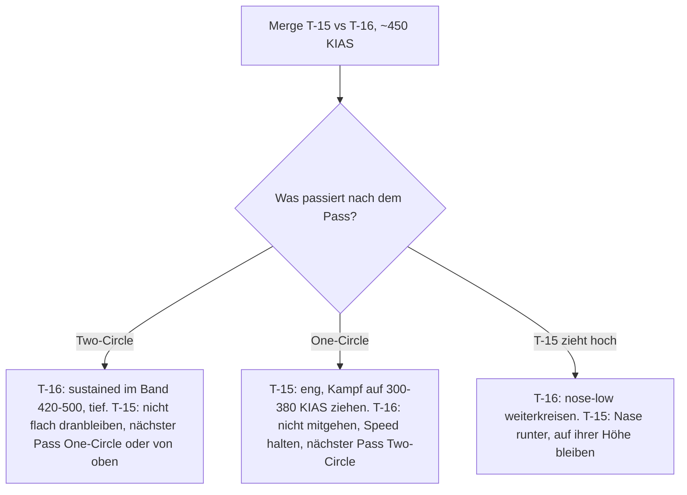

# T-15 vs. T-16

> Kraft gegen Rate: Die T-16 gewinnt genau einen Kampf – flach, tief, 420–500 KIAS. Die T-15 gewinnt, wenn sie diesen Kampf gar nicht erst stattfinden lässt.

## Was entscheidet

| | T-15 | T-16 | Quelle |
|---|---|---|---|
| Sustained bei ~450 KIAS | 15,4 °/s (7,0 G) | **17,6 °/s** (7,9 G) | gemessen |
| Max Sustained (10.000 ft) | 17 °/s @ 495 | **18 °/s** @ 470 | Diagramm |
| Max Instant (10.000 ft) | **24 °/s** @ 360 | 21 °/s @ 409 | Diagramm |
| Min Radius (10.000 ft) | **1.644 ft** | 2.099 ft | Diagramm |
| G bei gleicher Speed (≈355 KIAS) | **6,8 G** | 5,8 G | gemessen |
| Erster Turn aus 450 KIAS, nach 8 s | **146°**, danach ~286 KIAS | 141° sustained, hält ~450 KIAS | gemessen |
| 300 → 500 KIAS mit Nachbrenner | **~8,4 s** | ~11,5 s | gemessen |
| Energieverlust im vollen Zug | ~2,3-mal so hoch | **am geringsten** | gemessen |

Die T-15 ist in fast jeder Zeile vorn – langsam, schnell, vertikal. Die T-16 hat eine Waffe: 1–2 °/s mehr Sustained Rate im Band ~420–500 KIAS, das sind grob 20–40° pro Kreis und wirken nur über mehrere saubere Kreise. Den ersten Turn gewinnt die T-15 aus 450 KIAS nur um ~5°, ist danach aber ~160 KIAS langsamer. Alle Daten: [Flugzeugvergleich](/flugzeuge/vergleich).

## Wer gewinnt wo?

| Bereich / Flow | Vorteil | Warum |
|---|---|---|
| Unter ~380 KIAS, One-Circle | **T-15 klar** | ~20 % engere Kreise, mehr G bei gleicher Speed, mehr Sustained Rate. Hier ist die T-16 am schwächsten. |
| ~380–420 KIAS | Übergang | Die Sustained-Kurven kreuzen sich. |
| ~420–500 KIAS, flacher Two-Circle | **T-16** | +1–2 °/s Sustained, auf Meereshöhe am meisten (22 vs 20 °/s). |
| Über ~520 KIAS | **T-15** | Die T-16 fällt ab, die T-15 hält ihre Rate. |
| ~20.000 ft | **T-15** | T-16-Vorsprung nur 0–1 °/s; die T-15 behält Instant, Radius und das flachste Sustained-Plateau. |
| Beschleunigung, Extend mit Abstand | **T-15** | ~40 % mehr Schubüberschuss. |
| Vertikaler Two-Circle (T-15 zieht hoch, T-16 nose-low) | **T-16** | Die T-15 verliert im harten Zug Energie ~2,3-mal so schnell; die T-16 tauscht Höhe gegen Speed und bleibt in ihrem Band. |

## Als T-15

### Plan

Du bist der stärkere Jet – außer im flachen, tiefen Two-Circle bei 420–500 KIAS. Dort gibt es keine Speed, auf die du dich retten kannst: Die T-16 dreht bei 470 KIAS dauerhaft 18 °/s, du nirgends mehr als 17 °/s. Ändere also die **Art** des Kampfes, nicht nur die Speed:

1. **Langsamer One-Circle (300–380 KIAS):** dein robustestes Werkzeug. Dort ziehst du ~20 % engere Kreise und mehr G.
2. **Von oben:** Blow-Through, Höhe holen, aus überlegener Position neu angreifen. Extend funktioniert nur, wenn ihre Nase weg zeigt: Aus gleicher Position hast du nach 5 s nur ~160 ft Abstand, nach 10 s ~700 ft, aber ~75 kt mehr Speed.

Kämpf lieber hoch als tief: Auf ~20.000 ft ist ihr Vorsprung fast weg.

### Merge

Nicht um den ersten Turn kämpfen. Voll gezogen gewinnst du aus 450 KIAS nur ~5° und kommst bei ~286 KIAS heraus, während sie im Sustained-Turn ~450 hält ([Der erste Turn aus 450 KIAS](/grundlagen/neutral/der-merge#der-erste-turn-aus-450-kias-gemessen)). Besser: am Pass gegenläufig drehen und den One-Circle langsam machen, oder durchziehen und von oben kommen. Erzwingt sie Two-Circle, nutze einen Schussmoment, bleib danach aber nicht flach im Kreis – nimm am nächsten Nose-to-Nose-Pass den One-Circle. **Geht sie nose-low, geh mit, statt hochzuziehen.** Mehr: [Merge-Strategien für Ranked](/grundlagen/neutral/der-merge#merge-strategien-fur-ranked-start-450-kias), [One-Circle vs. Two-Circle](/grundlagen/neutral/one-two-circle).

### Was du vermeidest

- **Flacher Two-Circle über mehrere Kreise bei 400–500 KIAS**, am schlimmsten in Bodennähe.
- **Hochziehen gegen eine abtauchende T-16.** Nach einem Kreis ist sie unten, schnell und dreht besser; du bist oben und langsam. Nase runter, auf ihrer Höhe bleiben, den Kampf eng halten.
- **Unnötige Vollzüge.** Jede Sekunde Vollzug kostet dich rund zwei Sekunden Extend-Vorsprung.
- **Extend aus der Defensive.** Sitzt sie hinter dir, bringt dir dein Schub in den ersten Sekunden kaum Abstand. Erst [Guns Defense](/grundlagen/defensiv/guns-defense), dann Energie.

**Raketen-Lobbys:** Den ersten Fox-2-Schuss bekommst du nur mit ~5° Vorsprung, danach gehört der Two-Circle ihr – such den Schuss im One-Circle oder von oben.

## Als T-16

### Plan

Dein Kampf: **tief, flach, Two-Circle, 420–500 KIAS** (ideal ~450–470), in Lag Pursuit und sparsam geflogen. Alles andere – langsam, eng, vertikal, hoch – gehört ihr. Du hast Zeit: 8 Minuten Ranked sind bei ~16–20 s pro Kreis 24–30 Kreise. Sei am Rundenende hinten, dann gewinnst du auch nach Zeit.

### Merge

Pass eng an ihr vorbei, damit sie keinen Turning Room für einen Lead Turn hat. Dreh den ersten Turn **sustained**: 17,6 °/s, nach 8 s 141°, Speed bleibt bei ~450 KIAS. Voll ziehen bringt dieselben 141°, kostet aber ~85 KIAS ([Der erste Turn aus 450 KIAS](/grundlagen/neutral/der-merge#der-erste-turn-aus-450-kias-gemessen)). Die ~5° Rückstand nimmst du hin, sie ist danach ~160 KIAS langsamer. Fliegt sie One-Circle, geh nicht mit, sondern wähle am nächsten Pass Two-Circle. **Zieht sie hoch: nose-low weiterkreisen**, nie hinterher. Mehr: [Merge-Strategien für Ranked](/grundlagen/neutral/der-merge#merge-strategien-fur-ranked-start-450-kias).

### Was du vermeidest

- **Langsam werden.** Unter ~380 KIAS ist jede Kennzahl gegen dich. Kurve lockern, Speed zurückholen, bevor du weiter Winkel jagst.
- **One-Circle.** Ihr Kreis ist ~20 % enger.
- **Ihr in die Vertikale folgen** und **hoch kämpfen.** Sie hat ~40 % mehr Schubüberschuss; auf ~20.000 ft ist dein Vorsprung weg.
- **Gerade weglaufen.** Sie beschleunigt besser und ist schneller. Verteidige dich in der Kurve im Band: [Break Turn](/grundlagen/defensiv/break-turn), [Guns Defense](/grundlagen/defensiv/guns-defense), Speed über einen [Slice Turn](/grundlagen/defensiv/slice-turn) zurückholen.

**Raketen-Lobbys:** Im ausgeflogenen Two-Circle bist du der schneller drehende Jet, der nächste Fox-2-Schuss kommt eher von dir.

## Entscheidungshilfe

::: info IM SPIEL PRÜFEN
- **Rollrate:** Nicht gemessen, aber entscheidend dafür, wie schnell die T-15 einer abtauchenden T-16 folgen kann.
- **Ranked-Startgeometrie:** Wie viel seitlicher Versatz bleibt am Start für einen Lead Turn?
- **Timeout-Regel:** Wie entscheidet das Spiel genau, wer „Verfolger“ ist?
:::

::: tip MERKE
- T-15: nicht um den ersten Turn kämpfen, nie lange flach bei 400–500 KIAS kreisen. Langsamer One-Circle (300–380 KIAS) oder von oben.
- T-15: Geht sie nose-low, mitgehen statt hochziehen. Extend nur, wenn ihre Nase weg zeigt.
- T-16: eng passieren, erster Turn sustained, dann Two-Circle tief im Band.
- T-16: nie langsam, nie One-Circle, nie vertikal hinterher. Zieht sie hoch, nose-low weiterkreisen.
- 1–2 °/s Sustained-Vorsprung sind ~20–40° pro Kreis – das wirkt nur über mehrere saubere Kreise.
:::

Weiter: [T-15 vs. T-18](/flugzeuge/matchups/t15-vs-t18)
