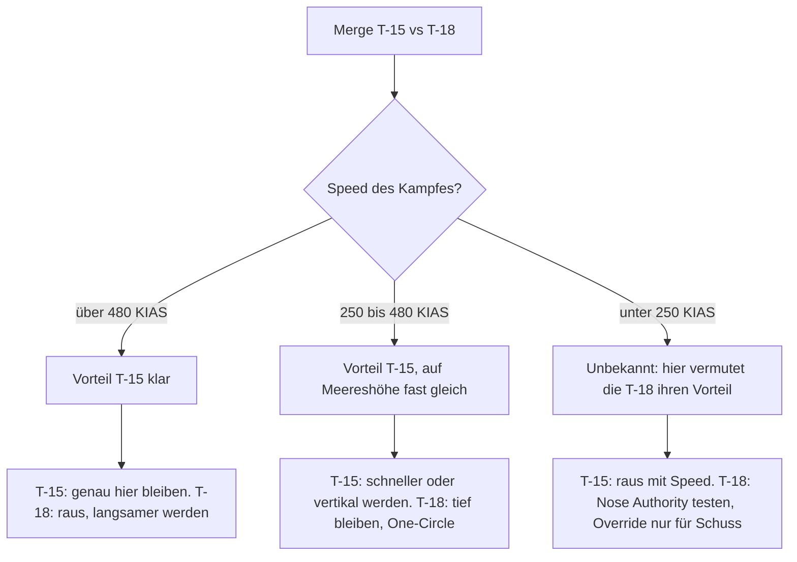

# T-15 vs. T-18

> Allrounder mit Kraft gegen Low-Speed-Brawler: In den Daten liegt die T-15 überall vorn. Die Chance der T-18 liegt dort, wo die Daten aufhören.

::: info DATENSTAND
Alle Zahlen stammen aus der Ingame-"Aircraft Performance Analysis", **Stand Dez 2025 (vor Patch v1.1)**. Seitdem geändert: v1.1 T-15 −3 % Lift, +7 % Schub, T-18 mehr Treibstoffgewicht und weniger Leergewicht; v1.4.1 T-15 Top-Speed reduziert, T-18 Top-Speed erhöht. Details: [Flugzeugvergleich](/flugzeuge/vergleich).
:::

## Die Daten im direkten Vergleich

| Wert | T-15 Excalibur | T-18 Cutlass | Vorteil |
|---|---|---|---|
| Gewicht (10.000 ft, 50 % Fuel) | 37.615 lbs | 36.597 lbs | – |
| Max Instant Rate (10.000 ft, 50 %) | **24 °/s** @ 360 KIAS | 22 °/s @ 385 KIAS | T-15 |
| Max Instant Rate (0 ft, 50 %) | **29 °/s** @ 337 | 27 °/s @ 365 | T-15 |
| Max Instant Rate (21.483 ft, 50 %) | **19 °/s** @ 383 | 17 °/s @ 426 | T-15 |
| Corner Speed (10.000 ft, 50–100 % Fuel) | **~360–385 KIAS** | ~385–409 KIAS | T-15 (niedriger) |
| Max Sustained Rate (10.000 ft, 50 %) | **17 °/s** @ 495 | 16 °/s @ 470 | T-15 (knapp) |
| Max Sustained Rate (0 ft, 50 %) | 20 °/s @ 475 | 20 °/s @ 447 | gleich |
| Max Sustained Rate (21.483 ft, 50 %) | **13 °/s** @ 405 | 12 °/s @ 405 | T-15 (knapp) |
| Max Sustained Rate (10.000 ft, 100 %) | 15 °/s @ 495 | 15 °/s @ 470 | gleich |
| Best-Sustained-Speed (Info-Karte) | ~500 KIAS | ~466 KIAS | – |
| Min Radius 0 ft | **1.138 ft** | 1.313 ft | T-15 |
| Min Radius 10.000 ft | **1.644 ft** | 1.899 ft | T-15 |
| Min Radius 21.483 ft | **2.578 ft** | 3.086 ft | T-15 |

Was du daraus mitnimmst: Beide Jets sind fast gleich schwer. Im dargestellten Bereich (ab ~170–200 KIAS) ist die T-15 bei Instant Rate und Radius **überall** vorn und bei Sustained Rate gleichauf oder knapp vorn. Das Gerücht "die T-18 hat den besten Radius" stimmt laut Tabelle nicht. Der Radius-Balken auf der Info-Karte der T-18 widerspricht der Tabelle, die Tabelle gilt.

## Wer gewinnt wo? Das Speedband-Urteil

| Bereich | Vorteil | Warum |
|---|---|---|
| Unter ~170 KIAS, AoA-Override | **unbekannt** (Design-Vorteil der T-18 vermutet) | Nicht in den Daten. Der Entwickler positioniert die T-18 als High-AoA-/Low-Speed-Jet. **Hypothese.** |
| ~170–380 KIAS | T-15 bei Instant und Radius; Sustained etwa gleich | Auf Meereshöhe liegt die T-18 zwischen 250–350 KIAS bei Sustained **minimal** vorn. |
| ~380–480 KIAS | T-15 knapp | Sustained 17 vs 16 °/s (10.000 ft), Instant und Radius weiter T-15. |
| Über ~480 KIAS | **T-15 klar** | Die T-18 fällt steil ab (Sustained 0 bei ~700 KIAS auf 10.000 ft), die T-15 hält 9 G bis ~700+ KIAS. Schlechteste Energiehaltung der T-18 bei hoher Speed. |
| One-Circle (Radius) | **T-15** (im dargestellten Bereich) | 1.644 vs 1.899 ft auf 10.000 ft. |
| Höhe | T-15 | Abstand bei Instant/Radius wächst mit der Höhe, T-15 hat das flache Plateau auf 21.000 ft. |
| Vertikal | vermutlich T-15 | Nur aus T/W-Balken abgeleitet (T-15 voll, T-18 ~95). Nicht gemessen. |

::: warning KEIN "T-18 DOMINIERT LANGSAM"
Ältere Versionen dieses Wikis behaupteten, die T-18 schlage die T-15 im langsamen Kurvenkampf. Die Daten zeigen das **nicht**: Bis hinunter zum Diagrammrand dreht die T-15 enger und schneller. Ein möglicher Vorteil der T-18 liegt **unterhalb** von ~170 KIAS und beim Ziehen über das AoA-Limit (Override, "Cobra-Button"). Das ist eine plausible Annahme aus der Entwicklerbeschreibung, keine gemessene Tatsache.
:::

## Aus dem Cockpit der T-15

### Dein Plan

Du hast den besseren Jet im gesamten gemessenen Bereich. Dein einziges Risiko ist, den Kampf dorthin zu tragen, wo niemand Daten hat: **sehr langsam, sehr hoher AoA**. Also: **Schnell bleiben, vertikal kämpfen, Energie ausspielen.** Persönliche Untergrenze als Richtwert: Lass dich nicht auf einen Kampf unter ~250 KIAS ein – es gibt keinen Grund dafür, du gewinnst auch darüber.

### Der Merge

- **Speed:** Richtwert ~380–450 KIAS (im Spiel testen). Genug Energie für die Vertikale, nah genug an deiner Corner Speed für einen harten ersten Turn. Siehe [Der Merge](/grundlagen/neutral/der-merge).
- **Lead Turn:** Du hast mehr Instant Rate (24 vs 22 °/s) und die niedrigere Corner Speed – du gewinnst den ersten Turn. Lead Turn einleiten, wenn die Sichtlinienrate deutlich steigt, grob bei einem Wenderadius seitlichem Versatz.
- **Flow:** Die T-18 wird One-Circle wollen und den Kampf langsam machen. Du musst nicht mitspielen:
  - **Two-Circle** (nach Links-an-Links beide links): Die ersten ~180° gehören dir, danach bist du bei Sustained gleich oder vorn – und kannst die Speed hoch halten. Gut für dich.
  - **One-Circle** (gegenläufig): Auch hier hast du laut Daten den kleineren Radius. Aber der One-Circle wird von selbst langsam. Nutze ihn für einen frühen Schuss; wenn keiner kommt, nimm am nächsten Pass Two-Circle oder geh aus der Ebene, bevor ihr unter ~250 KIAS seid.

### Was du vermeidest

- **Den "Phone Booth":** sehr langsame, sehr enge Kämpfe auf kurze Distanz. Dort liegt der vermutete Design-Vorteil der T-18.
- **Flat Scissors:** Die gewinnt, wer schneller verlangsamt und dabei Kontrolle behält. Genau dafür ist die T-18 gebaut (Annahme). Siehe [Scissors](/grundlagen/neutral/scissors).
- **Overshoot vor ihre Nase:** Wenn du mit viel Closure (Annäherungsgeschwindigkeit) auf eine langsame T-18 zufliegst, schießt du vorbei – und sie kann die Nase mit Override vermutlich schnell auf dich bringen. Lieber Lag Pursuit und High Yo-Yo. Siehe [Overshoot](/grundlagen/offensiv/overshoot), [Yo-Yos](/grundlagen/offensiv/yo-yos).

### So nutzt du ihre Schwäche

- **Mach den Kampf schnell.** Über ~480 KIAS kollabiert ihre Sustained Rate, deine nicht. Ein Kampf bei 480–550 KIAS ist für dich bequem und für sie teuer.
- **Geh vertikal.** Mit Speedüberschuss und Schub kannst du über ihr bleiben und aus der Höhe angreifen, statt im Kreis mit ihr zu drehen. Siehe [Vertikal-Kampf](/grundlagen/neutral/vertikal-kampf).
- **Lass sie den Override bezahlen.** Der Override kostet extrem Energie. Wenn sie ihre Nase damit auf dich reißt und nicht trifft, ist sie danach langsam und berechenbar: raus aus ihrer Nase, Abstand und Höhe nehmen, von außen neu angreifen.
- **Extend & Re-engage:** Sie kann dir bei hoher Speed nicht folgen. Du bestimmst, wann der nächste Merge stattfindet.
- **Raketen-Lobbys:** Im Two-Circle gehört der erste Fox-2-Schuss dem schneller drehenden Jet – in den ersten 180° bist das du. Im One-Circle kann sie dich dagegen unter der Mindestreichweite halten. Ein weiterer Grund, Two-Circle und Speed zu wählen.

### Wenn es schiefgeht

- **Du bist langsam geworden und sie ist nah:** Nicht im Kreis weiter verlangsamen. Ist sie nicht in Schussposition: unload (Last nahe null, volle Leistung), beschleunigen, Abstand gewinnen. Laut T/W-Balken beschleunigst du von den drei Jets am besten. Siehe [Separation](/grundlagen/defensiv/separation).
- **Sie ist hinter dir:** [Guns Defense](/grundlagen/defensiv/guns-defense). Nicht langsamer werden, solange sie tracken kann. Sobald ihre Speed weg ist: separieren.
- **Ihr steckt in einer Scissors:** Nicht versuchen, langsamer als die T-18 zu werden. Raus, sobald du einen Moment ohne Schussgefahr hast – mit Speed und am besten nach unten oder mit Lift Vector unter den Horizont, um schneller zu beschleunigen.

## Aus dem Cockpit der T-18

### Dein Plan

Die ehrliche Ausgangslage: Im gesamten Diagrammbereich ist die T-15 gleich gut oder besser als du. Du gewinnst dieses Matchup über drei Dinge:

1. **Fehler des T-15-Piloten:** Overshoots, ungeduldige Angriffe, zu langsam gewordene T-15.
2. **Tief und um 250–350 KIAS:** Dort bist du bei Sustained auf Meereshöhe minimal vorn – kein großer Vorteil, aber der einzige gemessene.
3. **Der Bereich unter dem Diagramm:** sehr langsam, hoher AoA, Override. Dort liegt vermutlich dein Design-Vorteil – **teste das, bevor du dich darauf verlässt** (Übung unten).

Dein Plan ist deshalb: **den Kampf tief und langsam machen, One-Circle, und die T-15 dazu bringen, mitzumachen.**

### Der Merge

- **Speed:** Richtwert ~380–420 KIAS (im Spiel testen), also um deine Corner Speed (10.000 ft: 385 KIAS bei 50 %, 409 KIAS bei 100 % Fuel; Meereshöhe: ~365 KIAS). Schneller bringt dir nichts.
- **Turning Room verweigern:** Sie hat die bessere Instant Rate. Pass **eng** an ihr vorbei, damit sie keinen Lead Turn bekommt.
- **Flow:** Wähle **One-Circle** – nach einem Links-an-Links-Vorbeiflug drehst du gegenläufig zu ihr. Der One-Circle ist gegen die T-15 kein Selbstläufer (sie hat laut Daten den kleineren Radius), aber er ist dein Weg in den langsamen Bereich. Zusätzlich hält er dich in Raketen-Lobbys oft unter ihrer Mindestreichweite.
- **Wenn sie Two-Circle wählt:** Die ersten 180° gewinnt sie. Bleib tief und unter ~380 KIAS, wo ihr bei Sustained etwa gleich seid, und nutze den nächsten Nose-to-Nose-Pass für One-Circle.

### Was du vermeidest

- **Schnelle Kämpfe über ~480 KIAS.** Dort ist deine Energiehaltung die schlechteste aller drei Jets.
- **Ihr in die Vertikale folgen.** Sie hat vermutlich mehr Schub-Reserve. Bleib unten, behalte Tally, sei bereit, wenn sie herunterkommt.
- **Weglaufen.** Gerade Extensions gegen eine T-15 verlierst du: Sie hat mehr Schub und laut Entwickler den höchsten Top-Speed.
- **Den Override als Dauerlösung.** Er kostet extrem Energie. Nur ziehen, wenn daraus ein Schuss wird oder er einen Schuss auf dich verhindert.

### So nutzt du ihre Schwäche

- **Mach ihr den Overshoot schmackhaft.** Eine T-15, die schnell von hinten oder oben kommt, hat viel Closure. Rechtzeitig in sie hinein drehen ([Break Turn](/grundlagen/defensiv/break-turn)), Speed abbauen, sie vorbeischießen lassen – und dann die Nase auf sie. Siehe [Overshoot](/grundlagen/offensiv/overshoot).
- **Zwing sie in den langsamen Kampf.** Viele T-15-Piloten können nicht widerstehen, "nur noch kurz" weiterzuziehen. Jeder Pass im One-Circle macht sie langsamer – dort, wo du hin willst.
- **Snapshots:** Im One-Circle kommt ihr alle ~180° nose-to-nose zusammen. Halte dort die Nase auf sie und nutze kurze Schussfenster (Funnel läuft durchs Ziel). Head-on-Guns können in der Lobby verboten sein.

### Wenn es schiefgeht

- **Sie sitzt hinter dir und ist schnell:** Nicht weglaufen. Break in sie hinein, Guns Defense, und versuch den Kampf in eine langsame Lage zu drehen, in der ihre Speed ein Nachteil wird (Overshoot-Gefahr für sie).
- **Sie macht Angriffe aus der Höhe:** Bei jedem Angriff rechtzeitig in sie hinein drehen, damit sie viel Winkel braucht. Ihre Speed nicht hinterherjagen.
- **Du bist sehr langsam, sie ist es nicht:** Du kannst ihr nicht davonfliegen. Halte die Nase so, dass sie keine Tracking-Lösung bekommt, und nutze jeden Overshoot.

## Entscheidungshilfe

## Ranked-Hinweise

- Ranked 1v1 läuft laut Berichten Guns-only. Die Rundenzeit ist 8 Minuten; läuft sie ab, gewinnt im 1v1 der **Verfolger** (seit v1.2.2).
- **T-15:** Extend & Re-engage ist dein Werkzeug, aber kein Selbstzweck. Gegen Ende der Runde willst du hinter ihr sein, nicht in einer Extension.
- **T-18:** Nur überleben reicht nicht. Wenn die T-15 dich mit Angriffen aus der Höhe beschäftigt und am Ende als Verfolger gilt, verlierst du. Du musst irgendwann einen Overshoot oder einen langsamen Pass erzwingen.

::: info IM SPIEL PRÜFEN
- **Low-Speed und AoA-Override:** Fliegt mit einem Partner in einer privaten Lobby nebeneinander bei ~200 KIAS und zieht gleichzeitig mit Override voll durch (allein: beide Jets nacheinander in Free Flight testen und die Zeit für 180° stoppen). Wer bringt die Nase schneller herum, wer bleibt steuerbar, wer verliert mehr Speed? Im Replay mit dem Specific-Energy-Graph auswerten.
- **Vertikal:** Wer kommt im Zoom aus gleicher Speed höher?
- **Beschleunigung und Top-Speed nach v1.4.1:** Kann eine T-18 einer extendenden T-15 heute folgen?
- **Post-Patch-Stand:** Die Ingame-Performance-Analyse neu ablesen (v1.1 hat beiden Jets das Gewicht bzw. den Lift verändert).
- **Timeout-Regel:** Wie entscheidet das Spiel genau, wer "Verfolger" ist?
:::

::: tip MERKE
- Im gemessenen Bereich ist die T-15 bei Instant Rate und Radius überall vorn, bei Sustained gleich oder knapp vorn.
- T-15: schnell bleiben, vertikal kämpfen, keine Kämpfe unter ~250 KIAS, keine Flat Scissors.
- T-18: tief, langsam, One-Circle, eng passieren. Overshoots provozieren, Override nur für einen Schuss.
- Der Low-Speed-Vorteil der T-18 ist eine Hypothese. Teste ihn, bevor du dein Spiel darauf baust.
:::

Weiter: [T-16 vs. T-18](/flugzeuge/matchups/t16-vs-t18)
