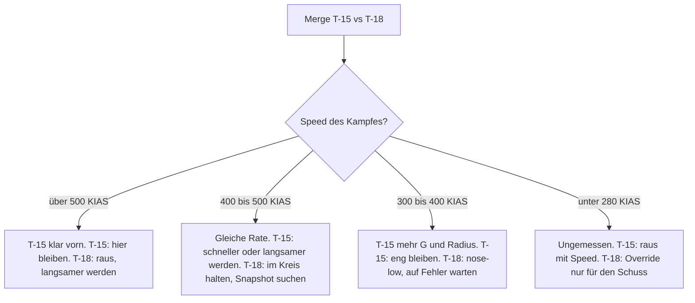

# T-15 vs. T-18

> Bei ~450 KIAS drehen beide gleich schnell: Die T-15 gewinnt, sobald sie den Kampf schneller oder langsamer macht – die T-18 lebt von ihrer Nase und den Fehlern der T-15.

## Was entscheidet

| | T-15 | T-18 | Quelle |
|---|---|---|---|
| Sustained bei ~450 KIAS | 15,4 °/s (7,0 G) | 15,6 °/s (7,0 G) | gemessen |
| G bei gleicher Speed (≈355 KIAS) | **6,8 G** | 5,7 G | gemessen |
| Max Instant (10.000 ft) | **24 °/s** @ 360 | 22 °/s @ 385 | Diagramm |
| Min Radius (10.000 ft) | **1.644 ft** | 1.899 ft | Diagramm |
| Erster Turn aus 450 KIAS, nach 8 s | **146°**, danach ~286 KIAS | ≥ ~138° mit α ~26° (geschätzt); 127° voll gezogen, ~281 KIAS | gemessen / geschätzt |
| AoA-Limiter | ~24–25° | bis 35°, Nase ~10° weiter in der Kurve | gemessen |
| Hohe Speed (10.000 ft) | Top-Speed über 885 KIAS | Einbruch ab ~510 KIAS (≈ Mach 0,9), Top-Speed ~720 | Diagramm |
| 300 → 500 KIAS mit Nachbrenner | **~8,4 s** | ~12,3 s | gemessen |

Bei ~450 KIAS ist der Rate-Kampf ausgeglichen (im Diagramm liegt die T-18 zwischen ~400 und ~470 KIAS sogar minimal vorn). Klar vorn ist die T-15 erst **über ~500 KIAS** oder **bei gleicher niedriger Speed**, wo sie mehr G zieht. Die Waffe der T-18 ist ihre Nasenautorität für Snapshots; ob sie unter ~280 KIAS oder mit Override mehr kann, ist nicht gemessen. Alle Daten: [Flugzeugvergleich](/flugzeuge/vergleich).

## Wer gewinnt wo?

| Bereich / Flow | Vorteil | Warum |
|---|---|---|
| Unter ~280 KIAS, AoA-Override | **unbekannt** | Design-Vorteil der T-18 laut Entwickler – **Hypothese**, nicht gemessen. |
| ~300–380 KIAS, One-Circle | **T-15** | Sustained etwa gleich, aber mehr G, mehr Instant Rate, kleinerer Radius. |
| ~400–500 KIAS, Two-Circle | **gleich** | Gleiche Sustained Rate. In Lag Pursuit fliegt die T-15 den größeren Kreis außen und fällt zurück. |
| Über ~500 KIAS | **T-15 klar** | Die T-18 bricht ab ~510 KIAS ein, die T-15 nicht. |
| ~20.000 ft | **T-15** | Mach 0,9 liegt dort schon bei ~450 KIAS – die T-18 bricht früher ein, die T-15 hält das flachste Plateau. |
| Beschleunigung, Vertikale | **T-15 klar** | ~1,4 vs ~0,95 × Gewicht Schubüberschuss; die T-18 hat fast doppelt so viel Widerstand. |
| Nose-to-Nose-Pass, nah | **T-18** | Mit α bis 35° kommt ihre Nase weiter herum – Snapshot-Gefahr. |

## Als T-15

### Plan

**Kein Lag-Kreisen bei ~450 KIAS** – dort dreht sie gleich schnell. Entscheide dich:

1. **Schnell:** über ~500 KIAS, vertikal, High Yo-Yo, Angriffe von oben. Über ~510 KIAS kann sie dir nicht folgen.
2. **Langsam bei mehr G:** One-Circle bei ~300–380 KIAS. Dort ziehst du bei gleicher Speed deutlich mehr G. Geh aber nicht unter ~280 KIAS – dort hat niemand Daten, und dort vermutet die T-18 ihren Vorteil.

Behalte immer ihre Nase im Blick.

### Merge

Im Two-Circle voll ziehen: Den ersten Turn gewinnst du aus 450 KIAS knapp – ~8° nach 8 s gegen eine sauber geflogene T-18, ~19°, wenn sie auf 35° überzieht ([Der erste Turn aus 450 KIAS](/grundlagen/neutral/der-merge#der-erste-turn-aus-450-kias-gemessen)). Danach bist du bei ~286 KIAS: Entweder du bleibst langsam und eng, wo du mehr G ziehst, oder du holst Speed für den schnellen Kampf. Im One-Circle hast du den kleineren Radius; nutze ihn für einen frühen Schuss, aber erwarte am Nose-to-Nose-Pass ihren Snapshot. Mehr: [Merge-Strategien für Ranked](/grundlagen/neutral/der-merge#merge-strategien-fur-ranked-start-450-kias), [One-Circle vs. Two-Circle](/grundlagen/neutral/one-two-circle).

### Was du vermeidest

- **Lag-Kreisen bei ~450 KIAS.** Gleiche Rate, und ihre Nase kommt weiter herum.
- **Phone Booth und Flat Scissors unter ~280 KIAS.** Ungetesteter Bereich, vermutlich ihrer. Siehe [Scissors](/grundlagen/neutral/scissors).
- **Overshoot vor ihre Nase.** Mit viel Closure auf eine langsame T-18 zu fliegen, endet in ihrem Snapshot. Lieber Lag und [High Yo-Yo](/grundlagen/offensiv/yo-yos).
- **Extend aus der Defensive.** Aus gleicher Position hast du nach 5 s nur ~230 ft Abstand, nach 10 s ~900 ft (bei ~95 kt mehr Speed). Extend nur, wenn ihre Nase weg zeigt. Siehe [Separation](/grundlagen/defensiv/separation).

**Raketen-Lobbys:** Den ersten Fox-2-Schuss im Two-Circle hast du; im One-Circle kann sie dich unter der Mindestreichweite halten – ein Grund mehr für Speed.

## Als T-18

### Plan

Die schwerste Paarung für dich: Die T-15 zieht bei gleicher Speed mehr G und gewinnt den ersten Turn. Du gewinnst über drei Dinge:

1. **Deine Nase:** α bis 35° bringt sie ~10° weiter in die Kurve – für Snapshots am Pass.
2. **Ihre Fehler:** Overshoots, unnötige Vollzüge, Lag-Kreisen bei ~450 KIAS. Bleibt sie dort im Kreis, ist das dein bester Fall.
3. **Den langsamen Bereich:** nach dem Merge nose-low, One-Circle von unten, Kampf langsam machen. Ob du unter ~280 KIAS und mit Override wirklich vorn bist, ist ungetestet.

Ranked: Nur überleben reicht nicht. Wer bei Zeitablauf hinten ist, gewinnt – erzwinge rechtzeitig einen langsamen Pass.

### Merge

Pass eng, damit sie keinen Turning Room hat. Dreh den ersten Turn mit **α ~26°**, nicht mit 35°: Voll durchgezogen kommst du nach 8 s nur auf 127°, liegst ~19° hinten und verlierst ~170 KIAS ([Der erste Turn aus 450 KIAS](/grundlagen/neutral/der-merge#der-erste-turn-aus-450-kias-gemessen)). Danach nose-low, One-Circle, sehr langsam. Die 35° und den Override hebst du für den Snapshot auf. Mehr: [Merge-Strategien für Ranked](/grundlagen/neutral/der-merge#merge-strategien-fur-ranked-start-450-kias).

### Was du vermeidest

- **Alles über ~480–510 KIAS.** Dort brichst du ein, sie nicht.
- **Ihr in die Vertikale folgen oder weglaufen.** Sie beschleunigt deutlich besser und ist viel schneller.
- **35° oder Override zum Kurven.** Über α ~26° ziehst du weniger G und verlierst extrem viel Energie. Nur für einen Schuss oder gegen einen Schuss auf dich.

**Raketen-Lobbys:** Im One-Circle hältst du sie oft unter der Mindestreichweite; im Two-Circle gehört der erste Fox-2-Schuss ihr.

## Entscheidungshilfe

::: info IM SPIEL PRÜFEN
- **Unter ~280 KIAS und mit Override:** Hat die T-18 dort wirklich einen Vorteil? Nebeneinander bei ~250 KIAS gleichzeitig voll ziehen, Zeit für 180° und Speedverlust im Replay vergleichen.
- **Erster Turn der T-18 mit α ~26°:** Die ≥ ~138° sind geschätzt, eine eigene Messung fehlt.
- **Extend gegen Gun-Reichweite:** Ab welchem Abstand ist eine extendende T-15 aus der Gun-Reichweite einer folgenden T-18?
:::

::: tip MERKE
- T-15: kein Lag-Kreisen bei ~450 KIAS. Schnell (über ~500 KIAS, vertikal) oder langsam bei mehr G – aber nicht unter ~280 KIAS.
- T-15: kein Overshoot vor ihre Nase, kein Extend aus der Defensive.
- T-18: erster Turn mit α ~26°, dann nose-low, One-Circle von unten, langsam.
- T-18: 35° und Override nur für den Snapshot. Nie über ~500 KIAS, nie hinterher in die Vertikale.
- Der Low-Speed-Vorteil der T-18 ist eine Hypothese. Teste ihn, bevor du dein Spiel darauf baust.
:::

Weiter: [T-16 vs. T-18](/flugzeuge/matchups/t16-vs-t18)
