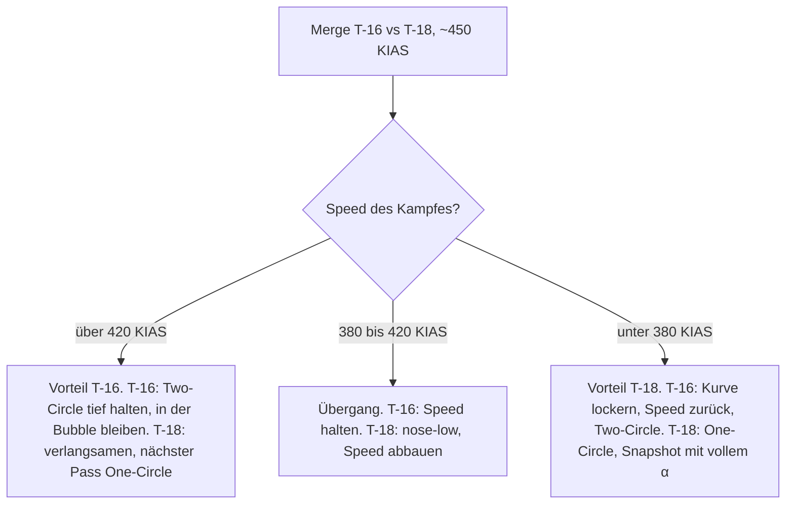

# T-16 vs. T-18

> Rate gegen Nase: Bleibt der Kampf schnell und die T-16 in der Bubble – außerhalb des Kurvenkreises der T-18 –, gewinnt die T-16 – wird er langsam und nah, gewinnt die T-18.

## Was entscheidet

| | T-16 | T-18 | Quelle |
|---|---|---|---|
| Sustained bei ~450 KIAS | **17,6 °/s** (7,9 G) | 15,6 °/s (7,0 G) | gemessen |
| Max Sustained (10.000 ft) | **18 °/s** @ 470 | 16 °/s @ 470 | Diagramm |
| Max Instant (10.000 ft) | 21 °/s @ 409 | **22 °/s** @ 385 | Diagramm |
| Min Radius (10.000 ft) | 2.099 ft | **1.899 ft** | Diagramm |
| Erster Turn aus 450 KIAS, nach 8 s | 141° sustained, hält ~450 KIAS | ≥ ~138° mit α ~26° (geschätzt); 127° voll gezogen, ~281 KIAS | gemessen / geschätzt |
| AoA-Limiter | ~23° | bis 35°, Nase ~10° weiter in der Kurve | gemessen |
| Speedverlust im Leerlauf bei ~450 KIAS | ~5 kt/s | ~9 kt/s | gemessen |
| 300 → 500 KIAS mit Nachbrenner | ~11,5 s | ~12,3 s | gemessen |
| Hohe Speed (10.000 ft) | Top-Speed ~835 KIAS | Einbruch ab ~510 KIAS (≈ Mach 0,9), Top-Speed ~720 | Diagramm |

Hier entscheidet fast nur die Speed. Die T-16 hat den größten Sustained-Vorsprung aller Paarungen: 2 °/s, grob 30–40° pro Kreis – solange beide im Band fliegen. Die T-18 hat den ~10 % kleineren Radius, die niedrigere Corner Speed und die bessere Nase; mit fast doppelt so viel Widerstand wird sie schnell langsam und damit schnell eng. Alle Daten: [Flugzeugvergleich](/flugzeuge/vergleich).

## Wer gewinnt wo?

| Bereich / Flow | Vorteil | Warum |
|---|---|---|
| Unter ~380 KIAS, One-Circle | **T-18** | Kleinerer Radius, mehr Instant und Sustained Rate. Langsam ist die T-16 der schwächste Jet. |
| ~380–420 KIAS | Übergang | Die Sustained-Kurven kreuzen sich. |
| ~420–500 KIAS, Two-Circle | **T-16** | +2 °/s Sustained, gemessen 17,6 vs 15,6 °/s. |
| Über ~480–510 KIAS | **T-16 klar** | Die T-18 bricht ab ~510 KIAS ein. |
| Erster Turn aus 450 KIAS | etwa gleich | T-18 mit α ~26° gleichauf; voll auf 35° gezogen verliert sie ~14°. |
| Nah, nose-to-nose | **T-18** | Mit α bis 35° kommt ihre Nase weiter herum – Snapshot-Gefahr. |
| Unter ~280 KIAS, AoA-Override | vermutlich T-18 | Design-Vorteil laut Entwickler – **Hypothese**, nicht gemessen. |
| Höhe | beide wollen tief | Auf ~20.000 ft schrumpft der Sustained-Vorsprung der T-16 auf 0–1 °/s; die T-18 bricht dort schon bei ~450 KIAS ein. |

## Als T-16

### Plan

**Schnell, tief, Two-Circle, 420–500 KIAS** (ideal ~450–470), in Lag Pursuit und sparsam geflogen. Die T-18 will den Kampf langsam und nah machen – deine Aufgabe ist, dass er schnell bleibt und du **in der [Bubble](/grundlagen/begriffe#bubble)** bleibst: außerhalb ihres Kurvenkreises, ohne direkt auf sie zuzuziehen. Du hast Zeit: 8 Minuten Ranked sind bei ~16–20 s pro Kreis 24–30 Kreise. Sei am Rundenende hinten.

### Merge

Pass eng, damit sie keinen Turning Room hat. Dreh den ersten Turn **sustained**: nach 8 s 141°, Speed bleibt bei ~450 KIAS. Eine T-18 mit α ~26° ist etwa gleichauf; zieht sie voll durch, liegt sie ~14° hinten und ist bei ~281 KIAS ([Der erste Turn aus 450 KIAS](/grundlagen/neutral/der-merge#der-erste-turn-aus-450-kias-gemessen)). Voll ziehen bringt dir keinen Winkel, kostet aber ~85 KIAS. Danach Two-Circle im Band. Fliegt sie One-Circle oder taucht nose-low ab, geh nicht mit – am nächsten Pass Two-Circle und Speed halten. Mehr: [Merge-Strategien für Ranked](/grundlagen/neutral/der-merge#merge-strategien-fur-ranked-start-450-kias), [One-Circle vs. Two-Circle](/grundlagen/neutral/one-two-circle).

### Was du vermeidest

- **Langsam werden und One-Circle.** Unter ~380 KIAS ist jede Kennzahl gegen dich.
- **Die Bubble verlassen.** Mit viel Closure in ihren Kreis hinein landest du vor ihrer Nase. Dann reicht ihr ein kurzer Zug auf 35° für den [Snapshot](/grundlagen/begriffe#snapshot). Lieber Lag und [High Yo-Yo](/grundlagen/offensiv/yo-yos); schieß nur, wenn du danach nicht vor ihre Nase rutschst.
- **Flat Scissors.** Die gewinnt, wer schneller langsam wird – sie. Siehe [Scissors](/grundlagen/neutral/scissors).
- **Gerader Extend aus der Defensive.** Bis ~500 KIAS beschleunigt ihr fast gleich. Erst darüber fällt sie zurück. Verteidige dich zuerst mit [Guns Defense](/grundlagen/defensiv/guns-defense).

**Raketen-Lobbys:** Im ausgeflogenen Two-Circle bist du der schneller drehende Jet, der Fox-2-Schuss gehört eher dir; im One-Circle hält sie dich unter der Mindestreichweite.

## Als T-18

### Plan

**Langsam, tief, One-Circle, unter ~380 KIAS.** Dort hast du Radius, Instant und Sustained Rate, und deine Nase zählt am meisten. Die T-16 will dich schnell halten; deine Aufgabe ist, den Kampf herunterzuziehen. Dein hoher Widerstand hilft dabei: Gas raus, und du wirst schnell langsam. Ranked: Eine T-16, die immer wieder neu ansetzt, lässt die Uhr laufen – erzwinge rechtzeitig einen langsamen Pass.

### Merge

Dreh den ersten Turn mit **α ~26°**, nicht mit 35°: Dann seid ihr etwa gleichauf. Voll durchgezogen kommst du nur auf 127°, liegst ~14° hinten und verlierst ~170 KIAS ([Der erste Turn aus 450 KIAS](/grundlagen/neutral/der-merge#der-erste-turn-aus-450-kias-gemessen)). Danach sofort **nose-low** – die Schwerkraft hilft dir beim Drehen –, One-Circle von unten, Kampf langsam machen. Am Nose-to-Nose-Pass ziehst du voll auf 35° für den Snapshot und lässt danach sofort nach. Mehr: [Merge-Strategien für Ranked](/grundlagen/neutral/der-merge#merge-strategien-fur-ranked-start-450-kias).

### Was du vermeidest

- **Schneller Two-Circle über ~420 KIAS.** Dort verlierst du grob 30–40° pro Kreis.
- **Alles über ~480–510 KIAS.** Deine Energiehaltung bricht ein.
- **Ihr bei Speed hinterherjagen.** Extendet sie, lass sie gehen, behalte Tally und bereite den nächsten Merge vor.
- **35° oder Override zum Kurven.** Über α ~26° ziehst du weniger G und verlierst extrem viel Energie. Nur für einen Schuss oder gegen einen Schuss auf dich.

**Raketen-Lobbys:** Zieh den Kampf in den One-Circle – dort hältst du sie oft unter der Mindestreichweite, im Two-Circle gehört der Fox-2-Schuss eher ihr.

## Entscheidungshilfe

::: info IM SPIEL PRÜFEN
- **Erster Turn der T-18 mit α ~26°:** Die ≥ ~138° sind geschätzt, eine eigene Messung fehlt.
- **Unter ~280 KIAS und mit Override:** Wie groß ist der Vorteil der T-18 dort wirklich?
- **Gun-Reichweite:** Wie weit muss die T-16 außerhalb ihres Kreises bleiben, um vor dem Snapshot sicher zu sein?
:::

::: tip MERKE
- T-16: eng passieren, erster Turn sustained, dann Two-Circle tief bei 420–500 KIAS.
- T-16: in der Bubble bleiben (außerhalb ihres Kurvenkreises), nie mit ihr langsam werden, keine Flat Scissors.
- T-18: erster Turn mit α ~26°, dann nose-low, One-Circle, Kampf unter ~380 KIAS ziehen.
- T-18: 35° nur für den Snapshot am Pass. Nie schnell kämpfen.
- 2 °/s Sustained-Vorsprung der T-16 sind ~30–40° pro Kreis – aber nur, wenn die T-18 mitspielt.
:::

Weiter: [Team-Taktik](/flugzeuge/team)
