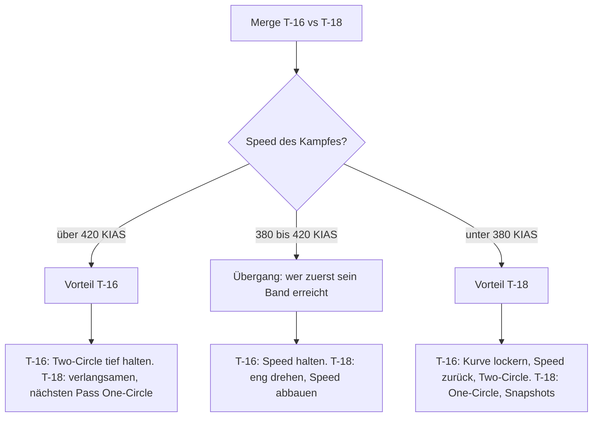

# T-16 vs. T-18

> Rate-Spezialist gegen Low-Speed-Brawler: Hier entscheidet fast nur die Speed. Über ~420 KIAS gewinnt die T-16, unter ~380 KIAS die T-18.

::: info DATENSTAND
Alle Zahlen stammen aus der Ingame-"Aircraft Performance Analysis", **Stand Okt 2026**. Die Werte der T-18 sind Zahl für Zahl dieselben wie in den Screenshots von Dez 2025. Die T-16 ist durch −20 % Treibstoffgewicht (v1.4.1) etwas leichter und minimal besser geworden; die Grundaussagen dieses Matchups bleiben. Details: [Flugzeugvergleich](/flugzeuge/vergleich).
:::

## Die Daten im direkten Vergleich

| Wert | T-16 Falchion | T-18 Cutlass | Vorteil |
|---|---|---|---|
| Gewicht (10.000 ft, 50 % Fuel) | 24.417 lbs | 36.597 lbs | – |
| Max Instant Rate (10.000 ft, 50 %) | 21 °/s @ 409 KIAS | **22 °/s** @ 385 KIAS | T-18 (knapp) |
| Max Instant Rate (0 ft, 50 %) | 26 °/s @ 378 | **27 °/s** @ 365 | T-18 (knapp) |
| Max Instant Rate (20.190 ft, 49 %) | 18 °/s @ 434 | 18 °/s @ 412 | gleich |
| Corner Speed (10.000 ft, 50–100 % Fuel) | ~409–421 KIAS | **~385–409 KIAS** | T-18 (niedriger) |
| Max Sustained Rate (10.000 ft, 50 %) | **18 °/s** @ 470 | 16 °/s @ 470 | T-16 |
| Max Sustained Rate (0 ft, 50 %) | **22 °/s** @ 447 | 20 °/s @ 447 | T-16 |
| Max Sustained Rate (20.190 ft, 49 %) | **14 °/s** @ 423 | 13 °/s @ 423 | T-16 (knapp) |
| Max Sustained Rate (10.000 ft, 100 %) | **16 °/s** @ 470 | 15 °/s @ 470 | T-16 (knapp) |
| Best-Sustained-Speed (Info-Karte) | ~466 KIAS | ~466 KIAS | – |
| Min Radius 0 ft | 1.428 ft | **1.313 ft** | T-18 |
| Min Radius 10.000 ft | 2.099 ft | **1.899 ft** | T-18 |
| Min Radius 20.190 ft | 3.073 ft | **2.816 ft** | T-18 |

Was du daraus mitnimmst: Das ist das klarste Matchup der drei. Die T-16 hat den deutlichsten Sustained-Vorsprung aller Paarungen (2 °/s auf 10.000 ft **und** auf Meereshöhe). Die T-18 hat den kleineren Radius (~10 % auf 10.000 ft, ~8 % auf Meereshöhe), die niedrigere Corner Speed und etwas mehr Instant Rate – die nützt ihr aber nur nahe Corner Speed mit 9 G. Aus 450 KIAS (Ranked-Start) sind beide im ersten Turn etwa gleichauf, wenn die T-18 α bei ~26° hält; zieht sie voll auf 35° durch, verliert sie ihn ([Der erste Turn aus 450 KIAS](/grundlagen/neutral/der-merge#der-erste-turn-aus-450-kias-gemessen)). Begriffe: [Kurvenphysik](/grundlagen/kurvenphysik), [Begriffe](/grundlagen/begriffe).

## Wer gewinnt wo? Das Speedband-Urteil

| Bereich | Vorteil | Warum |
|---|---|---|
| Unter ~380 KIAS | **T-18** | Kleinerer Radius, mehr Instant Rate, mehr Sustained Rate. Die T-16 ist hier der schwächste Jet. |
| ~380–420 KIAS | Übergang | Die Sustained-Kurven kreuzen sich. |
| ~420–480 KIAS | **T-16** | Sustained-Vorsprung ~2 °/s – Two-Circle-Territorium. |
| Über ~480 KIAS | **T-16 klar** | Die Energiehaltung der T-18 kollabiert (Sustained 0 bei ~720 KIAS auf 10.000 ft), die T-16 hält länger durch (Sustained 0 bei ~835 KIAS). |
| One-Circle | **T-18** | Radius-Kampf, und er wird von selbst langsam. |
| Two-Circle | **T-16** | Rate-Kampf. Aus 450 KIAS ist der erste Turn etwa gleichauf (T-16 141°, T-18 mit α ~26° geschätzt ≥138° nach 8 s; voll auf 35° gezogen nur 127°), danach zählt Sustained. |
| Unter ~170 KIAS, AoA-Override | vermutlich T-18 | Nicht in den Daten. **Hypothese** aus der Entwicklerbeschreibung. |
| Höhe | beide wollen tief | Der T-16-Vorsprung in Sustained bleibt auf Meereshöhe bei 2 °/s, der Radius-Vorteil der T-18 liegt in allen Höhen bei ~8–10 %. Auf ~20.000 ft schrumpft alles (Sustained 14 vs 13 °/s, Instant gleich). |

### Wie viel Winkel ist "2 °/s"?

Rechnung: Bei 18 °/s dauert ein Vollkreis 360 / 18 = 20 s, bei 22 °/s (Meereshöhe) etwa 16 s. 2 °/s Vorsprung sind damit **grob 30–40° pro Kreis**. Das gilt aber nur, solange **beide** im Sustained-Band fliegen. Eine T-18, die langsam und eng wird, spielt einen anderen Kampf – dann gilt diese Rechnung nicht mehr.

## Aus dem Cockpit der T-16

### Dein Plan

**Schnell, tief, Two-Circle, 420–480 KIAS.** Dort hast du den größten Sustained-Vorsprung des ganzen Spiels gegen einen anderen Jet. Die T-18 will den Kampf langsam machen – deine Aufgabe ist, dass **dein** Kampf schnell bleibt, egal was sie tut.

### Der Merge

- **Speed:** Richtwert ~430–470 KIAS (im Spiel testen) – zwischen deiner Corner Speed und deiner Best-Sustained-Speed. Siehe [Der Merge](/grundlagen/neutral/der-merge).
- **Turning Room verweigern:** Sie hat die niedrigere Corner Speed und laut Diagramm etwas mehr Instant Rate – das zählt, wenn sie nahe Corner Speed in den Merge kommt. Pass **eng** an ihr vorbei, damit sie keinen Lead Turn bekommt.
- **Flow:** Two-Circle – nach einem Links-an-Links-Vorbeiflug drehst du links, zu ihrem Heck. Aus 450 KIAS verlierst du den ersten Turn nicht: Mit deiner Sustained-Kurve (17,6 °/s) bist du nach 8 s bei 141° und hältst ~450 KIAS. Eine T-18, die α bei ~26° hält, ist etwa gleichauf (geschätzt ≥138°), zieht sie voll auf 35° durch, liegt sie hinten (127°) und ist bei ~280 KIAS. Voll ziehen bringt dir in 8 s keinen zusätzlichen Winkel (ebenfalls 141°), kostet aber ~85 KIAS. Also nicht nachjagen, sondern sofort in deine Sustained-Kurve im Band. Kommt sie nahe ihrer Corner Speed (~385–409 KIAS) mit gutem Lead Turn, kann der erste halbe Kreis an sie gehen (Diagramm: 22 vs 21 °/s; nicht gemessen). Mehr: [One-Circle vs. Two-Circle](/grundlagen/neutral/one-two-circle).
- **Wenn sie One-Circle fliegt:** Nicht mitgehen. Am nächsten Nose-to-Nose-Pass ist der Flow wieder offen – wähle Two-Circle und halte deine Speed.

### Was du vermeidest

- **Langsam werden.** Unter ~380 KIAS ist jede Kennzahl gegen dich.
- **One-Circle.** Radius-Kampf, und der wird langsam. Doppelt falsch für dich.
- **Flat Scissors.** Die gewinnt, wer schneller verlangsamt und Kontrolle behält – das ist der Kampf, für den die T-18 gebaut ist. Siehe [Scissors](/grundlagen/neutral/scissors).
- **Zu nah an eine langsame T-18 heranfliegen.** Mit hoher Closure (Annäherungsgeschwindigkeit) schießt du vorbei und landest vor ihrer Nase. Siehe [Overshoot](/grundlagen/offensiv/overshoot).

### So nutzt du ihre Schwäche

- **Halte den Kampf schnell.** Je länger ihr über ~420 KIAS dreht, desto mehr Winkel gewinnst du – und über ~480 KIAS bricht ihre Energiehaltung ein.
- **Lass sie langsam werden, aber werd es nicht mit.** Wenn sie bremst, um eng zu drehen, bleib im Band und **außerhalb** ihres engen Kreises. Arbeite mit Lag Pursuit und [High Yo-Yo](/grundlagen/offensiv/yo-yos), statt direkt auf sie zuzuziehen. Schieß aus einer Position, in der du nach dem Schuss nicht vor ihre Nase rutschst.
- **Raketen-Lobbys:** Im ausgeflogenen Two-Circle bist du der schneller drehende Jet (der erste Turn aus 450 KIAS ist etwa gleichauf). Damit gehört der Fox-2-Schuss (IR-Rakete) eher dir. Im One-Circle kann sie dich unter der Mindestreichweite halten – ein weiterer Grund, Two-Circle zu fliegen.

### Wenn es schiefgeht

- **Du bist in einem langsamen One-Circle gelandet:** Nicht weiter verlangsamen, um mitzuhalten. Ist sie nicht in Schussposition: Kurve lockern, unload, Speed zurück ins Band holen, beim nächsten Pass Two-Circle. Siehe [Separation](/grundlagen/defensiv/separation).
- **Sie sitzt hinter dir:** [Guns Defense](/grundlagen/defensiv/guns-defense), nicht verlangsamen. Ist sie langsam und du schnell, kannst du dich durch Speed absetzen – bei hoher Speed kann sie schlecht folgen. Beim Top-Speed bist du klar vorn (10.000 ft: ~835 vs ~720 KIAS); wie schnell du dich in einem geraden Extend absetzt, ist noch nicht gemessen (siehe unten).
- **Ihr steckt in einer Scissors:** Raus mit Speed, sobald kein Schuss auf dich droht. Langsamer werden als die T-18 gewinnst du nicht.

## Aus dem Cockpit der T-18

### Dein Plan

**Langsam, tief, One-Circle, unter ~380 KIAS.** Dort hast du Radius, Instant und Sustained auf deiner Seite – und je langsamer es wird, desto mehr kommt vermutlich dein High-AoA-Design zum Tragen. Die T-16 will dich schnell halten. Deine Aufgabe ist, den Kampf herunterzuziehen.

### Der Merge

- **Speed:** Richtwert ~380–420 KIAS (im Spiel testen), also um deine Corner Speed (10.000 ft: 385 KIAS bei 50 %, 409 KIAS bei 100 % Fuel; Meereshöhe: ~365 KIAS).
- **Lead Turn:** Laut Diagramm hast du die niedrigere Corner Speed und mehr Instant Rate (22 vs 21 °/s, auf Meereshöhe 27 vs 26 °/s). Das wirkt aber nur, wenn du nahe deiner Corner Speed in den Merge kommst: Aus 450 KIAS (Ranked-Start) dauert der G-Aufbau 2–3 s, und du erreichst nur 8,7 G. Hältst du α bei ~26°, bist du nach 8 s etwa gleichauf mit ihrer Sustained-Kurve (geschätzt ≥138 vs 141°). Ziehst du voll auf 35° durch, verlierst du den ersten Turn (gemessen 127°) und ~170 KIAS. Lead Turn einleiten, wenn die Sichtlinienrate zur T-16 deutlich steigt, grob bei einem Wenderadius seitlichem Versatz (bei deiner Merge-Speed auf 10.000 ft grob 1.900–2.400 ft).
- **Flow:** **One-Circle** – nach einem Links-an-Links-Vorbeiflug drehst du gegenläufig zu ihr. Zieh den Kreis eng und lass die Speed absinken, Ziel grob 300–350 KIAS (Richtwert, im Spiel testen). Die T-16 muss dann entweder mit langsam werden (gut für dich) oder einen großen Kreis fliegen (auch gut für dich).
- **Wenn sie Two-Circle wählt:** Flieg den ersten Turn mit α ~26°, nicht Knüppel voll – dann seid ihr aus 450 KIAS etwa gleichauf. Voll auf 35° durchgezogen kommst du gemessen nur auf 127° (kaum mehr als deine Sustained-Kurve mit 125°), liegst ~14° hinten und verlierst ~170 KIAS, denn über α ~26° ziehst du weniger G. Danach gewinnt sie über Sustained. Mach den Kampf deshalb langsam – am nächsten Pass One-Circle oder nose-low – und nutze deine Nase (α bis 35°) für Snapshots. Nicht in einen langen, schnellen Two-Circle mit ihr einsteigen.

### Was du vermeidest

- **Schnelle Two-Circle-Kämpfe über ~420 KIAS.** Dort verlierst du grob 30–40° pro Kreis.
- **Alles über ~480 KIAS.** Deine Energiehaltung bricht ein.
- **Ihr bei Speed hinterherjagen.** Wenn sie extendet, um neu anzusetzen: Lass sie gehen, behalte Tally, bereite den nächsten Merge vor.
- **Den Override als Dauerlösung.** Er kostet extrem Energie. Nur ziehen, wenn daraus ein Schuss wird oder er einen Schuss auf dich verhindert.

### So nutzt du ihre Schwäche

- **Mach sie langsam.** Unter ~380 KIAS ist die T-16 der schwächste Jet im Spiel. Jeder Pass im One-Circle kostet sie Speed, und sie gewinnt sie schlecht zurück.
- **Provozier den Overshoot.** Eine T-16, die schnell bleibt und dich von außen angreift, hat viel Closure. Rechtzeitig in sie hinein drehen ([Break Turn](/grundlagen/defensiv/break-turn)), sie vorbeischießen lassen und dann die Nase auf sie bringen.
- **Snapshots am Pass:** Im One-Circle trefft ihr euch alle ~180° nose-to-nose. Dort hast du dank Radius und Nasenautorität (α bis 35°, Nase ~10° weiter in der Kurve als bei ihr) oft die Nase zuerst auf ihr – voll ziehen nur für den Snapshot, danach sofort nachlassen. Head-on-Guns können in der Lobby verboten sein.

### Wenn es schiefgeht

- **Sie hat dich in einen schnellen Two-Circle gezogen und gewinnt Winkel:** Nicht versuchen, ihre Sustained Rate zu überbieten. Den Kampf verlangsamen und in eine Lage drehen, in der sie überschießt – oder am nächsten Pass auf One-Circle umstellen.
- **Sie sitzt hinter dir:** Break in sie hinein, Guns Defense, und den Kampf langsam machen. Dort kann sie nicht mit dir drehen. Gerade weglaufen ist bei hoher Speed deine schwächste Option.
- **Du bist zu schnell geworden:** Gas raus und mit Last die Speed abbauen, bevor du wieder auf sie eindrehst – aber nicht in einer Lage, in der sie gerade schießen kann.

## Entscheidungshilfe

## Ranked-Hinweise

- Ranked 1v1 läuft laut Berichten Guns-only. Die Rundenzeit ist 8 Minuten; läuft sie ab, gewinnt im 1v1 der **Verfolger** (seit v1.2.2).
- Dieses Matchup kann zu einem langen Hin und Her werden: Die T-16 zieht den Kampf schnell, die T-18 langsam. Wer sich am Ende der Runde nicht durchgesetzt hat, sollte zumindest **hinten** sein.
- **T-16:** 8 Minuten sind bei ~16–20 s pro Kreis rund 24–30 Kreise. Du hast Zeit, wenn du im Band bleibst.
- **T-18:** Eine T-16, die immer wieder extendet und neu ansetzt, kann die Uhr herunterlaufen lassen. Erzwinge rechtzeitig einen langsamen Pass.

::: info IM SPIEL PRÜFEN
- **Low-Speed und AoA-Override:** Wie groß ist der Vorteil der T-18 unter ~170 KIAS wirklich? Test in einer privaten Lobby: nebeneinander bei ~200 KIAS, gleichzeitig mit Override durchziehen, Nase-Drehung und Speedverlust im Replay vergleichen.
- **Gerader Extend in der Praxis:** Gemessen (10.000 ft, voller Tank) sind beide fast gleich stark: unter ~370 KIAS beschleunigt die T-18 minimal besser, darüber die T-16 (300 → 500 KIAS ~11,5 vs ~12,3 s). Die T-18 hat zwar mehr Schub (T/W-Balken stimmt), aber fast doppelt so viel Widerstand. Ab Mach 0,9 (10.000 ft: ~510 KIAS) bricht die T-18 ein, Top-Speed ~720 vs ~835 KIAS. Offen: wie das im echten Extend mit Abstand und Gun-Reichweite aussieht.
- **Vertikal:** Beide gelten als schwächer als die T-15. Wer von beiden ist vertikal besser?
- **Timeout-Regel:** Wie entscheidet das Spiel genau, wer "Verfolger" ist?
:::

::: tip MERKE
- Speed entscheidet: über ~420 KIAS T-16, unter ~380 KIAS T-18, über ~480 KIAS bricht die T-18 ein.
- T-16: eng passieren, Two-Circle, tief, im Band bleiben. Nie mit verlangsamen, keine Flat Scissors.
- T-18: um Corner Speed mergen, Lead Turn, erster Turn mit α ~26° (aus 450 KIAS dann etwa gleichauf, voll durchgezogen verloren), One-Circle, Kampf auf ~300–350 KIAS herunterziehen. Nie schnell kämpfen.
- 2 °/s Sustained-Vorsprung der T-16 sind ~30–40° pro Kreis – aber nur, wenn die T-18 mitspielt.
:::

Weiter: [Team-Taktik](/flugzeuge/team)
