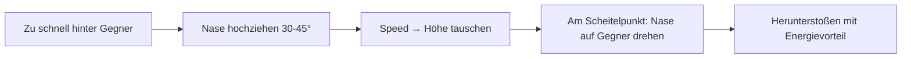
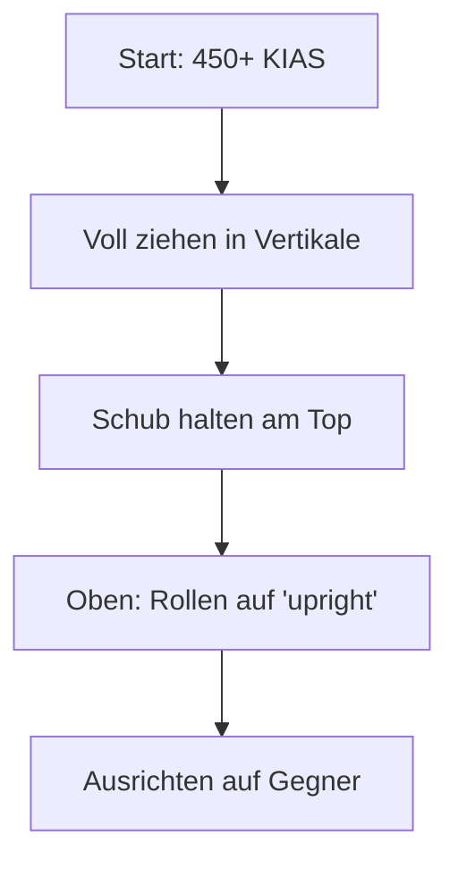
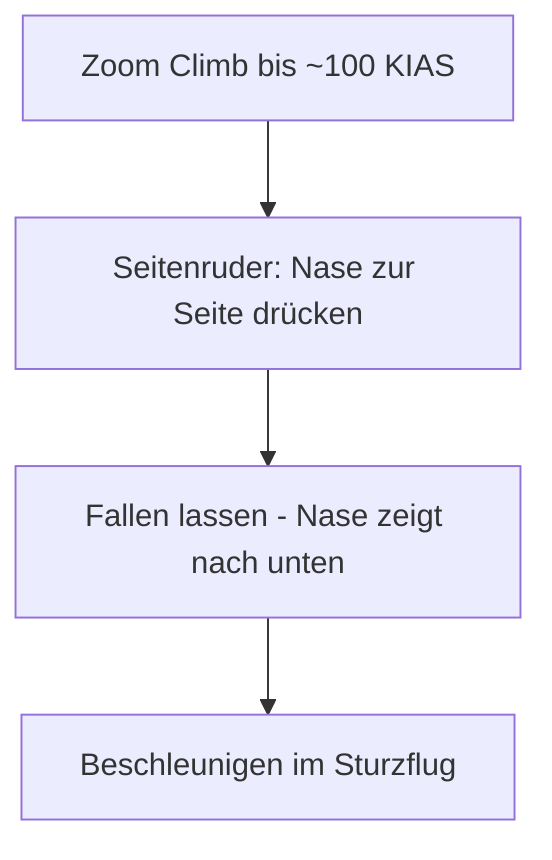

# 4. Empfohlene Manöver (T-15)

Diese Manöver nutzen die Stärken der T-15 (Schub & Vertikale) optimal aus.

## Grundlagen-Training

*   **Beschleunigung:** Übe das schnelle Erholen von Speed nach einem Turn. Nase runter (unloading) bis 0G, Vollgas.
*   **Corner Speed Halten:** Versuche, Kurven bei exakt 360-380 KIAS zu fliegen, ohne Höhe zu verlieren.
*   **Vertikale Kontrolle:** Übe das "Parken" am Top eines Loops - Schub nutzen, um die Nase zu kontrollieren.

---

## Kern-Manöver (Must-Know)

### 1. High Yo-Yo

> Das wichtigste Manöver für Energy Fighter - Overshoot verhindern ohne Energie zu verlieren.

**Wann nutzen?**
- Du näherst dich dem Gegner zu schnell
- Der Gegner bricht hart in deine Richtung
- Du drohst hinter dem Gegner vorbeizuschießen

**Ausführung:**

1. Du erkennst, dass du zu schnell bist (>100 kts schneller als Gegner)
2. Anstatt zu bremsen: Nase **30-45° nach oben** ziehen
3. Du tauschst Speed gegen Höhe (Gesamtenergie bleibt erhalten)
4. Am Scheitelpunkt die Nase kontrolliert auf den Gegner drehen
5. Mit Höhenvorteil herabstoßen

::: tip T-15 VORTEIL
Dein massiver Schub erlaubt dir riesige Yo-Yos. Wo andere Jets "verhungern", kannst du oben noch beschleunigen und die Position wählen.
:::

**Typische Fehler:**
- Zu früh herunterstoßen → Gegner entkommt
- Zu wenig Höhe gewinnen → kein Energievorteil
- Gegner aus den Augen verlieren → Look-Back vergessen

---

### 2. Zoom Climb

> Schneller Höhengewinn mit Energieüberschuss - dein Fluchtweg nach oben.

**Wann nutzen?**
- Du brauchst Separation vom Gegner
- Du willst Höhe für einen erneuten Angriff
- Du musst einem langsamen Kampf entkommen

**Ausführung:**

1. Mindestens **450 KIAS** haben
2. Afterburner aktivieren
3. Nase **60-80°** nach oben ziehen
4. Bei ~250 KIAS: Entscheidung treffen
   - **Weiter steigen:** Schub hält dich oben
   - **Umkehren:** Hammerhead oder Immelmann

::: warning HÖHENVERLUST BEACHTEN
Auf 21.000+ ft verliert die T-15 deutlich an Schub. Plane deinen Zoom entsprechend.
:::

**Typische Fehler:**
- Zu langsam starten → zu wenig Höhe gewinnen
- Zu lange oben bleiben → Energie verschwendet
- Keine Exit-Strategie → Gegner wartet unten

---

### 3. Immelmann (Vertical Loop)

> Richtungsumkehr mit Höhengewinn - klassisches T-15 Manöver.

**Wann nutzen?**
- Richtungsänderung um 180° benötigt
- Gleichzeitig Höhenvorteil gewinnen
- Gegner im horizontalen Flow ausmanövrieren

**Ausführung:**

1. Bei hoher Speed (>450 KIAS) voll ziehen in die Vertikale
2. Schub nutzen, um oben zu bleiben
3. Am Top des Loops auf "upright" rollen
4. Nase auf Gegner oder Fluchtrichtung ausrichten

::: tip POWER-NOSE
Du kannst am Top des Loops langsamer sein als jeder andere Jet und hast trotzdem noch volle Kontrolle. Die T-18 stallt, die T-16 fällt - du "parkst".
:::

---

### 4. Lag Displacement Roll

> Angriffsposition verbessern wenn der Gegner bricht.

**Wann nutzen?**
- Gegner bricht hart in eine Richtung
- Du drohst aus der Schussposition zu fliegen
- Du musst deinen Angriffsvektor korrigieren

**Ausführung:**

1. Gegner bricht z.B. nach rechts
2. Du rollst **nach links** (entgegen seiner Kurve)
3. Dadurch verlängerst du deinen Flugweg
4. Nase wieder auf Gegner ausrichten

**Warum T-15?** Erfordert viel überschüssige Energie, die du hast. Andere Jets würden dabei zu langsam werden.

---

## Fortgeschrittene Manöver

### Oblique Loop (Schräger Loop)

Ein Loop, der nicht exakt vertikal ist, sondern in einem Winkel zur Horizontalen.

**Wann nutzen?**
- Du willst nicht direkt über dem Gegner sein
- Vertikaler Fluchtweg mit seitlicher Versetzung

**Ausführung:**
1. Mit 450+ KIAS beginnen
2. Nase 60-70° nach oben, aber mit 30-45° Bank
3. Loop wird "schräg" - du endest versetzt vom Startpunkt

---

### Hammerhead (Wingover)

> Am vertikalen Scheitelpunkt: Nase drehen und kontrolliert fallen lassen.

**Wann nutzen?**
- Am Ende eines Zoom Climbs
- Wenn du oben "geparkt" hast und umkehren willst
- Für überraschende Richtungsänderung

**Ausführung:**

1. Zoom Climb bis die Speed unter 150 KIAS fällt
2. **Seitenruder** nutzen (nicht Querruder!) um die Nase zur Seite zu drücken
3. Die Nase "fällt" in die gewünschte Richtung
4. Beschleunigen im kontrollierten Sturzflug

::: warning SEITENRUDER
Beim Hammerhead ist das Seitenruder entscheidend, nicht das Querruder. Übe dies!
:::

---

## Kombinationen

Diese Manöver-Ketten sind typisch für T-15 Piloten:

### Boom-Zoom-Hammerhead
1. **Boom & Zoom** Angriff von oben
2. Nach dem Schuss: **Zoom Climb** nach oben
3. Am Top: **Hammerhead** zurück auf den Gegner
4. Erneuter Angriff mit Energievorteil

### High Yo-Yo zu Immelmann
1. **High Yo-Yo** um Overshoot zu vermeiden
2. Wenn Gegner weiterdreht: direkt in **Immelmann** übergehen
3. Du hast jetzt Höhe UND bist hinter dem Gegner

---

## Trainings-Übungen

### Übung 1: Zoom-Hammerhead Drill
Starte bei 5.000 ft mit 500 KIAS. Zoom Climb bis 15.000 ft, Hammerhead, Sturzflug zurück auf 5.000 ft. Wiederhole bis es flüssig ist.

### Übung 2: High Yo-Yo Timing
Fliege hinter einem AI-Gegner. Wenn du zu nah kommst, führe High Yo-Yo aus. Ziel: Niemals overshooten.

### Übung 3: Vertikale Kontrolle
Zoom Climb, am Top 10 Sekunden "parken" (unter 100 KIAS, aber volle Kontrolle), dann kontrolliert fallen lassen. Trainiert Power-Nose.
