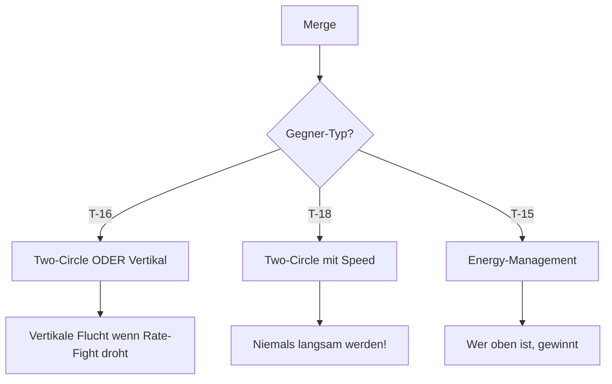

# 2. Taktik & Einsatzprofil (T-15)

## Der Archetyp: Energy Fighter

Die T-15 ist ein klassischer **Energy Fighter**. Du gewinnst Kämpfe nicht, indem du eng im Kreis fliegst, sondern indem du den Kampf in die Vertikale ziehst und deine Energie (Speed + Höhe) als Waffe einsetzt.

### Optimaler Einsatzbereich (The Envelope)

| Parameter | Sweet Spot (Ziel) | Danger Zone (Vermeiden) |
|-----------|-------------------|-------------------------|
| **Höhe** | Jede Höhe (Vorteil steigt mit Höhe) | Sea Level (hoher Drag) |
| **Speed** | **400 - 500 KIAS** | < 300 KIAS |
| **Kampfart** | Vertikal / Boom & Zoom | Horizontaler Kurvenkampf |

---

## Taktische Konzepte

### Die "Power-Nose" Taktik

Auch wenn die T-15 im horizontalen Kurvenkampf verliert, kann sie in der Vertikalen dominieren.

* **Unterschied zur T-18:** Während die T-18 ihre Nase durch Anstellwinkel (Lift) bewegt, nutzt die T-15 ihren massiven Schub.
* **Manöver:** Ziehe vertikal hoch. Die T-16 wird früher stallen (Strömungsabriss/Schubmangel). Du kannst dank der zwei Triebwerke oben "parken", die Nase kontrolliert auf den langsamen Gegner unter dir drehen und feuern.
* **Der "Monster-Pull":** Auf Meereshöhe hast du mit **29°/s** die höchste Instant-Rate aller Jets. Nutze dies für einen vernichtenden ersten Schlag bei High-Speed (>350 KIAS), aber beachte den massiven Energieverlust danach.

---

## Der Merge

> Der Merge ist der kritischste Moment im Luftkampf. Hier wird oft der Kampf entschieden.

### Merge-Strategie für die T-15

### Speed am Merge

| Situation | Empfohlene Speed | Grund |
|-----------|------------------|-------|
| vs. T-16 | 450-500 KIAS | Vertikale Option offenhalten |
| vs. T-18 | 400-450 KIAS | Nicht zu langsam werden! |
| vs. T-15 | 400-500 KIAS | Energie-Parität wichtig |

### Lead Turn am Merge

::: tip LEAD TURN TIMING
Als T-15 kannst du dir einen Lead Turn leisten, weil du die Energie hast, um Fehler zu korrigieren. Drehe 0.5-1 Sekunde vor dem Passieren.
:::

### Flow-Entscheidung

| Flow | Wann wählen? | T-15 Vorteil? |
|------|--------------|---------------|
| **One-Circle** | Nur wenn du Höhenvorteil hast | Nein - T-18 dominiert |
| **Two-Circle** | Gegen T-18 mit Speed | Bedingt - Rate ist mittelmäßig |
| **Vertikal** | Immer gegen T-16, oft gegen T-18 | **JA** - Dein Territorium |

---

## Defensive Strategien

> Auch Energy Fighter werden manchmal gejagt. So überlebst du.

### Wenn du gejagt wirst

#### Gegen T-16 (Rate Fighter)

1. **Nicht horizontal drehen!** - Du verlierst den Rate-Fight
2. **Zoom Climb** - Ziehe sofort vertikal
3. Die T-16 kann dir nicht folgen (nur ein Triebwerk)
4. Am Top: Hammerhead oder Immelmann zurück auf ihn

::: tip HÖHE IST DEINE RETTUNG
Gegen die T-16 ist der Fluchtweg immer OBEN. Sie verliert über 20.000 ft massiv an Leistung.
:::

#### Gegen T-18 (Angles Fighter)

1. **Speed halten!** - Unter 300 KIAS bist du tot
2. **Vertikal gehen** - Die T-18 kann nicht steigen
3. **Slash Attack** - Von oben angreifen, nicht im Kreis kämpfen
4. Wenn sie dich einholt: **Lag Displacement Roll** + Beschleunigen

::: danger LANGSAM = TOT
Die T-18 dominiert unter 250 KIAS. Lass dich niemals auf dieses Tempo herunterziehen!
:::

#### Gegen T-15 (Energy Fighter)

1. **Energie-Vergleich:** Wer ist schneller/höher?
2. Wenn du weniger Energie hast: **Defensive Spirale** nach unten, Energie aufbauen
3. Wenn du mehr Energie hast: **Vertikal dominieren**
4. Spiegelkampf = Geduld. Warte auf seinen Fehler.

### Notfall-Protokoll

Wenn alles schiefgeht und du dringend raus musst:

1. **Afterburner MAX**
2. **Nase 60-80° nach oben**
3. **Zoom Climb** so hoch wie möglich
4. Am Top: Situation neu bewerten
5. Option A: Weiterfliegen (Flucht)
6. Option B: Hammerhead und kontern

---

## Error Recovery

> Jeder macht Fehler. So korrigierst du sie.

### "Ich bin zu langsam geworden" (< 300 KIAS)

**Problem:** Du hast Energie verloren und bist verwundbar.

**Lösung:**
1. **Sofort Nase runter** - Höhe in Speed umwandeln
2. **Unload** (0G) - Maximale Beschleunigung
3. **Afterburner** - Volles Schub
4. Weg vom Gegner - Separation gewinnen
5. Erst wieder engagen wenn > 400 KIAS

### "Ich bin im horizontalen Kampf gefangen"

**Problem:** Du bist in einen Rate-Fight geraten (T-16 Territorium).

**Lösung:**
1. **Nicht weiterkämpfen!** - Du verlierst
2. Nächste Gelegenheit: **Vertikal ausbrechen**
3. High Yo-Yo oder Zoom Climb
4. Reset und neu anfangen

### "Ich habe den Gegner verloren"

**Problem:** Du weißt nicht wo der Gegner ist.

**Lösung:**
1. **Speed aufbauen** (400+ KIAS)
2. **Höhe gewinnen** - Besserer Überblick
3. **Head on a Swivel** - Aktiv suchen
4. Wenn gefunden: Situation neu bewerten

### "Mein erster Angriff hat nicht getroffen"

**Problem:** Du hast geschossen und verfehlt, Gegner ist noch da.

**Lösung:**
1. **Nicht nachsetzen!** (wenn du Energie verloren hast)
2. **Zoom Climb** - Höhe gewinnen
3. Reset und zweiter Anlauf
4. Boom & Zoom wiederholen

---

## Cockpit-Workflow

1. **Energie-Monitor:** Checke permanent deine Speed. Wenn du unter 350 KIAS fällst, musst du entladen (Nase runter/Turn lockern).
2. **Vertikaler Scan:** Schau nicht nur links/rechts. Dein Fluchtweg ist fast immer **OBEN**.
3. **Schub-Management:** Nutze deinen Schubvorteil. Afterburner ist dein bester Freund, um aus brenzligen Situationen (vertikal) zu entkommen.

---

## Do's & Don'ts

### Do's

* ✅ Zieh den Kampf in die Vertikale, wann immer möglich.
* ✅ Nutze "Boom & Zoom" Angriffe (schnell rein, schießen, schnell raus nach oben).
* ✅ Fliege schnell (Mach 0.8+).
* ✅ Nutze deinen Schubvorteil für vertikale Dominanz.
* ✅ Sei geduldig - warte auf den richtigen Moment.

### Don'ts

* ❌ Lass dich auf einen horizontalen Kurvenkampf mit einer T-16 ein.
* ❌ Werde langsam (< 250 KIAS) in der Nähe einer T-18.
* ❌ Verliere deine Energie für einen Schuss, der nicht 100% sicher ist.
* ❌ Folge einem Gegner wenn er in sein Territorium zieht.
* ❌ Unterschätze die T-18 im Nahkampf.
