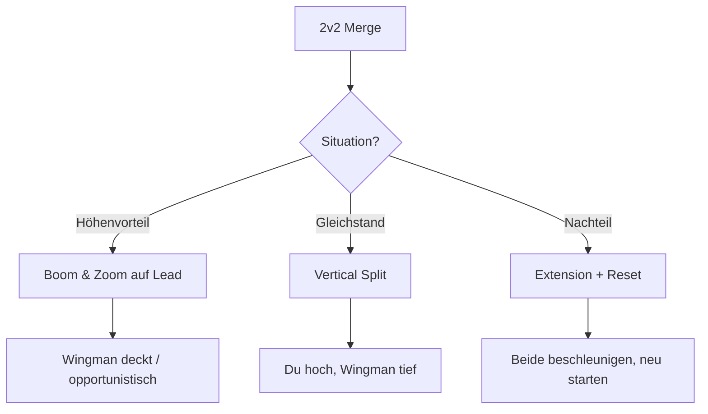
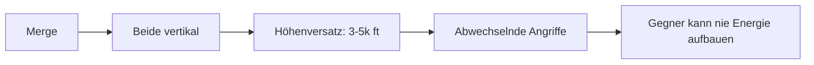
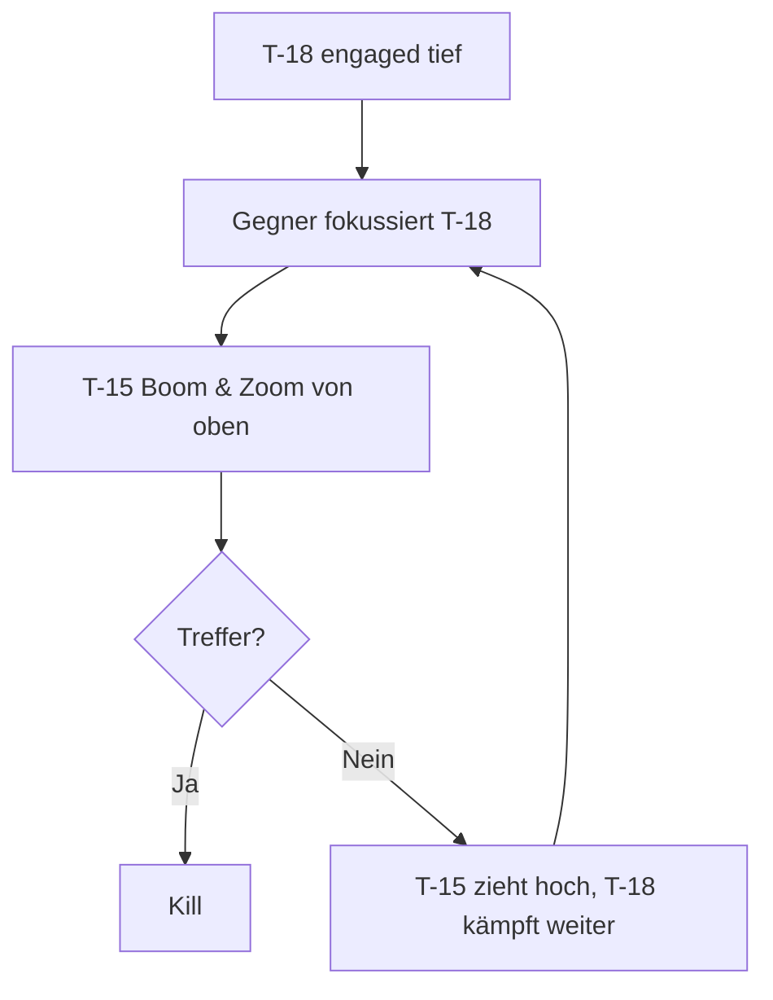
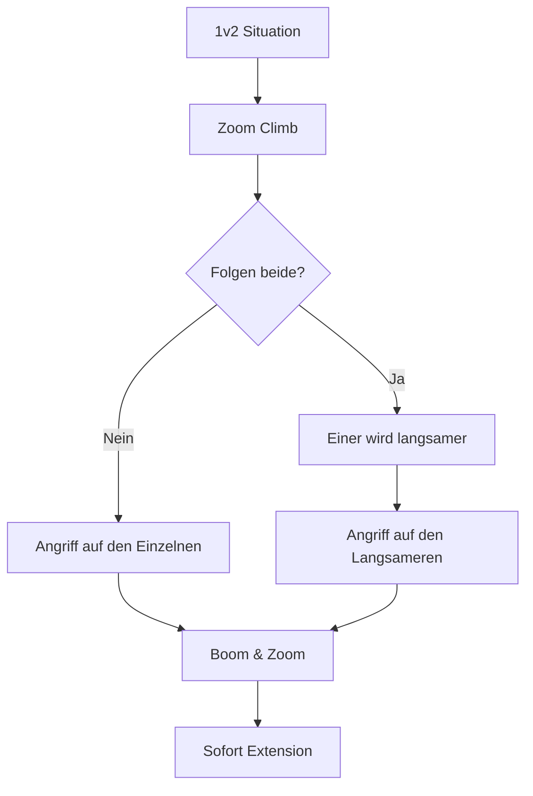

# 5. Team-Taktiken (T-15)

> Die T-15 Excalibur ist ein exzellenter Team-Spieler - als dominanter Lead oder unterstützender Wingman.

## Grundlagen der Wingman-Koordination

### Rollen im 2v2

| Rolle | Aufgabe | Wann T-15? |
|-------|---------|------------|
| **Lead** | Primärer Angreifer, Taktik-Entscheidung | Ideal - vertikale Kontrolle |
| **Wingman** | Unterstützung, Deckung, Opportunist | Gut - Energie für Interventionen |

### Formation & Separation

**Empfohlene Formation:**
- **Spread:** 1.5-2 nm seitlicher Abstand
- **Stack:** Lead 2.000-5.000 ft höher (Energievorteil nutzen)

::: tip HÖHENVERSATZ NUTZEN
Als T-15 Team sollte mindestens ein Pilot höher sein. Der höhere Pilot hat immer die Option für Boom & Zoom.
:::

### Kommunikation (Brevity)

| Ruf | Bedeutung | T-15 Kontext |
|-----|-----------|--------------|
| **"Engaged"** | Ich kämpfe aktiv | Lead im Kampf |
| **"Press"** | Greif an | Wingman soll einsteigen |
| **"Extend"** | Trenne dich | Energie aufbauen |
| **"Zoom"** | Ich gehe vertikal | Typisch für T-15 |
| **"Separate"** | Wir trennen uns | Für Zangenbewegung |

---

## Die T-15 im 2v2

### Als Team-Lead

Die T-15 ist ein **exzellenter Lead**:

**Deine Aufgaben:**
1. **Initiale Engage-Entscheidung** - Wer greift wen an?
2. **Vertikale Kontrolle** - Du bestimmst die Höhenschicht
3. **Erstes Engagement** - Du machst den ersten Angriff (Boom & Zoom)

**Taktik:**

::: warning NICHT ALLEINE ENGAGEN
Auch mit Energievorteil: Stelle sicher, dass dein Wingman weiß was du tust. Ein isolierter T-15 ist verwundbar.
:::

### Als Wingman

Als Wingman bist du der **Opportunist und Beschützer**:

**Deine Aufgaben:**
1. **Deckung** - Beobachte den Gegner-Wingman
2. **Opportunismus** - Wenn Lead den Gegner bindet, du greifst an
3. **Rettung** - Wenn Lead in Schwierigkeiten ist, greife ein

**Taktik:**
- Halte **Energie-Reserve** (höher/schneller als Lead)
- **Zoom Climb** bereit für schnelle Intervention
- Greife erst an wenn klar ist, dass Lead sicher ist

---

## Kombinations-Taktiken

### T-15 + T-15 (Double Energy)

**Stärke:** Absolute vertikale Dominanz

**Taktik:**

1. Beide T-15 gehen nach dem Merge vertikal
2. **Höhenversatz:** Ein Pilot 3-5.000 ft höher
3. Abwechselnd Boom & Zoom Angriffe
4. Gegner wird "von oben erdrückt"

::: tip ABWECHSELNDE ANGRIFFE
Wenn T-15 #1 angreift, steigt T-15 #2. Wenn #1 nach oben zieht, greift #2 an. Unendlicher Druck.
:::

---

### T-15 + T-16 (Energy + Rate)

**Stärke:** Vertikale und horizontale Kontrolle

**Taktik:**

| Pilot | Rolle | Aufgabe |
|-------|-------|---------|
| T-15 | Lead/Vertikale | Boom & Zoom, Höhenkontrolle |
| T-16 | Wingman/Horizontale | Rate-Fight wenn Gegner unten bleibt |

**Ablauf:**
1. T-15 macht initialen Boom & Zoom Angriff
2. Gegner reagiert:
   - **Vertikal folgen:** T-15 dominiert
   - **Horizontal bleiben:** T-16 engaget
3. T-15 deckt T-16 von oben

::: warning HÖHENSEPARATION
T-16 sollte unter 15.000 ft bleiben. T-15 kann darüber operieren. Nutzt diese natürliche Separation.
:::

---

### T-15 + T-18 (Energy + Angles)

**Stärke:** High-Low Kombination, Sandwich-Taktik

**Taktik:**

| Pilot | Rolle | Aufgabe |
|-------|-------|---------|
| T-15 | High Cover | Boom & Zoom von oben |
| T-18 | Low Bait/Fighter | Gegner anlocken, One-Circle kämpfen |

**Ablauf:**
1. T-18 zieht Gegner in niedrige Höhe und langsamen Kampf
2. T-15 bleibt hoch und beobachtet
3. Wenn Gegner auf T-18 fokussiert: T-15 Boom & Zoom
4. Gegner in der Zange

::: tip GEDULD
Als T-15 in dieser Kombi: Warte auf den richtigen Moment. Ein verfehlter Boom & Zoom gibt dem Gegner Zeit, die T-18 zu erledigen.
:::

---

## 2v1 Situationen

### Du bist in Überzahl (2v1)

**Du als T-15 + Partner gegen 1:**

1. **Nicht beide gleichzeitig engagen!** - Kollisionsgefahr, Blue-on-Blue
2. **Höhenversatz:** Du oben, Partner unten (oder umgekehrt)
3. **Abwechselnd angreifen:** Einer kämpft, einer wartet
4. **Sandwich:** Von zwei Seiten gleichzeitig Druck

::: warning BLUE-ON-BLUE GEFAHR
In 2v1 ist die größte Gefahr, den eigenen Wingman zu treffen. Immer wissen, wo der Partner ist!
:::

### Du bist in Unterzahl (1v2)

**Du als T-15 gegen 2:**

Dies ist eine Überlebenssituation. Ziel: Überleben, nicht unbedingt gewinnen.

**Strategie:**
1. **Vertikal gehen** - Dein Vorteil, nutze ihn
2. **Trennung erzwingen** - Wenn beide folgen, wird einer langsamer
3. **Den Schwächeren angreifen** - Identifiziere den schlechteren Piloten/das schlechtere Flugzeug
4. **Hit and Run** - Ein Kill, dann weg

::: danger NICHT HEROISCH WERDEN
1v2 gewinnt man selten. Wenn du einen erwischst, fliehe sofort. Der zweite wird dich sonst erwischen.
:::

---

## Kommunikations-Checkliste

### Vor dem Merge
- [ ] "Sorted" - Wer nimmt welches Ziel
- [ ] "Visual" - Ich sehe den Gegner
- [ ] "Tally" - Ich sehe beide Gegner

### Während des Kampfs
- [ ] "Engaged [Gegner]" - Ich kämpfe gegen [Ziel]
- [ ] "Press" - Du kannst angreifen
- [ ] "Extend" - Ich brauche Raum
- [ ] "Defensive" - Ich werde angegriffen

### Notfall
- [ ] "Break [Richtung]!" - Sofort ausweichen
- [ ] "Separate!" - Wir trennen uns
- [ ] "Bug out!" - Flucht, Kampf abbrechen
