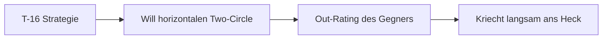

# T-16 Falchion

> Der "König der Rate" - Horizontal unschlagbar.

## Übersicht

Die T-16 Falchion, analog zur **F-16C Viper**, ist ein leichtes, einstrahliges Kampfflugzeug, das für hohe G-Belastungen und minimale Energieverluste in der Kurve optimiert ist.

::: info REALES VORBILD
| VFM | DCS/Real |
|-----|----------|
| T-16 Falchion | F-16C Viper |
:::

## Leistungsdaten

| Parameter | Wert | Bewertung |
|-----------|------|-----------|
| **Corner Speed** | ~380-420 kts | Etwas niedriger als T-15 |
| **Sustained Turn Rate** | **Beste im Spiel** | Horizontale Dominanz |
| **Instantaneous Turn Rate** | Gut | Schnelle Nase |
| **Turn Radius** | Mittel | Ausgewogen |
| **Schub/Gewicht (TWR)** | Gut | Solide, aber unter T-15 |
| **Energieerhalt** | Sehr gut | Minimaler Verlust in Kurven |

## Stärken

::: tip PRIMÄRER VORTEIL: SUSTAINED RATE
In einem **Two-Circle-Kampf** (Nase-auf-Heck-Verfolgung) kann die T-16 eine **höhere Anzahl Grad pro Sekunde** drehen als die T-15, ohne dabei signifikant Geschwindigkeit zu verlieren.

Sie ist der **"King of Sustained Turn Rate"**.
:::

**Weitere Vorteile:**
- Beste Turn Rate im Hochgeschwindigkeits-Kurvenkampf
- Geringer aerodynamischer Widerstand
- Gute Nose Authority bei mittleren Geschwindigkeiten
- Ausgewogene Performance ohne extreme Schwächen

## Schwächen

::: warning NACHTEILE
- **Vertikale Schwäche**: Kann T-15 nicht in die Vertikale folgen (ein Triebwerk vs. zwei)
- **Energie-Bluten vertikal**: Verliert Energie wenn sie gegen Schwerkraft kämpft
- **One-Circle**: Verliert gegen T-18 im Radius-Fight
:::

## Taktischer Archetyp: Rate Fighter

Die T-16 möchte den Gegner in einen **Hochgeschwindigkeits-Kurvenkampf** locken, in dem sie ihre überlegene Aerodynamik ausspielen kann, um den Gegner **"auszukurven" (Out-Rate)**.

## Vergleichstabelle

| Merkmal | T-15 Excalibur | T-16 Falchion | T-18 Cutlass |
|---------|----------------|---------------|--------------|
| DCS Analog | F-15C Eagle | F-16C Viper | F/A-18C Hornet |
| Hauptstärke | Schub, Vertikale | **Beste Wenderate** | Bester Radius |
| Bevorzugter Kampf | Vertikal | **Horizontal, 2-Circle** | Langsam, 1-Circle |
| E-M Kategorie | Energy Fighter | Rate Fighter | Radius/Angles Fighter |
