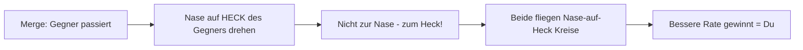
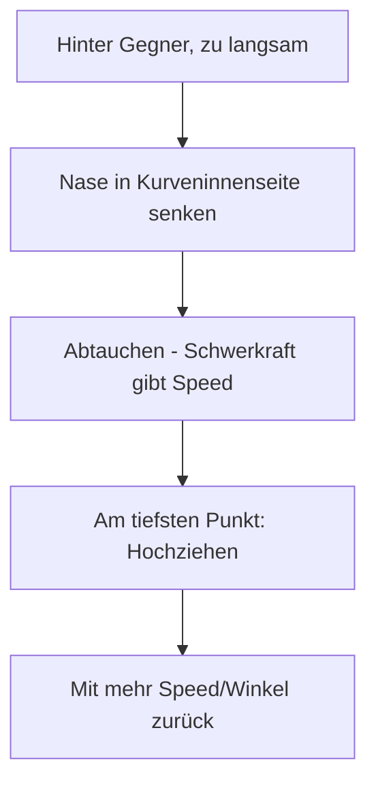
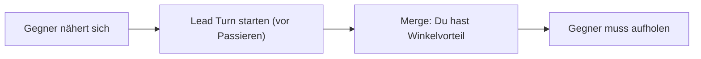
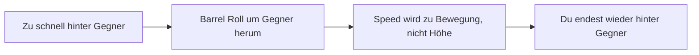

# 4. Empfohlene Manöver (T-16)

Diese Manöver sind essenziell für den erfolgreichen T-16 Piloten.

## Grundlagen-Training

*   **Sustained Turn:** Lerne, eine Kurve bei exakt 450 KIAS zu fliegen, ohne Höhe oder Geschwindigkeit zu verlieren. Das ist dein "Brot-und-Butter" Manöver.
*   **Lead Turn:** Übe, am Merge schon Bruchteile von Sekunden VOR dem Passieren den Turn einzuleiten.
*   **G-Management:** Smooth is fast. Konstanter Stick-Druck statt ruckartige Bewegungen.

---

## Kern-Manöver (Must-Know)

### 1. Two-Circle Flow Entry

> Das wichtigste Manöver für Rate Fighter - den Kampf in deinen Vorteil zwingen.

**Wann nutzen?**
- Am Merge gegen jeden Gegner
- Wenn du einen Rate-Vorteil ausspielen willst
- Wenn der Gegner One-Circle will (T-18)

**Ausführung:**

1. Am Merge drehst du deine Nase zum **Heck** des Gegners (nicht zu seiner Nase!)
2. Du etablierst einen Kreis, in dem beide Flugzeuge "Nase auf Heck" fliegen
3. Halte konstante 440-470 KIAS
4. Jede Runde gewinnst du 1-2° Winkel
5. Nach 3-4 Kreisen sitzt du hinter ihm

::: tip GEDULD IST ALLES
Ein Rate-Fight ist kein Sprint, sondern ein Marathon. Erwarte nicht, nach dem ersten Kreis zu gewinnen.
:::

**Typische Fehler:**
- Zur Nase statt zum Heck drehen → One-Circle Flow (Nachteil)
- Zu schnell fliegen (>500 kts) → Radius zu groß
- Ungeduldig werden → Stick überziehen, Energie verlieren

---

### 2. Low Yo-Yo

> Geschwindigkeit aufbauen und Winkel verkürzen - dein Energie-Booster.

**Wann nutzen?**
- Du wirst zu langsam (unter 400 KIAS)
- Du brauchst mehr Winkel auf den Gegner
- Der Gegner ist höher als du

**Ausführung:**

1. Du bist hinter dem Gegner, aber zu langsam
2. Senke die Nase in die **Kurveninnenseite** (tauche ab)
3. Die Schwerkraft beschleunigt dich
4. Am tiefsten Punkt: Ziehe wieder hoch zum Gegner
5. Du hast jetzt mehr Speed UND einen besseren Winkel

::: warning HÖHENVERLUST
Du verlierst dabei Höhe. Achte auf dein Hard Deck (2.000 ft minimum)!
:::

**Typische Fehler:**
- Zu tief tauchen → Boden
- Zu früh hochziehen → Speed-Gewinn verschenkt
- Gegner aus den Augen verlieren

---

### 3. Lead Turn

> Am Merge früher drehen als der Gegner - Winkeldiebstahl.

**Wann nutzen?**
- Immer am Merge
- Wenn du den ersten Schuss willst
- Gegen langsamere Gegner

**Ausführung:**

1. Vor dem Merge: Identifiziere die Drehrichtung
2. **0.5-1 Sekunde VOR** dem Passieren: Turn einleiten
3. Du drehst deine Nase auf den Gegner, bevor er reagieren kann
4. Ergebnis: Du hast nach dem Merge einen Winkelvorteil

::: tip TIMING IST ALLES
Zu früh = Gegner sieht es und kontert. Zu spät = kein Vorteil. Übe das Timing!
:::

**Typische Fehler:**
- Zu früh drehen → Gegner kontert, du verlierst Energie
- Zu spät drehen → kein Vorteil, neutraler Merge
- Falsche Richtung → du drehst vom Gegner weg

---

### 4. Defensive Break

> Letztes Mittel gegen Raketen oder Guns - radikale Kursänderung.

**Wann nutzen?**
- Rakete im Anflug
- Gegner hat Schusslösung
- Nur als Notfall!

**Ausführung:**

1. Maximaler Zug am Stick (9G)
2. In Richtung der größten Winkeländerung
3. Nur 1-2 Sekunden halten
4. **Sofort** danach Energie wieder aufbauen

::: danger ENERGIE-KILLER
Ein Break Turn bei 9G vernichtet deine Energie. Danach bist du verwundbar. Nutze es nur als letztes Mittel!
:::

---

## Fortgeschrittene Manöver

### Barrel Roll Attack

> Ein offensives Manöver um Overshoot zu vermeiden und Position zu halten.

**Wann nutzen?**
- Du näherst dich zu schnell
- Du willst nicht High Yo-Yo (kein vertikaler Vorteil nötig)
- Du willst im horizontalen Flow bleiben

**Ausführung:**

1. Du rollst **über** den Gegner in einer Barrel Roll
2. Die zusätzliche Strecke verbraucht deine überschüssige Speed
3. Du endest wieder hinter dem Gegner

**Unterschied zum High Yo-Yo:** Du bleibst horizontal statt vertikal zu gehen. Besser für T-16, da vertikal nicht deine Stärke ist.

---

### Horizontal Reversal

> Plötzlicher Richtungswechsel im horizontalen Kampf.

**Wann nutzen?**
- Der Gegner folgt dir im Kreis
- Du willst die Drehrichtung wechseln
- Um Separation zu gewinnen

**Ausführung:**

1. Im Turn: Plötzlich Flügel level (aufhören zu drehen)
2. Unload (0G) für 1-2 Sekunden - Speed aufbauen
3. Turn in die **entgegengesetzte** Richtung einleiten
4. Der Gegner muss reagieren und verliert Energie

::: tip ÜBERRASCHUNGSEFFEKT
Funktioniert am besten, wenn der Gegner dich nicht sieht. Nutze es, wenn er gerade in seinen Instrumenten schaut.
:::

---

## Kombinationen

Diese Manöver-Ketten sind typisch für T-16 Piloten:

### Lead Turn zu Two-Circle
1. **Lead Turn** am Merge - sofortiger Winkelvorteil
2. Übergang in **Two-Circle Flow**
3. Rate-Vorteil ausspielen über 3-4 Kreise
4. Kill

### Low Yo-Yo Recovery
1. Du wirst zu langsam im Kampf
2. **Low Yo-Yo** um Speed aufzubauen
3. Zurück in den **Two-Circle Flow**
4. Weiter mit Rate-Vorteil

### Barrel Roll zu Lead Pursuit
1. Gegner bricht, du bist zu schnell
2. **Barrel Roll Attack** um Overshoot zu vermeiden
3. Am Ende der Rolle: **Lead Pursuit** auf Gegner
4. Schusslösung suchen

---

## Trainings-Übungen

### Übung 1: Sustained Turn Drill
Fliege einen horizontalen Kreis bei exakt 450 KIAS. Ziel: 5 Kreise ohne Speed- oder Höhenverlust. Nutze Trimm.

### Übung 2: Lead Turn Timing
Gegen AI-Gegner: Versuche bei jedem Merge einen Lead Turn. Messe, wie viel Winkelvorteil du nach dem Merge hast.

### Übung 3: Rate-Fight Geduld
Gegen AI in Two-Circle: Zähle die Kreise bis zum Kill. Ziel: Konstante Verbesserung pro Runde, kein hektisches Manövrieren.

### Übung 4: Low Yo-Yo Speed Recovery
Starte bei 350 KIAS (zu langsam). Führe Low Yo-Yo aus. Ziel: Nach dem Manöver bei 450+ KIAS sein.
