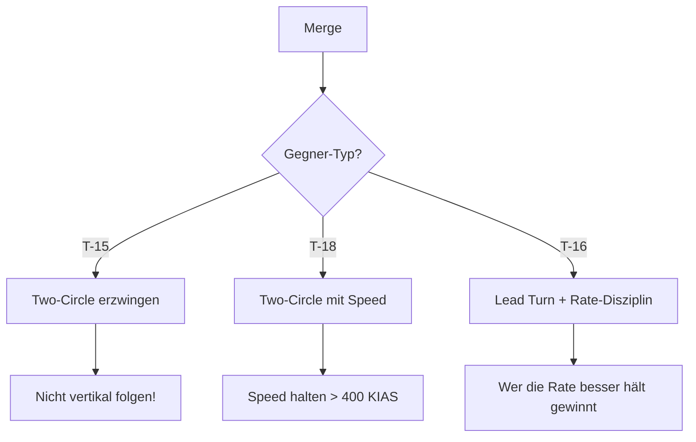

# 2. Taktik & Einsatzprofil (T-16)

## Der Archetyp: Rate Fighter

Die T-16 ist ein **Rate Fighter**. Deine Stärke ist Geduld. Du gewinnst nicht durch den ersten harten Turn, sondern indem du Runde für Runde ein paar Grad Winkel gutmachst, bis du hinter dem Gegner sitzt.

### Optimaler Einsatzbereich (The Envelope)

| Parameter | Sweet Spot (Ziel) | Danger Zone (Vermeiden) |
|-----------|-------------------|-------------------------|
| **Höhe** | **0 - 15.000 ft** | > 20.000 ft (Leistungsverlust) |
| **Speed** | **440 - 470 KIAS** | < 300 KIAS (Stall) |
| **Kampfart** | Horizontaler Two-Circle | Vertikal / One-Circle |

::: warning DIE "HÖHEN-FALLE" (Altitude Trap)
Die T-16 ist der König des Rate-Fights - aber nur in niedriger bis mittlerer Höhe.
* **Sea Level:** Du dominierst absolut mit 22°/s Sustained Turn.
* **High Altitude (20k+):** Deine Sustained Rate bricht auf 13°/s ein und ist damit **identisch zur T-15**.
* **Taktik:** Zwinge den Kampf nach unten! Dein optimales Habitat ist zwischen **2.000 und 10.000 ft**.
:::

---

## Taktische Konzepte

### Rate Fighting Philosophie

> "Smooth is fast, fast is smooth."

* **Konstanter G-Druck:** Halte den Stick-Druck gleichmäßig. Ruckartiges Ziehen kostet mehr Energie als es Winkel bringt.
* **Speed-Band:** Deine optimale Zone ist 440-470 KIAS. Zu schnell = größerer Radius. Zu langsam = weniger Rate.
* **Geduld:** Ein Rate-Kill dauert typischerweise 3-4 Kreise. Akzeptiere das.

### Two-Circle Dominanz

Im Two-Circle Flow fliegst du und der Gegner beide "Nase auf Heck" in gegenläufigen Kreisen. Hier gewinnt die bessere **Sustained Turn Rate** - also du.

---

## Der Merge

> Der Merge entscheidet, welchen Kampf du führst. Zwinge den Gegner in Two-Circle!

### Merge-Strategie für die T-16

### Speed am Merge

| Situation | Empfohlene Speed | Grund |
|-----------|------------------|-------|
| vs. T-15 | 450-470 KIAS | Optimal für Rate, nicht zu langsam |
| vs. T-18 | 440-470 KIAS | Speed halten, nicht abbremsen lassen |
| vs. T-16 | 450 KIAS | Corner Speed für maximale Rate |

### Lead Turn am Merge

::: tip LEAD TURN ENTSCHEIDEND
Der Lead Turn ist für die T-16 kritisch. Du gewinnst vielleicht nur 5° pro Runde, also zählt jeder Grad vom Start.
:::

**Timing:** 0.5-1 Sekunde vor dem Passieren den Turn einleiten.

### Flow-Entscheidung

| Flow | Wann wählen? | T-16 Vorteil? |
|------|--------------|---------------|
| **One-Circle** | Niemals freiwillig | Nein - T-18 dominiert |
| **Two-Circle** | Immer | **JA** - Dein Territorium |
| **Vertikal** | Nur zur Flucht | Nein - T-15 dominiert |

---

## Defensive Strategien

> Rate Fighter sind nicht für defensives Fliegen gebaut. Vermeide diese Situationen!

### Wenn du gejagt wirst

#### Gegen T-15 (Energy Fighter)

1. **Nicht vertikal folgen!** - Das ist sein Territorium
2. **Horizontal bleiben** - Zwinge ihn in deinen Bereich
3. Wenn er Boom & Zoom macht: **Break Turn** + sofort wieder Rate aufbauen
4. **Geduld:** Er muss irgendwann horizontal kommen

::: warning ALTITUDE TRAP VERMEIDEN
Wenn eine T-15 dich nach oben zieht, folge NICHT. Bleib unter 15.000 ft wo du Vorteil hast.
:::

#### Gegen T-18 (Angles Fighter)

1. **Speed halten!** - Unter 350 KIAS wirst du verwundbar
2. **Two-Circle erzwingen** - Drehe zum Heck, nicht zur Nase
3. Wenn er One-Circle will: **Separation gewinnen**, dann neu engagen
4. **Aushungern:** Nach 2-3 Kreisen ist die T-18 bei 200 KIAS und kann nicht mehr

::: danger NICHT LANGSAM WERDEN
Die T-18 gewinnt jeden Kampf unter 300 KIAS. Halte deine Speed um jeden Preis!
:::

#### Gegen T-16 (Rate Fighter)

1. **Rate-Disziplin:** Wer sauberer fliegt, gewinnt
2. **Speed-Band halten** (440-470 KIAS)
3. **Lead Turn** nutzen
4. Spiegelkampf = Wer den ersten Fehler macht, verliert

### Notfall-Protokoll

Wenn alles schiefgeht:

1. **Horizontal Extension** - Flügel level, Unload, beschleunigen
2. **Separation gewinnen** - Weg vom Gegner
3. **Niedrig bleiben** - Dein Habitat ist unten
4. **Reset:** Neu engagen wenn Energie wiederhergestellt

::: warning NICHT VERTIKAL FLIEHEN
Dein Notfall-Fluchtweg ist HORIZONTAL, nicht vertikal. Steigen kostet dich Energie die du nicht hast.
:::

---

## Error Recovery

> Fehler passieren. So korrigierst du sie.

### "Ich bin zu langsam geworden" (< 350 KIAS)

**Problem:** Du bist aus deinem optimalen Speed-Band gefallen.

**Lösung:**
1. **Flügel level** - Aufhören zu drehen
2. **Unload** (0G) - Maximale Beschleunigung
3. **Low Yo-Yo** - Nase runter, Speed aufbauen
4. Zurück in den Fight wenn > 440 KIAS

### "Die T-15 ist vertikal entkommen"

**Problem:** Der Gegner ist nach oben geflohen, du kannst nicht folgen.

**Lösung:**
1. **Nicht folgen!** - Du verlierst vertikal
2. **Energie aufbauen** - Horizontal beschleunigen
3. **Warten** - Er muss irgendwann runterkommen
4. Bereit sein für seinen nächsten Angriff

### "Ich bin im One-Circle gefangen"

**Problem:** Die T-18 hat One-Circle erzwungen (Nase auf Nase).

**Lösung:**
1. **Extension** - Versuche Separation zu gewinnen
2. **Barrel Roll** - Um aus dem Flow zu kommen
3. **Horizontal Reversal** - Richtung wechseln
4. Neu starten in Two-Circle

### "Der Kampf dauert zu lange"

**Problem:** Nach 5+ Kreisen hast du immer noch keinen Schuss.

**Lösung:**
1. **Überprüfe deine Speed** - Bist du im optimalen Band?
2. **Überprüfe deine G-Load** - Zu viel/zu wenig?
3. **Geduld bewahren** - Rate-Fights dauern
4. Warte auf den Fehler des Gegners

---

## Cockpit-Workflow

1. **G-Management:** Halte den Stick-Druck konstant. Rupfe nicht am Stick. Smooth is fast.
2. **Horizont-Check:** Versuche, den Kampf flach zu halten. Vermeide unnötiges Steigen.
3. **Speed-Disziplin:** Deine "Rate-Band" ist bei 440-470 KIAS. Wenn du schneller bist, wird der Radius zu groß. Wenn du langsamer bist, sinkt die Rate.

---

## Do's & Don'ts

### Do's

* ✅ Zwinge Gegner in den Two-Circle-Fight (Nase auf Heck).
* ✅ Bleib geduldig. Ein Rate-Kill dauert 3-4 Kreise.
* ✅ Halte konstante Speed im optimalen Band (440-470 KIAS).
* ✅ Nutze Lead Turns am Merge für frühen Vorteil.
* ✅ Bleib niedrig (unter 15.000 ft).

### Don'ts

* ❌ Folge einer T-15 in die Vertikale (Todesurteil).
* ❌ Lass dich auf einen langsamen Kampf (< 300 KIAS) mit einer T-18 ein.
* ❌ Überziehe den Stick ("Yanking and Banking"). Das vernichtet deine Energie.
* ❌ Werde ungeduldig - Rate-Fights brauchen Zeit.
* ❌ Kämpfe über 20.000 ft - dort verlierst du deinen Vorteil.
