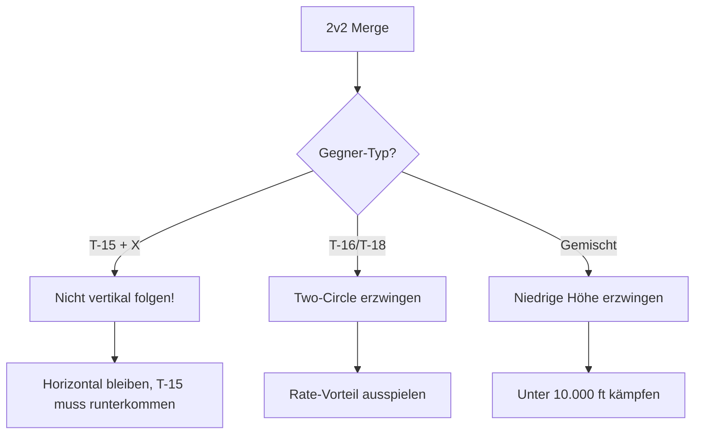
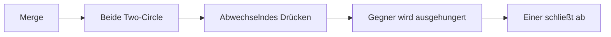
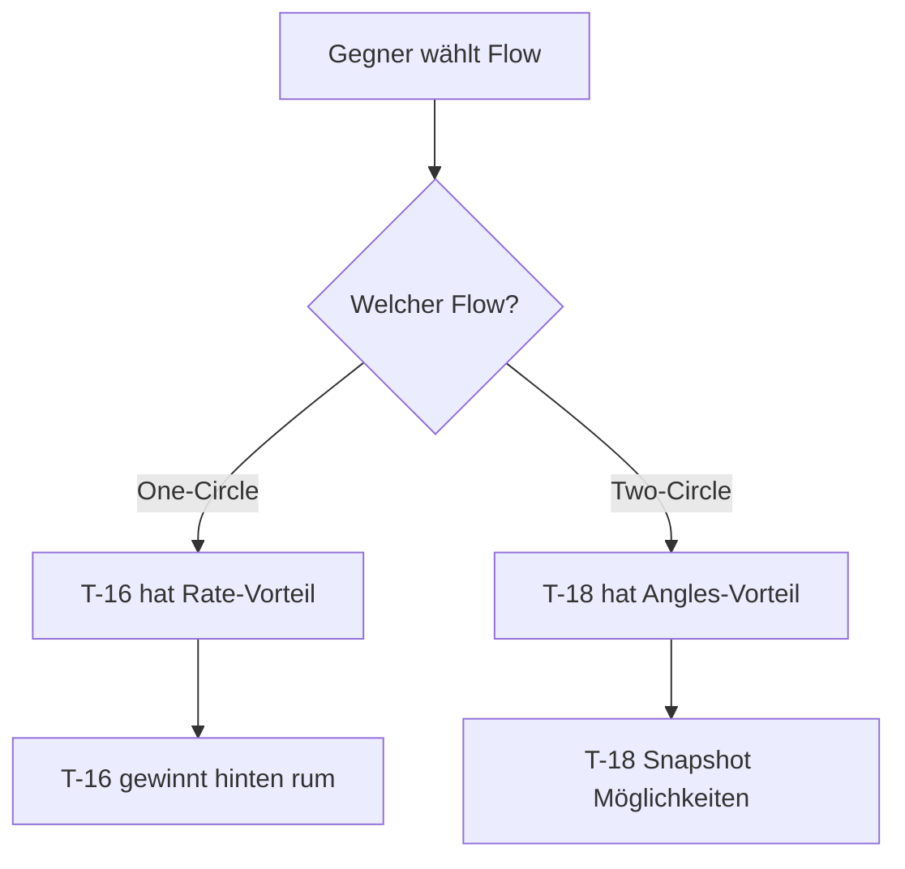
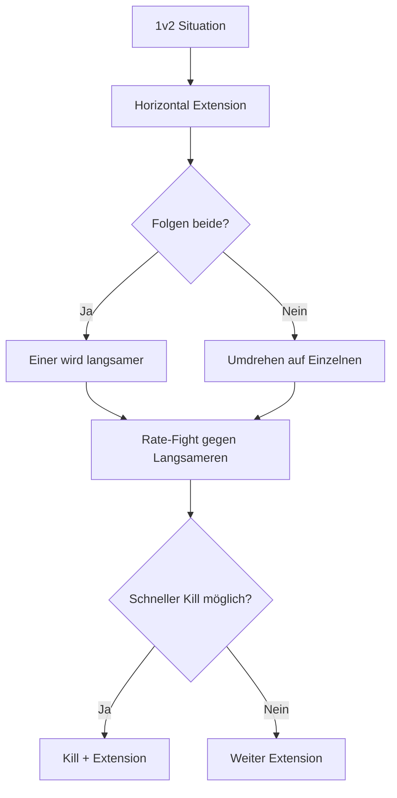

# 5. Team-Taktiken (T-16)

> Die T-16 Falchion ist der perfekte Team-Spieler - geduldig, ausdauernd und tödlich im koordinierten Kampf.

## Grundlagen der Wingman-Koordination

### Rollen im 2v2

| Rolle | Aufgabe | Wann T-16? |
|-------|---------|------------|
| **Lead** | Primärer Angreifer, Taktik-Entscheidung | Gut - besonders gegen andere T-16 |
| **Wingman** | Unterstützung, Deckung, Opportunist | Ideal - Geduld und Ausdauer |

### Formation & Separation

**Empfohlene Formation:**
- **Spread:** 1-1.5 nm seitlicher Abstand
- **Level:** Gleiche Höhe oder leichter Versatz (1.000-2.000 ft)

::: tip HORIZONTAL BLEIBEN
Als T-16 Team solltet ihr beide im niedrigen/mittleren Höhenband bleiben (unter 15.000 ft). Dort habt ihr euren Vorteil.
:::

### Kommunikation (Brevity)

| Ruf | Bedeutung | T-16 Kontext |
|-----|-----------|--------------|
| **"Engaged"** | Ich kämpfe aktiv | Lead im Rate-Fight |
| **"Press"** | Greif an | Wingman soll einsteigen |
| **"Extend"** | Trenne dich | Energie aufbauen |
| **"Flow"** | Ich bin im Two-Circle | Typisch für T-16 |
| **"Merge"** | Zusammenkommen | Für koordinierten Angriff |

---

## Die T-16 im 2v2

### Als Team-Lead

Die T-16 ist ein **solider Lead**, besonders gegen nicht-vertikale Gegner:

**Deine Aufgaben:**
1. **Initiale Engage-Entscheidung** - Wer greift wen an?
2. **Flow-Kontrolle** - Two-Circle erzwingen
3. **Geduld zeigen** - Das Team muss warten können

**Taktik:**

::: warning ALTITUDE TRAP VERMEIDEN
Als Lead: Wenn ein Gegner (T-15) vertikal geht, folge NICHT. Dein Wingman soll ihn beobachten, du fokussierst den anderen.
:::

### Als Wingman

Als Wingman bist du der **geduldige Unterstützer**:

**Deine Aufgaben:**
1. **Deckung** - Beobachte den Gegner-Wingman
2. **Ausdauer** - Du kannst länger kämpfen als andere
3. **Opportunismus** - Wenn Lead den Gegner bindet, du schließt ab

**Taktik:**
- Halte **Speed im Band** (440-470 KIAS)
- **Geduld** - Warte auf den richtigen Moment
- Greife erst an wenn Lead sicher engaged ist

---

## Kombinations-Taktiken

### T-16 + T-16 (Double Rate)

**Stärke:** Unendliche Ausdauer im horizontalen Kampf

**Taktik:**

1. Beide T-16 erzwingen Two-Circle
2. **Abwechselndes Engagement:** Einer kämpft, einer erholt Energie
3. Gegner verliert Energie über Zeit
4. Wenn Gegner langsam genug: Kill

::: tip ENERGIE-ROTATION
Wenn du müde wirst (Speed fällt), rufe "Extend". Dein Partner übernimmt, du baust Energie auf.
:::

---

### T-16 + T-15 (Rate + Energy)

**Stärke:** Horizontale UND vertikale Kontrolle

**Taktik:**

| Pilot | Rolle | Aufgabe |
|-------|-------|---------|
| T-16 | Horizontal/Boden | Rate-Fight, Gegner binden |
| T-15 | Vertikal/High Cover | Boom & Zoom wenn Gelegenheit |

**Ablauf:**
1. T-16 engaget und zwingt Two-Circle
2. Gegner fokussiert T-16
3. T-15 nutzt Moment für Boom & Zoom von oben
4. Oder: Gegner flieht vertikal → T-15 verfolgt

::: tip HÖHENTEILUNG
T-16 bleibt unter 15.000 ft. T-15 operiert darüber. Ihr kontrolliert beide Ebenen.
:::

---

### T-16 + T-18 (Rate + Angles)

**Stärke:** Perfekter Flow-Konter - einer für One-Circle, einer für Two-Circle

**Taktik:**

| Pilot | Rolle | Aufgabe |
|-------|-------|---------|
| T-16 | Two-Circle Spezialist | Rate-Fight, Gegner aushungern |
| T-18 | One-Circle Spezialist | Nahkampf, Finishing |

**Ablauf:**
1. Beide engagen gleichzeitig
2. Gegner muss sich entscheiden:
   - **One-Circle mit T-18:** T-16 Rate-Vorteil
   - **Two-Circle mit T-16:** T-18 Nose Authority Vorteil
3. Der "falsch gematcht" Pilot gewinnt

::: tip FLOW-KONTER
Diese Kombination ist tödlich, weil der Gegner immer gegen den falschen Archetyp kämpft.
:::

---

## 2v1 Situationen

### Du bist in Überzahl (2v1)

**Du als T-16 + Partner gegen 1:**

1. **Koordinierter Two-Circle:** Beide von verschiedenen Seiten
2. **Abwechselndes Drücken:** Einer kämpft, einer beobachtet
3. **Geduld:** Ihr habt Zeit, er nicht
4. **Finishing:** Wenn er langsam ist, einer schließt ab

::: warning NICHT ÜBEREILEN
In 2v1 mit T-16: Geduld gewinnt. Der Gegner wird Fehler machen. Warte darauf.
:::

### Du bist in Unterzahl (1v2)

**Du als T-16 gegen 2:**

Dies ist eine schwierige Situation für die T-16. Du kannst nicht vertikal fliehen.

**Strategie:**
1. **Horizontal Extension** - Versuche Separation zu gewinnen
2. **Niedrig bleiben** - Dein optimales Territorium
3. **Einen isolieren** - Wenn einer zurückfällt, engagen
4. **Defensive Rate-Fight** - Überleben statt gewinnen

::: danger NICHT VERTIKAL
Als T-16 in 1v2: Fliehe NICHT vertikal. Das ist deine schwächste Richtung. Bleib horizontal.
:::

---

## Team-Taktik: "The Grind"

Eine spezielle T-16 Team-Taktik für geduldige Piloten:

### Ablauf

1. **Setup:** Beide T-16 auf gleicher Höhe (5.000-10.000 ft)
2. **Merge:** Beide erzwingen Two-Circle auf ihre Gegner
3. **Rotation:** Alle 2-3 Kreise ruft einer "Extend"
4. **Extension:** Der erschöpfte Pilot löst sich, baut Energie auf
5. **Übernahme:** Der frische Pilot übernimmt beide Kämpfe kurz
6. **Repeat:** Nach Energie-Aufbau wieder einsteigen

**Vorteile:**
- Ihr habt immer einen frischen Kämpfer
- Gegner werden langsam ausgehungert
- Niemand wird zu langsam

::: tip THE GRIND
Diese Taktik erfordert viel Kommunikation und Disziplin, ist aber gegen nicht-T-16 Teams fast unschlagbar.
:::

---

## Kommunikations-Checkliste

### Vor dem Merge
- [ ] "Sorted" - Wer nimmt welches Ziel
- [ ] "Visual" - Ich sehe den Gegner
- [ ] "Low" - Wir bleiben niedrig

### Während des Kampfs
- [ ] "Flow" - Ich bin im Two-Circle
- [ ] "Extend" - Ich brauche Energie-Pause
- [ ] "Press" - Du kannst angreifen
- [ ] "Cover" - Ich beobachte

### Notfall
- [ ] "Break [Richtung]!" - Sofort ausweichen
- [ ] "Drag" - Ich ziehe Gegner weg
- [ ] "Bug out!" - Flucht, Kampf abbrechen
