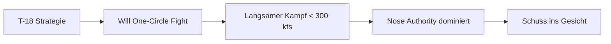

# T-18 Cutlass

> Der "Radius-Kämpfer" - Der Boogeyman im Nahkampf.

## Übersicht

Die T-18 Cutlass, basierend auf der **F/A-18C Hornet**, ist ein Marine-Jagdflugzeug, das für extreme Anstellwinkel (High Alpha / High AoA) bei niedrigen Geschwindigkeiten ausgelegt ist.

::: info REALES VORBILD
| VFM | DCS/Real |
|-----|----------|
| T-18 Cutlass | F/A-18C Hornet |
:::

## Leistungsdaten

| Parameter | Wert | Bewertung |
|-----------|------|-----------|
| **Corner Speed** | ~250-300 kts | Sehr niedrig! |
| **Sustained Turn Rate** | Niedrig | Verliert Rate schnell |
| **Instantaneous Turn Rate** | **Beste im Spiel** | Extrem gefährlich! |
| **Turn Radius** | **Kleinste** | Dominiert One-Circle |
| **Schub/Gewicht (TWR)** | Schwach | Schlechte vertikale Performance |
| **Energieerhalt** | Schlecht | "Dreckige" Flügel = hoher Widerstand |
| **High AoA Fähigkeit** | **Exzellent** | Unter 150 kts noch steuerbar |

## Stärken

::: tip PRIMÄRER VORTEIL: NOSE AUTHORITY & RADIUS
Die T-18 kann ihre Nase auch bei **extrem niedrigen Geschwindigkeiten (unter 150 Knoten)** noch auf den Gegner richten.

Sie dominiert den **One-Circle-Kampf** (Nase-auf-Nase), da sie den **engsten Kurvenradius** fliegen kann.
:::

**Weitere Vorteile:**
- Beste Instantaneous Turn Rate
- Kann fast unabhängig von Flugrichtung die Nase auf Ziel richten
- Gefährliche Snapshot-Fähigkeit
- Low-Speed-Monster bei 250 kts

## Schwächen

::: warning KRITISCHE NACHTEILE: BLEED RATE
Um diese Nose Authority zu erreichen, induziert die T-18 **massiven aerodynamischen Widerstand**.

- Eine harte Kurve (Baton Turn) kann das Flugzeug **fast augenblicklich stoppen**
- Beraubt das Flugzeug seiner kinetischen Energie
- Einmal langsam ("slow and low"), hat die T-18 **Schwierigkeiten**, Energie wieder aufzubauen
- Besonders gegen eine T-15 mit zwei Triebwerken
:::

**Weitere Schwächen:**
- "Dreckige" Flügel = hoher Widerstand (High Drag)
- Kann nicht steigen - verliert vertikal gegen T-15
- Sustained Fight = Niederlage (wird immer schwächer)

## Taktischer Archetyp: Radius/Angles Fighter

Die T-18 will den Kampf in einen **langsamen "Messerkampf"** zwingen, in dem der Schub der T-15 irrelevant wird und nur noch der **Wenderadius** zählt.

## Vergleichstabelle

| Merkmal | T-15 Excalibur | T-16 Falchion | T-18 Cutlass |
|---------|----------------|---------------|--------------|
| DCS Analog | F-15C Eagle | F-16C Viper | F/A-18C Hornet |
| Hauptstärke | Schub, Vertikale | Beste Wenderate | **Bester Radius, High AoA** |
| Bevorzugter Kampf | Vertikal | Horizontal, 2-Circle | **Langsam, 1-Circle** |
| E-M Kategorie | Energy Fighter | Rate Fighter | Radius/Angles Fighter |
