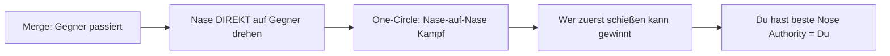
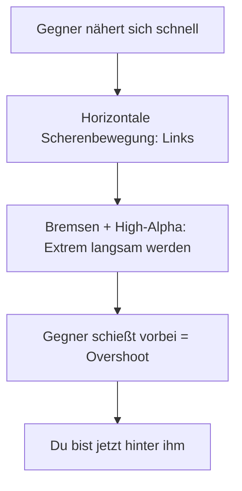
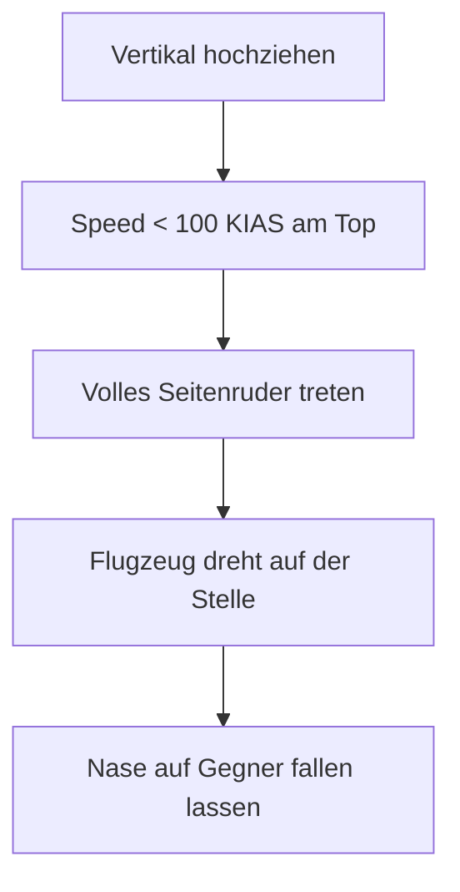
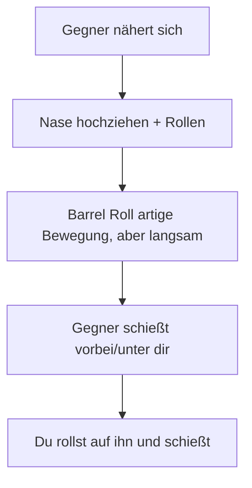

# 4. Empfohlene Manöver (T-18)

Diese Manöver sind maßgeschneidert für die High-Alpha Fähigkeiten der T-18.

## Grundlagen-Training

*   **High-Alpha Flight:** Übe das Fliegen bei 120-150 KIAS. Halte die Nase hoch, nutze die Ruder zum Rollen, nicht die Querruder (um Stall an einer Tragfläche zu vermeiden).
*   **Radius Control:** Versuche, den engstmöglichen Kreis zu fliegen, egal wie langsam du wirst.
*   **Ruder-Koordination:** Bei sehr niedrigen Geschwindigkeiten steuerst du mit den Pedalen, nicht mit dem Stick.

---

## Kern-Manöver (Must-Know)

### 1. One-Circle Entry

> Das wichtigste Manöver für Angles Fighter - den Kampf in deinen Vorteil zwingen.

**Wann nutzen?**
- Am Merge gegen jeden Gegner
- Wenn du deine Nose Authority ausspielen willst
- Immer als Standard-Taktik

**Ausführung:**

1. Am Merge drehst du deine Nase **direkt auf den Gegner** (nicht auf sein Heck!)
2. Du etablierst einen One-Circle Flow (beide Nasen aufeinander)
3. Bremse aktiv (Throttle zurück, Klappen wenn nötig)
4. Deine überlegene Nose Authority gibt dir den ersten Schuss

::: tip ERSTER SCHUSS GEWINNT
Im One-Circle zählt der erste Treffer. Du hast die beste Nose Authority - nutze sie!
:::

**Typische Fehler:**
- Zum Heck drehen → Two-Circle Flow (Rate-Nachteil!)
- Zu schnell bleiben → Gegner nutzt Sustained Rate gegen dich
- Ersten Schuss verpassen → Du verlierst Energie schneller als der Gegner

---

### 2. Flat Scissors

> Gegner zum Overshoot zwingen - dein ultimatives Defensiv-Manöver.

**Wann nutzen?**
- Gegner kommt schnell von hinten
- Du bist langsamer als der Gegner
- Du willst die Rollen umkehren (Jäger wird Gejagter)

**Ausführung:**

1. Gegner nähert sich schnell von hinten
2. Leite horizontale Scherenbewegung ein (links-rechts-links)
3. **Bremsen** und High-Alpha nutzen um extrem langsam zu werden
4. Der Gegner (der schneller fliegen muss) schießt an dir vorbei
5. Du bist jetzt hinter ihm

::: tip BREMSWETTBEWERB
Niemand kann so langsam fliegen wie du. Du gewinnst **jeden** Brems-Wettbewerb. Nutze das!
:::

**Typische Fehler:**
- Zu schnell bleiben → Gegner gewinnt die Scissors
- Zu früh aufhören → Gegner korrigiert und schießt doch
- Energie nicht mehr aufbauen können → Du steckst fest

---

### 3. The Pirouette

> Aggressive Nasendrehung am vertikalen Scheitelpunkt - dein Signature-Move.

**Wann nutzen?**
- Am Top eines vertikalen Manövers
- Wenn du überraschend die Richtung wechseln willst
- Für maximale Nose Authority bei minimaler Speed

**Ausführung:**

1. Ziehe vertikal hoch bis Speed fast weg ist (< 100 KIAS)
2. **Volles Seitenruder** treten (Full Rudder)
3. Das Flugzeug dreht sich fast auf der Stelle um die Gierachse
4. Nase fallen lassen und auf Gegner richten

::: warning NUR T-18
Nur die T-18 hat die Autorität für dieses Manöver. T-15 und T-16 stallen unkontrolliert.
:::

**Typische Fehler:**
- Zu viel Speed → Manöver funktioniert nicht, normaler Turn
- Falsches Ruder → du fällst in die falsche Richtung
- Gegner zu weit weg → kein Nutzen, nur Energieverlust

---

### 4. Snapshot

> Schneller Schuss aus ungünstigem Winkel - Hit and Reset.

**Wann nutzen?**
- Gegner fliegt kurz durch dein Fadenkreuz
- Du hast keinen stabilen Tracking-Shot
- Im One-Circle wenn sich die Nasen kreuzen

**Ausführung:**

1. Gegner bewegt sich durch dein Sichtfeld
2. Kurzzeitig **maximal am Stick ziehen**
3. Nase "in den Weg" des Gegners werfen
4. **Feuern** - Gun oder Fox-2
5. Sofort wieder entlasten (Unload)

::: danger ENERGIE-KOSTEN
Jeder Snapshot kostet massiv Energie. Triff beim ersten Mal, oder du bist verwundbar!
:::

---

## Fortgeschrittene Manöver

### Rolling Scissors

> Vertikale Version der Flat Scissors - für fortgeschrittene Piloten.

**Wann nutzen?**
- Gegner ist sehr nah und schnell
- Flat Scissors nicht möglich (zu wenig horizontaler Raum)
- Du willst vertikal gehen, aber langsam bleiben

**Ausführung:**

1. Kombiniere vertikale Bewegung mit Rollen
2. Mache eine "langsame Barrel Roll"
3. Der Gegner kann dir nicht folgen (zu schnell)
4. Du endest hinter oder über ihm

---

### High-Alpha Gun Defense

> Letzte Verteidigung gegen Gun-Angriff durch extremes Abbremsen.

**Wann nutzen?**
- Gegner hat Gun-Lösung
- Kein Raum für andere Manöver
- Nur als letzte Option

**Ausführung:**

1. Gegner feuert oder ist kurz davor
2. **Maximaler Zug** am Stick (9G+)
3. **Throttle auf Idle** - aktiv bremsen
4. Du wirst so langsam, dass der Gegner überschießt
5. Oder: Dein veränderter Flugpfad macht den Schuss ungültig

::: danger RISIKO
Dies ist ein Glücksspiel. Wenn es nicht funktioniert, bist du tot. Nur als allerletzte Option!
:::

---

### Phone Booth Taktik

> Den Kampf in extrem enge Distanz zwingen - dein Territorium.

**Wann nutzen?**
- Gegen T-16 (Rate Fighter)
- Wenn der Gegner Two-Circle will
- Um deine Nose Authority maximal auszuspielen

**Ausführung:**

1. Aggressiv auf den Gegner zu fliegen
2. Distanz unter 500m bringen
3. Hier zählt nur noch Nose Authority
4. Deine High-Alpha gibt dir den Vorteil

---

## Kombinationen

Diese Manöver-Ketten sind typisch für T-18 Piloten:

### One-Circle zu Snapshot
1. **One-Circle Entry** am Merge
2. Nasen kreuzen sich
3. **Snapshot** wenn Gegner durch Fadenkreuz fliegt
4. Treffer oder Reset

### Flat Scissors zu Pirouette
1. Gegner hinter dir, du startest **Flat Scissors**
2. Gegner folgt langsam
3. Du gehst vertikal und machst **Pirouette** am Top
4. Du bist jetzt hinter/über dem Gegner

### Rolling Scissors zu Gun Defense
1. **Rolling Scissors** gegen schnellen Gegner
2. Gegner bleibt dran und versucht zu schießen
3. **High-Alpha Gun Defense** als letztes Mittel
4. Gegner überschießt, du konterst

### Phone Booth Domination
1. Merge in **One-Circle Entry**
2. Aktiv bremsen, **Phone Booth** Distanz erzwingen
3. **Snapshot** → **Snapshot** → **Snapshot**
4. Irgendwann triffst du

---

## Trainings-Übungen

### Übung 1: High-Alpha Kontrolle
Fliege bei 150 KIAS einen kontrollierten Kreis. Nutze nur Ruder zum Rollen. Ziel: 3 Kreise ohne Stall oder Kontrollverlust.

### Übung 2: Pirouette Drill
Zoom Climb bis 100 KIAS, Pirouette, kontrolliert fallen lassen. Wiederhole 10x. Ziel: Präzise Nasenkontrolle in jede Richtung.

### Übung 3: Scissors Mastery
Gegen AI-Gegner: Lass ihn hinter dich kommen, dann Flat Scissors. Ziel: Gegner zum Overshoot zwingen, dann selbst hinter ihm sein.

### Übung 4: Snapshot Treffsicherheit
Im One-Circle gegen AI: Versuche nur Snapshots (keine Tracking-Shots). Ziel: Treffer pro Versuch erhöhen.

### Übung 5: Phone Booth Survival
Gegen AI im Nahkampf: Bringe die Distanz unter 500m und halte sie dort. Ziel: 30 Sekunden überleben und schießen.
