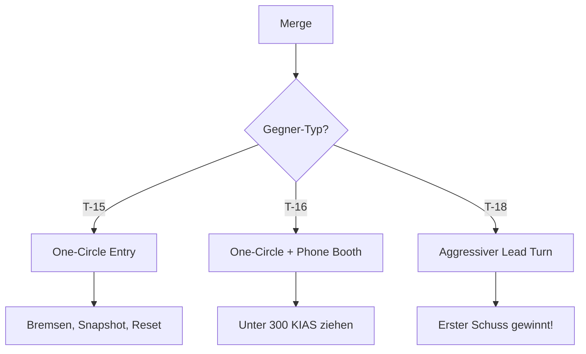

# 2. Taktik & Einsatzprofil (T-18)

## Der Archetyp: Angles Fighter

Die T-18 ist ein **Angles Fighter** (Winkel-Kämpfer). Du gewinnst nicht durch Geschwindigkeit oder Ausdauer, sondern durch Geometrie. Du kannst deine Nase auf Ziele richten, von denen andere Piloten nur träumen.

### Optimaler Einsatzbereich (The Envelope)

| Parameter | Sweet Spot (Ziel) | Danger Zone (Vermeiden) |
|-----------|-------------------|-------------------------|
| **Höhe** | **0 - 10.000 ft** | > 20.000 ft |
| **Speed** | **200 - 350 KIAS** | > 400 KIAS (Durchschnittlich) |
| **Kampfart** | One-Circle / Phone Booth | Sustained Two-Circle |

::: danger DIE 30-SEKUNDEN-REGEL
Die Diagramme lügen nicht: Deine Sustained Turn Rate ist fast immer die schlechteste (z.B. 16°/s bei 10k ft vs. 18°/s bei der T-16).
* Vermeide Kämpfe bei >400 KIAS. Dort bist du nur Durchschnitt.
* Nutze die **Corner Speed von ~365-385 KIAS** für den ersten Merge.
* Ziehe den Gegner sofort unter 300 KIAS. Dort gelten die Sustained-Rate-Diagramme nicht mehr, dort regiert deine High-Alpha-Fähigkeit.
:::

---

## Taktische Konzepte

### Angles Fighting Philosophie

> "Der erste Schuss gewinnt. Mach ihn möglich."

* **Nose Authority:** Deine Fähigkeit, die Nase auf das Ziel zu drehen, ist einzigartig. Nutze sie.
* **Aggression:** Im One-Circle zählt Geschwindigkeit des Schusses, nicht Eleganz.
* **Opfere Speed:** Anders als andere Jets gewinnst du durch Abbremsen, nicht durch Beschleunigen.

### One-Circle Dominanz

Im One-Circle Flow fliegen beide Nasen aufeinander zu. Hier gewinnt, wer **zuerst schießen kann** - und das bist du dank deiner Nose Authority.

### Phone Booth Kämpfe

Wenn die Distanz unter 500m fällt, bist du König. Hier zählt nur noch, wer die Nase schneller auf den Gegner bekommt.

---

## Der Merge

> Der Merge ist dein Moment. Hier entscheidest du den Kampf - oder verlierst ihn.

### Merge-Strategie für die T-18

### Speed am Merge

| Situation | Empfohlene Speed | Grund |
|-----------|------------------|-------|
| vs. T-15 | 350-385 KIAS | Corner Speed für ersten Schuss |
| vs. T-16 | 350-400 KIAS | Dann sofort abbremsen |
| vs. T-18 | 350-385 KIAS | Spiegelkampf - Corner Speed |

### Lead Turn am Merge

::: tip AGGRESSIVER LEAD TURN
Als T-18 ist der Lead Turn entscheidend. Du musst den ersten Schuss bekommen. Drehe früh und aggressiv.
:::

**Timing:** 1-1.5 Sekunden vor dem Passieren - früher als andere!

### Flow-Entscheidung

| Flow | Wann wählen? | T-18 Vorteil? |
|------|--------------|---------------|
| **One-Circle** | Immer | **JA** - Dein Territorium |
| **Two-Circle** | Niemals freiwillig | Nein - T-16 dominiert |
| **Vertikal** | Nur Pirouette | Bedingt - T-15 dominiert auf Dauer |

---

## Defensive Strategien

> Deine beste Verteidigung ist Angriff. Aber manchmal wirst du trotzdem gejagt.

### Wenn du gejagt wirst

#### Gegen T-15 (Energy Fighter)

1. **Nicht vertikal folgen!** - Du verlierst sofort
2. **Bremsen** - Werde so langsam wie möglich
3. **Flat Scissors** - Zwinge ihn zum Overshoot
4. Wenn er Boom & Zoom macht: **Jink** + Umdrehen nach seinem Pass

::: warning SPEED IST SEIN FREUND
Die T-15 will schnell sein. Werde langsam, dann muss er zu dir kommen - in dein Territorium.
:::

#### Gegen T-16 (Rate Fighter)

1. **One-Circle erzwingen** - Drehe zur Nase, nicht zum Heck
2. **Phone Booth** - Distanz unter 500m bringen
3. **Snapshot-Möglichkeiten** suchen
4. **Aushungern umkehren:** ER hat die bessere Sustained Rate, aber du hast Nose Authority

::: danger TWO-CIRCLE VERMEIDEN
Im Two-Circle verlierst du gegen die T-16. Erzwinge One-Circle um jeden Preis!
:::

#### Gegen T-18 (Angles Fighter)

1. **Spiegelkampf** - Wer aggressiver ist, gewinnt
2. **Lead Turn** - Wer früher dreht, hat Vorteil
3. **Erster Schuss** - Alles auf die erste Chance setzen
4. Rolling Scissors können helfen, Position zu verbessern

### Notfall-Protokoll

Wenn alles schiefgeht:

1. **Flat Scissors** - Gegner zum Overshoot zwingen
2. **Rolling Scissors** - Wenn horizontal nicht geht
3. **Pirouette** - Als letzte Option vertikal gehen, am Top drehen
4. **High-Alpha Gun Defense** - Absolut letztes Mittel

::: danger ENERGIE-PROBLEM
Du hast schlechte Beschleunigung. Wenn du fliehen musst, geht das nicht durch Speed. Nutze Manöver um den Spieß umzudrehen.
:::

---

## Error Recovery

> Im Angles Fighting hast du weniger Fehlertoleranz. So korrigierst du.

### "Ich habe den ersten Schuss verpasst"

**Problem:** Du hattest eine Chance und hast nicht getroffen. Jetzt hast du weniger Energie.

**Lösung:**
1. **Nicht verzweifeln** - Du bekommst weitere Chancen im One-Circle
2. **Nose Authority nutzen** - Halte die Nase auf dem Gegner
3. **Nächster Pass** - Snapshot-Gelegenheit suchen
4. Wenn Energie kritisch: **Flat Scissors** zum Reset

### "Ich bin zu schnell" (> 400 KIAS)

**Problem:** Du bist aus deinem optimalen Speed-Band nach oben gefallen.

**Lösung:**
1. **Aktiv bremsen** - Throttle zurück, ggf. Klappen
2. **In die Kurve ziehen** - Speed durch Manöver abbauen
3. Ziel: Unter 350 KIAS kommen
4. Dann: Normaler Kampf fortsetzen

### "Der Gegner hält Distanz"

**Problem:** T-16 oder T-15 verweigert den Nahkampf.

**Lösung:**
1. **Aggression erhöhen** - Direkt auf ihn zufliegen
2. **Phone Booth erzwingen** - Distanz schließen
3. **Lead Turn** - Bei jedem Pass aggressiver werden
4. Geduld: Irgendwann muss er schießen, dann ist er nah

### "Ich habe keine Energie mehr" (< 150 KIAS)

**Problem:** Du bist so langsam, dass du kaum noch manövrieren kannst.

**Lösung:**
1. **Ruhe bewahren** - Du hast immer noch Nose Authority
2. **High-Alpha nutzen** - Du kannst immer noch die Nase drehen
3. **Snapshot suchen** - Eine letzte Chance
4. **Unload und beschleunigen** wenn der Gegner nicht sofort schießen kann

---

## Cockpit-Workflow

1. **AoA-Management:** Achte auf deinen Anstellwinkel. Du kannst so hart ziehen, dass du fast stehen bleibst. Tu dies nur, wenn du einen Schuss hast!
2. **Ruder-Nutzung:** Bei High-Alpha (< 200 KIAS) steuerst du mehr mit den Pedalen (Ruder) als mit dem Stick, um die Flügel stabil zu halten.
3. **Geduld beim Schuss:** Du hast oft nur eine Chance für einen "Snapshot" (Gegner fliegt durch Fadenkreuz).

---

## Do's & Don'ts

### Do's

* ✅ Erzwinge One-Circle-Kämpfe (Nase auf Nase).
* ✅ Zieh den Gegner in den "Schlamm" (< 250 KIAS). Dort bist du König.
* ✅ Nutze die Nase, um Gegner einzuschüchtern.
* ✅ Sei aggressiv am Merge - erster Schuss gewinnt.
* ✅ Nutze Flat Scissors wenn du gejagt wirst.

### Don'ts

* ❌ Versuche, eine T-16 in einem langen Kreisrennen zu schlagen.
* ❌ Folge einer T-15 in die Stratosphäre.
* ❌ Bleib schnell (> 400 KIAS). Speed ist für die T-18 oft ein Nachteil im Nahkampf.
* ❌ Verpasse den ersten Schuss im One-Circle.
* ❌ Kämpfe in Two-Circle - das ist T-16 Territorium.
