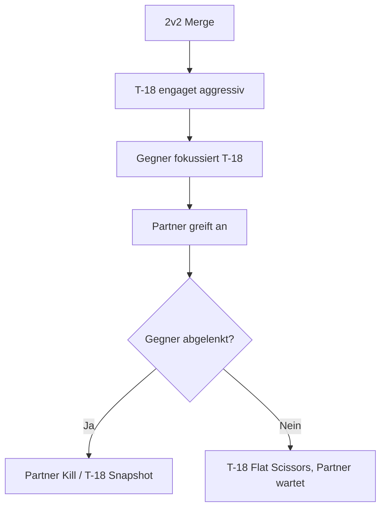
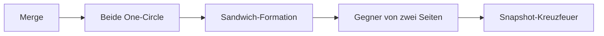
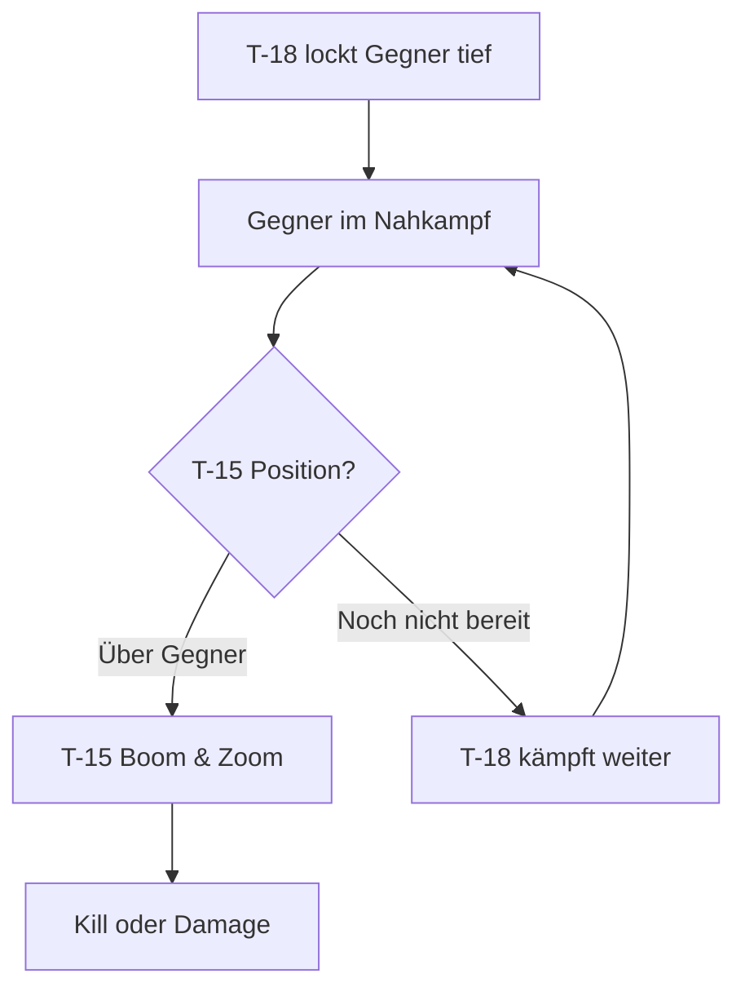
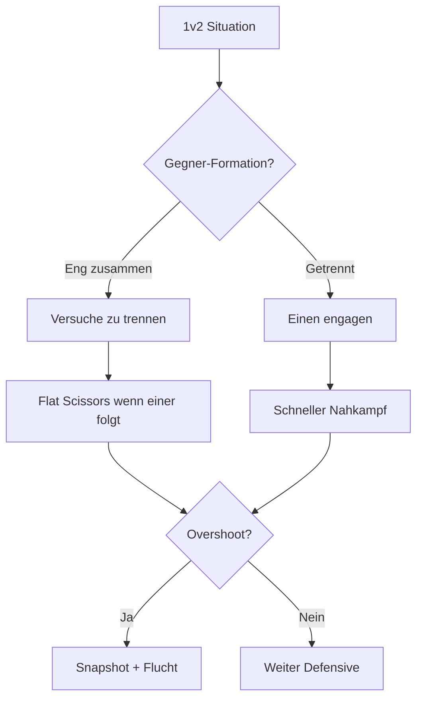
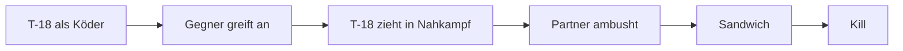

# 5. Team-Taktiken (T-18)

> Die T-18 Cutlass ist der aggressive Nahkämpfer im Team - perfekt als Köder oder Finisher.

## Grundlagen der Wingman-Koordination

### Rollen im 2v2

| Rolle | Aufgabe | Wann T-18? |
|-------|---------|------------|
| **Lead** | Primärer Angreifer, Taktik-Entscheidung | Bedingt - nur gegen andere T-18 |
| **Wingman** | Unterstützung, Deckung, Opportunist | Ideal - Nahkampf-Spezialist |
| **Bait** | Gegner anlocken | Exzellent - zieht Gegner in Nahkampf |

### Formation & Separation

**Empfohlene Formation:**
- **Spread:** 1-1.5 nm seitlicher Abstand
- **Level oder Low:** Gleiche Höhe oder T-18 tiefer

::: tip NIEDRIG UND NAH
Als T-18 solltest du nicht weit vom Partner sein. Deine Stärke ist Nahkampf - sei bereit schnell einzugreifen.
:::

### Kommunikation (Brevity)

| Ruf | Bedeutung | T-18 Kontext |
|-----|-----------|--------------|
| **"Engaged"** | Ich kämpfe aktiv | T-18 im One-Circle |
| **"Press"** | Greif an | Partner soll einsteigen |
| **"Merge"** | Zusammenkommen | Für Nahkampf |
| **"Bait"** | Ich ziehe an | T-18 lockt Gegner |
| **"Finish"** | Ich schließe ab | T-18 Snapshot-Chance |

---

## Die T-18 im 2v2

### Als Bait (Köder)

Die T-18 ist ein **exzellenter Köder** - Gegner unterschätzen oft ihre Gefährlichkeit:

**Deine Aufgaben:**
1. **Gegner anlocken** - In den Nahkampf ziehen
2. **Beschäftigen** - Gegner an dich binden
3. **Überleben** - Bis Partner eingreifen kann
4. **Opportunismus** - Wenn Chance: Snapshot!

**Taktik:**

::: warning KOMMUNIKATION KRITISCH
Als Bait musst du deinem Partner sagen, wann er eingreifen soll. "Press!" wenn der Gegner auf dich fokussiert ist.
:::

### Als Finisher

Wenn dein Partner den Gegner geschwächt hat:

**Deine Aufgaben:**
1. **Beobachten** - Warten auf den richtigen Moment
2. **Schnell einsteigen** - Wenn Gegner langsam/abgelenkt
3. **Snapshot** - Schneller Kill
4. **Raus** - Nicht verweilen

**Taktik:**
- Warte bis Gegner unter **300 KIAS**
- Oder bis Gegner **auf Partner fokussiert**
- Dann: Aggressiver One-Circle Entry
- Snapshot und raus

---

## Kombinations-Taktiken

### T-18 + T-18 (Double Angles)

**Stärke:** Overwhelming Nahkampf-Dominanz

**Taktik:**

1. Beide T-18 erzwingen One-Circle
2. **Sandwich:** Von zwei Seiten gleichzeitig angreifen
3. Gegner kann nicht beiden ausweichen
4. Einer bekommt den Shot

::: danger BLUE-ON-BLUE GEFAHR
Mit zwei T-18 im Nahkampf ist Friendly Fire ein echtes Risiko. Klare Sektoren absprechen!
:::

---

### T-18 + T-15 (Angles + Energy)

**Stärke:** High-Low Sandwich, klassische Kombination

**Taktik:**

| Pilot | Rolle | Aufgabe |
|-------|-------|---------|
| T-18 | Low Bait/Fighter | Gegner in Nahkampf ziehen |
| T-15 | High Cover | Boom & Zoom von oben |

**Ablauf:**
1. T-18 engaget aggressiv, zieht Gegner tief
2. Gegner fokussiert T-18 (Nahkampf)
3. T-15 Boom & Zoom von oben
4. Oder: T-18 Snapshot wenn Gegner abgelenkt

::: tip KÖDER-ROLLE
Als T-18 in dieser Kombi bist du der Köder. Dein Job ist es, den Gegner zu binden. Der Kill geht oft an die T-15 - und das ist okay!
:::

---

### T-18 + T-16 (Angles + Rate)

**Stärke:** Flow-Konter - perfekte Ergänzung

**Taktik:**

| Pilot | Rolle | Aufgabe |
|-------|-------|---------|
| T-18 | One-Circle Spezialist | Nahkampf, Snapshots |
| T-16 | Two-Circle Spezialist | Rate-Fight, Ausdauer |

**Ablauf:**
1. Beide engagen gleichzeitig
2. Gegner muss Flow wählen
3. Egal was er wählt - einer von euch hat Vorteil
4. Der Benachteiligte unterstützt den Bevorteilten

::: tip FLOW-ZWANG
Diese Kombination zwingt den Gegner, gegen seinen Willen zu kämpfen. Er verliert immer gegen einen von euch.
:::

---

## 2v1 Situationen

### Du bist in Überzahl (2v1)

**Du als T-18 + Partner gegen 1:**

1. **Sandwich erzwingen:** Von zwei Seiten angreifen
2. **Abwechselnder Druck:** Einer drückt, einer positioniert sich
3. **Nahkampf erzwingen:** Distanz schließen
4. **Schneller Abschluss:** Nicht spielen, töten!

::: warning SCHNELL HANDELN
Als T-18 in 2v1: Sei aggressiv. Je länger der Kampf dauert, desto mehr Energie verlierst du. Schneller Kill ist das Ziel.
:::

### Du bist in Unterzahl (1v2)

**Du als T-18 gegen 2:**

Dies ist die schwierigste Situation für die T-18. Du kannst weder fliehen noch lange kämpfen.

**Strategie:**
1. **Einen isolieren** - Versuche, zwischen ihnen zu kommen
2. **Nahkampf erzwingen** - Dein einziger Vorteil
3. **Flat Scissors** - Wenn einer zu nah kommt
4. **Opportunistischer Kill** - Einen erwischen, dann defensive

::: danger ÜBERLEBENS-MODUS
1v2 als T-18 ist kritisch. Dein Ziel ist Überleben, nicht Heldentum. Wenn du einen erwischst, fliehe sofort!
:::

---

## Team-Taktik: "The Trap"

Eine spezielle T-18 Team-Taktik für aggressive Teams:

### Ablauf

1. **Setup:** T-18 fliegt voraus als scheinbar leichtes Ziel
2. **Bait:** Gegner greifen T-18 an
3. **Engage:** T-18 zieht Gegner in Nahkampf
4. **Ambush:** Partner (idealerweise T-15) greift von oben an
5. **Kill:** T-18 oder Partner schließt ab

**Voraussetzung:**
- Partner muss versteckt/höher sein
- T-18 muss überleben können bis Partner eingreift
- Klare Kommunikation

::: tip THE TRAP
Diese Taktik funktioniert am besten gegen aggressive Gegner. Vorsichtige Piloten fallen nicht so leicht darauf rein.
:::

---

## Kommunikations-Checkliste

### Vor dem Merge
- [ ] "Sorted" - Wer nimmt welches Ziel
- [ ] "Visual" - Ich sehe den Gegner
- [ ] "Bait" - Ich gehe als Köder vor

### Während des Kampfs
- [ ] "Engaged" - Ich bin im Nahkampf
- [ ] "Press!" - Greif jetzt an!
- [ ] "Finish" - Ich habe Schusschance
- [ ] "Defensive" - Ich werde gejagt

### Notfall
- [ ] "Break [Richtung]!" - Sofort ausweichen
- [ ] "Scissors" - Ich mache Flat Scissors
- [ ] "Bug out!" - Flucht, Kampf abbrechen
