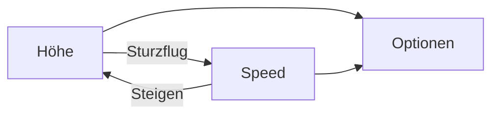
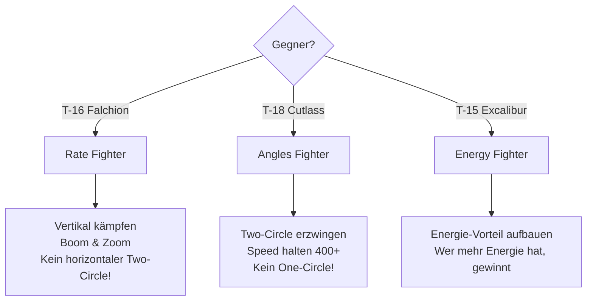

# Golden Rules

> Die Merksätze, die über Leben und Tod entscheiden.

Diese Regeln gelten **immer** - egal gegen wen du fliegst. Präge sie dir ein, bis sie automatisch werden.

---

## Die 10 Gebote des Luftkampfs

### 1. Energy is Life

> **Energie ist Leben.**

Geschwindigkeit und Höhe sind deine Lebensversicherung. Wer keine Energie hat, kann nicht manövrieren, nicht fliehen, nicht kämpfen.

::: danger MERKE
Langsam = Tot. Halte **immer** mindestens 300 kts, besser 400+.
:::

---

### 2. No Nose Fight

> **Kämpfe niemals Nase-auf-Nase gegen einen Angles Fighter.**

Ein One-Circle-Fight gegen eine T-18 Cutlass ist Selbstmord. Sie dreht die Nase schneller und schießt dir ins Gesicht.

::: tip T-15 REGEL
Gegen T-18: **Two-Circle erzwingen** - drehe zum Heck, nicht zur Nase!
:::

---

### 3. Speed is Life, Altitude is Life Insurance

> **Geschwindigkeit ist Leben, Höhe ist Lebensversicherung.**

- **Speed** gibt dir Optionen im Moment
- **Höhe** gibt dir Optionen für später (kann in Speed umgewandelt werden)

---

### 4. Lose Sight, Lose Fight

> **Verlierst du den Gegner aus den Augen, verlierst du den Kampf.**

Situational Awareness ist alles. Der Gegner, den du nicht siehst, ist der, der dich tötet.

::: warning IMMER
- Kopf auf Drehkranz
- Gegner tracken
- Wisse wo er ist, BEVOR du manövrierst
:::

---

### 5. Fight in the Vertical

> **Kämpfe in der Vertikalen.**

Die T-15 hat **zwei Triebwerke**. Nutze sie! Ein flacher, horizontaler Kampf negiert deinen größten Vorteil.

| Horizontal | Vertikal |
|------------|----------|
| T-16 gewinnt (Rate) | **T-15 gewinnt (Schub)** |
| T-18 gefährlich (Radius) | **T-15 dominiert** |

---

### 6. Don't Turn with a Turner

> **Drehe nicht mit einem Kurvenkämpfer.**

Die T-16 dreht besser. Die T-18 dreht enger. Versuche nicht, sie in ihrem Spiel zu schlagen.

::: danger FEHLER
"Ich ziehe einfach härter" → **Niederlage**
:::

::: tip RICHTIG
"Ich kämpfe anders" → **Sieg**
:::

---

### 7. Pull - Unload - Pull

> **Ziehen - Entlasten - Ziehen**

Der Kampf-Rhythmus erfahrener Piloten:
1. **Pull**: Manöver/Schuss
2. **Unload**: 0G, Energie aufbauen
3. **Pull**: Nächstes Manöver

Wer **permanent zieht**, verliert seine Energie und stirbt.

---

### 8. Overshoot is Opportunity

> **Ein Overshoot ist eine Chance.**

Wenn der Gegner an dir vorbeischießt:
- Für **dich**: Rollentausch! Nachbrenner, Nase drauf.
- Gegen **dich**: Vermeide ihn durch Lag Pursuit und High Yo-Yo.

---

### 9. Corner Speed or Die

> **Corner Speed oder stirb.**

Bei Corner Speed (400-450 kts für T-15) hast du maximale Turn Rate. Darüber oder darunter bist du im Nachteil.

| Speed | Status |
|-------|--------|
| < 300 kts | **GEFAHR** - Träge, verwundbar |
| 300-400 kts | Aufbauen |
| **400-450 kts** | **OPTIMAL** |
| > 500 kts | Radius zu groß |

---

### 10. Patience Kills

> **Geduld tötet.**

Der Sieg gehört dem, der **wartet**. Erzwinge nichts. Warte auf den Fehler des Gegners. Ein sicherer Schuss ist besser als zehn verzweifelte.

::: info MENTALITÄT
Hektik → Fehler → Tod

Geduld → Chance → Sieg
:::

---

## Schnell-Referenz: Gegen wen wie?

---

## Die Kurzform (Zum Auswendiglernen)

| # | Regel | Bedeutung |
|---|-------|-----------|
| 1 | **Energy is Life** | Nie langsam werden |
| 2 | **No Nose Fight** | Kein One-Circle vs T-18 |
| 3 | **Speed is Life** | Optionen = Überleben |
| 4 | **Lose Sight, Lose Fight** | Gegner immer im Auge |
| 5 | **Fight in the Vertical** | T-15 dominiert vertikal |
| 6 | **Don't Turn with a Turner** | Nicht ihr Spiel spielen |
| 7 | **Pull - Unload - Pull** | Energie-Rhythmus |
| 8 | **Overshoot is Opportunity** | Chance nutzen |
| 9 | **Corner Speed or Die** | 400-450 kts optimal |
| 10 | **Patience Kills** | Warte auf den Fehler |

---

## Das Mantra

::: tip VOR JEDEM KAMPF
> Ich bin ein **Energy Fighter**.
> Ich kämpfe **vertikal**.
> Ich halte **Speed**.
> Ich habe **Geduld**.
> Der Gegner macht den ersten Fehler - **nicht ich**.
:::
