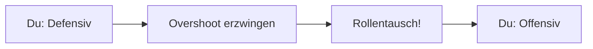

# Defensive Manöver - Einführung

Defensive Manöver sind deine Lebensversicherung, wenn der Gegner hinter dir ist. Dein Ziel verschiebt sich drastisch: Von "Gewinnen" zu "Überleben".

## Das Grundprinzip: Den Spieß umdrehen

Dein Hauptziel in der Defensive ist es, den Gegner zum **Overshoot** zu zwingen. Du willst, dass er an dir vorbeifliegt. Sobald er vor dir ist, wechseln die Rollen, und du bist der Angreifer.

Dazu nutzt du:
1.  **Break Turns:** Um den Schusswinkel des Gegners sofort zu zerstören.
2.  **Geometrie:** Um ihn in eine Position zu zwingen, in der er nicht feuern kann.
3.  **Energie-Management:** Um ihn dazu zu bringen, seine Energie schneller zu verbrauchen als du.

## Übersicht der Manöver

Hier lernst du, wie du überlebst und konterst:

*   [**Break Turn**](./defensiv/break-turn.md): Die erste Reaktion auf jeden Angriff.
*   [**Scissors (Scheren)**](./defensiv/scissors.md): Nutze Bremsen und Rollen, um den Gegner vorbeiziehen zu lassen.
*   [**Slice Turn**](./defensiv/slice-turn.md): Ein Manöver, um Energie und Separation zu gewinnen.
*   [**Defensive Spirale**](./defensiv/spirale.md): Wenn du festsitzt und Zeit gewinnen musst.
*   [**Jinking & Overshoots**](./defensiv/jinking.md): Die "Notbremse", wenn der Gegner direkt im Nacken sitzt.
