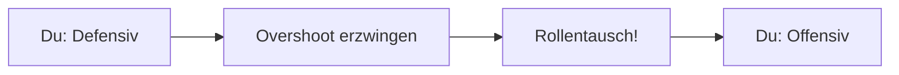
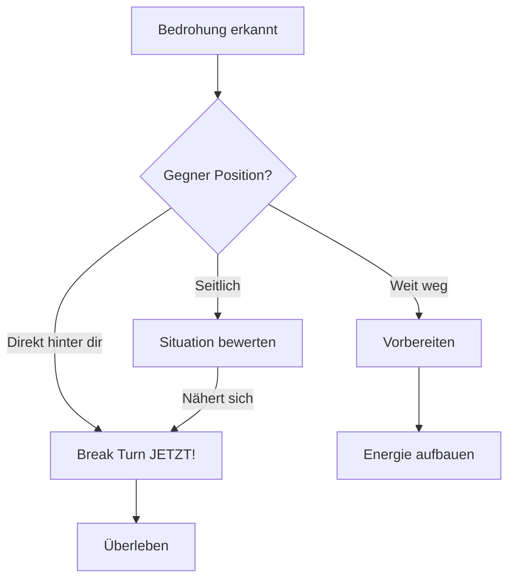
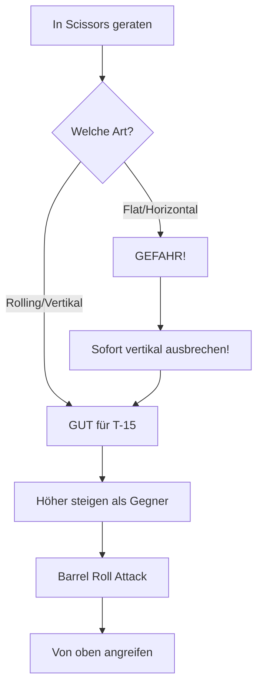
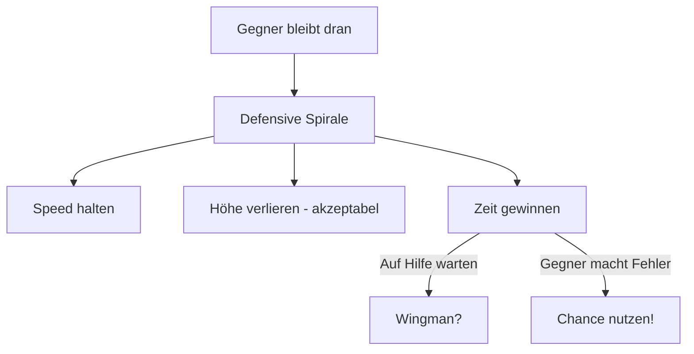
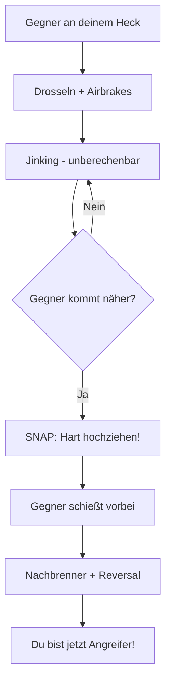

# Defensive Manöver

Defensive Manöver nutzt du, wenn der Gegner hinter dir ist. Ziel: Überleben und die Situation umkehren.

## Grundprinzip: Overshoot erzwingen

Dein Hauptziel in der Defensive ist es, den Gegner zum **Overshoot** zu zwingen. Dann wechseln die Rollen.

---

## Break Turn

Der härteste Turn, den du fliegen kannst. Nutze ihn als erste Reaktion auf einen Angriff.

### Ausführung

1. **Max G** - Ziehe so hart du kannst
2. **In Richtung Bedrohung** - Drehe ZUM Gegner
3. **Leichtes Sinken** - Hilft den Turn zu verschärfen
4. **Afterburner** - Halte Speed so gut es geht

::: warning ENERGIE-KOSTEN
Break Turns kosten enorm viel Energie. Nutze sie nur wenn nötig!
:::

### Wann Break Turn?

---

## Scissors (Scherenmanöver)

Scissors treten auf, wenn ein Overshoot passiert und der Verteidiger versucht, den Angreifer durch Bremsen und Kurvenwechsel vor sich zu zwingen.

::: danger KRITISCHE UNTERSCHEIDUNG FÜR T-15
Es gibt **zwei Varianten** - und für die T-15 ist die Unterscheidung **überlebenswichtig**!
:::

### Flat Scissors (Horizontale Schere)

**Beschreibung:** Zwei Flugzeuge weben horizontal hin und her, wie Scherenblätter. Wer langsamer fliegen kann, gewinnt.

::: danger T-15 DOKTRIN: VERMEIDEN!
Dies ist ein reiner **Radius- und Langsamflug-Kampf**.

| Gegner | Deine Gewinnchance |
|--------|-------------------|
| T-18 Cutlass | **0%** - Sie gewinnt immer |
| T-16 Falchion | **~20%** - Sie gewinnt meist |

Die T-15 ist zu schwer und hat bei niedrigen Geschwindigkeiten schlechtere Rollraten. **Flat Scissors gegen T-18 = Tod!**
:::

### Rolling Scissors (Vertikale Schere)

**Beschreibung:** Beide Flugzeuge fliegen korkenzieherartig umeinander, wobei sie fortlaufend Höhe und Geschwindigkeit tauschen. Es ist eine Serie von "Fassrollen" umeinander.

::: tip T-15 DOKTRIN: BEVORZUGT
Dieses Manöver integriert eine **vertikale Komponente** - dein Terrain!
:::

**Ausführung:**
1. Wenn du am Gegner vorbeischießt, ziehe sofort **hoch in die Vertikale** (ca. 60-70°)
2. Nutze den **Schub der T-15**, um höher zu steigen als der Gegner
3. Rolle über dem Gegner zurück und ziehe die Nase nach unten (**Barrel Roll Attack**)

**Warum es funktioniert:**
- Die T-18 und T-16 können zwar eng drehen, aber die T-15 kann **besser steigen** und dabei Energie halten
- Indem du den Kampf "groß" und vertikal machst, zwingst du den Gegner, gegen die Schwerkraft zu arbeiten
- Wenn die T-18 versucht, ihre Nase vertikal auf dich zu richten, wird sie extrem schnell Energie verlieren und "aus dem Himmel fallen" (Stall)
- Du kannst dann entspannt hinter sie fallen

### Zusammenfassung Scissors

| Scissors-Typ | T-15 Doktrin | Begründung |
|--------------|--------------|------------|
| **Flat Scissors** | VERMEIDEN | Radius/Low-Speed-Kampf = Niederlage |
| **Rolling Scissors** | BEVORZUGT | Vertikale Komponente = T-15 Vorteil |

---

## Slice Turn

Ein niedriger Turn mit Sinken, um Speed und Distanz zu gewinnen.

### Wann nutzen?

- Gegner ist höher
- Du brauchst Speed
- Gegner committed zu hartem Turn

### Ausführung

1. Rolle auf die Seite (90° Bank)
2. Ziehe mit leichtem Sinken
3. Beschleunige während des Turns
4. Verlasse den Fight mit Speed

::: tip T-15 VORTEIL
Die T-15 kann nach einem Slice schnell wieder Höhe gewinnen!
:::

---

## Defensive Spirale

Wenn du Energie verloren hast und der Gegner hartnäckig bleibt.

### Das Konzept

Statt immer härter zu drehen (und mehr Energie zu verlieren), fliege eine kontrollierte absteigende Spirale.

### Wichtig

- **Nicht stumpf abwärts drehen** - kontrolliert!
- **Speed über 300 kts halten**
- **Auf Gegner-Fehler warten**

---

## Overshoot erzwingen (Die "Notbremse")

Wenn eine T-16 oder T-18 an deinem Heck klebt (6 Uhr Position):

### Die Technik

1. **Drosseln**: Schub sofort auf **Leerlauf (Idle)**
2. **Airbrakes**: Ausfahren (in VFM sehr effektiv)
3. **Jink**: Unregelmäßige Roll- und Ziehbewegungen um das Zielen zu erschweren, aber **keine konstante Kurve** fliegen (da dies dem Gegner einen Vorhaltpunkt gibt)
4. **Der Snap**: Sobald du siehst, dass der Gegner aufgrund deiner Bremsung schnell näher kommt und droht, an dir vorbeizufliegen:
   - Ziehe **hart in die Vertikale** oder
   - Führe eine **High Yo-Yo Defense** aus
5. **Reversal**: Wenn er vorbeigeflogen ist: **Nachbrenner rein**, Nase auf ihn drehen. Du bist nun der Angreifer!

---

## Notfall: Gegner hat Schusslösung

::: danger SOFORTMASSNAHMEN
Wenn der Gegner gerade schießen will:

1. **Harter Break Turn** - Max G in seine Richtung
2. **Flares/Chaff** - Gegen Missiles
3. **Jink** - Unvorhersehbare Bewegungen
4. **Rollen** - Ändere Flugbahn ständig
:::

### Jinking

Kleine, schnelle Richtungsänderungen um Schusslösung zu stören:

- Links-rechts rollen
- Pitch up/down variieren
- **Nicht vorhersehbar** sein
- **Keine konstante Kurve** - das gibt dem Gegner einen Vorhaltewinkel

---

## Defensive Zusammenfassung

| Manöver | Wann | Ziel |
|---------|------|------|
| Break Turn | Sofort bei Bedrohung | Winkel gewinnen |
| Rolling Scissors | Nach Overshoot | Position umkehren |
| Slice Turn | Energie niedrig | Speed + Distanz |
| Defensive Spirale | Auswegslos | Zeit gewinnen |
| Jinking | Gegner schießt | Schuss stören |

::: info T-15 PHILOSOPHIE
Die beste Defensive ist, nie in die Defensive zu geraten. Halte Energie, halte Situationsbewusstsein!
:::
