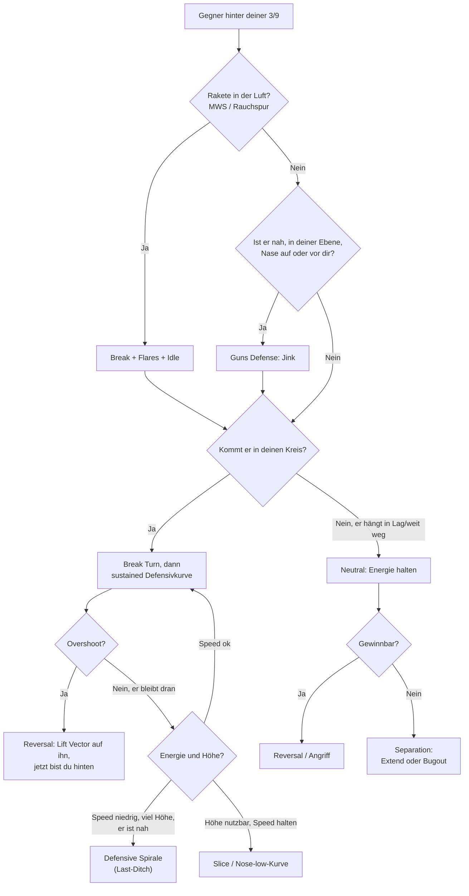

# Defensive Manöver – Prioritäten und Entscheidungslogik

> Er ist hinter dir. Erst überleben, dann neutralisieren, dann entweder umdrehen oder raus.

Defensiv heißt: Der Gegner steht hinter deiner 3/9-Linie und bestimmt das Tempo. Du gewinnst das nicht in einem Zug, sondern arbeitest eine Prioritätenliste ab. Jede Stufe hat nur ein Ziel: die nächste zu erreichen.

## Die Prioritäten

1. **Bedrohung sehen.** Kopf drehen, RWR und MWS beachten ([RWR & MWS](/avionik/rwr)).
2. **Den Schuss schlagen.** Rakete: [Break + Flares + Idle](/grundlagen/defensiv/break-turn#raketenabwehr-kurzfassung). Kanone in Lösung: [Guns Defense](/grundlagen/defensiv/guns-defense). Alles andere wartet.
3. **Sicht halten.** Ohne Sicht reagierst du nur noch auf Vermutungen.
4. **Eintritt in deinen Kurvenkreis verweigern.** Mit [Break Turn](/grundlagen/defensiv/break-turn) und Defensivkurve hältst du seine AA hoch.
5. **Overshoot erzwingen.** Siehe [Overshoot](/grundlagen/offensiv/overshoot).
6. **Neutralisieren:** keiner hat mehr einen Vorteil.
7. **Umkehren oder separieren.** Reversal, Schere, Vertikale – oder kontrolliert raus: [Separation](/grundlagen/defensiv/separation).

::: warning DIE REIHENFOLGE ZÄHLT
Wer gegen eine anfliegende Rakete an seine Energie denkt, ist tot. Wer nach dem überlebten Schuss weiter Max-G zieht, verliert die Energie für die nächste Stufe. Immer die oberste offene Priorität zuerst.
:::

## Entscheidungslogik

```mermaid
flowchart TD
    T["Gegner hinter deiner 3/9"] --> M{"Rakete in der Luft?<br/>MWS / Rauchspur"}
    M -->|Ja| MD["Break + Flares + Idle"]
    M -->|Nein| GU{"Ist er nah, in deiner Ebene,<br/>Nase auf oder vor dir?"}
    GU -->|Ja| J["Guns Defense: Jink"]
    GU -->|Nein| E{"Kommt er in deinen Kreis?"}
    E -->|Ja| B["Break Turn, dann<br/>sustained Defensivkurve"]
    E -->|"Nein, er hängt in Lag/weit weg"| N["Neutral: Energie halten"]
    MD --> E
    J --> E
    B --> O{"Overshoot?"}
    O -->|Ja| R["Reversal: Lift Vector auf ihn,<br/>jetzt bist du hinten"]
    O -->|"Nein, er bleibt dran"| L{"Energie und Höhe?"}
    L -->|"Speed niedrig, viel Höhe,<br/>er ist nah"| SP["Defensive Spirale<br/>(Last-Ditch)"]
    L -->|"Höhe nutzbar, Speed halten"| SL["Slice / Nose-low-Kurve"]
    L -->|"Speed ok"| B
    N --> S{"Gewinnbar?"}
    S -->|Ja| R2["Reversal / Angriff"]
    S -->|Nein| SEP["Separation:<br/>Extend oder Bugout"]
```

## Die Werkzeuge

| Situation | Werkzeug | Kurz |
|---|---|---|
| Er kommt rein, droht in Schussposition | [Break Turn](/grundlagen/defensiv/break-turn) | Lift Vector auf ihn, max Instant Rate nahe Corner Speed, dann Defensivkurve |
| Rakete in der Luft | [Raketenabwehr](/grundlagen/defensiv/break-turn#raketenabwehr-kurzfassung) | Break + Flares + Idle, Details: [Gegenmaßnahmen](/avionik/gegenmassnahmen) |
| Er ist in Kanonen-Lösung | [Guns Defense](/grundlagen/defensiv/guns-defense) | Unload, rollen, max G aus seiner Ebene, wiederholen |
| Rate nötig, Speed halten, Höhe da | [Slice Turn](/grundlagen/defensiv/slice-turn) | Überbankt, Nase unter Horizont, nahe max G |
| Langsam, er klebt hinter dir, viel Höhe | [Defensive Spirale](/grundlagen/defensiv/spirale) | Steil nose-low, geladen, langsam |
| Kein Sieg möglich oder Unterzahl | [Separation](/grundlagen/defensiv/separation) | Unload, volle Leistung, raus aus seiner WEZ |
| Er hat überschossen, ihr seid nah nebeneinander | [Scissors](/grundlagen/neutral/scissors) | Gezielt einsetzen oder vermeiden |

## VFM-Hinweise

- **Jet-Wahl prägt die Defensive.** Die [T-15](/flugzeuge/t15) bricht am härtesten (beste Instant Rate, kleinster Radius), die [T-16](/flugzeuge/t16) verteidigt am besten, indem sie im Band ~420–500 KIAS Speed hält, die [T-18](/flugzeuge/t18) will den Kampf langsam machen. Daten: [Flugzeugvergleich](/flugzeuge/vergleich).
- **Ranked 1v1:** Bei Zeitablauf gewinnt der Verfolger. Nur überleben reicht nicht, du musst neutralisieren und umdrehen ([Separation im Ranked](/grundlagen/defensiv/separation#vfm-separation-im-ranked-1v1-hat-einen-preis)).

::: tip MERKE
- Sehen, Schuss schlagen, Sicht halten, Eintritt verweigern, Overshoot erzwingen, neutralisieren, umdrehen oder raus.
- Immer die oberste offene Priorität zuerst.
- Max G nur, solange eine Bedrohung da ist. Danach Energie halten.
- Der Overshoot des Angreifers ist dein Weg zurück – aber nicht durch Bremsen in seine Tracking-Lösung hinein.
:::

Weiter: [Break Turn](/grundlagen/defensiv/break-turn)
