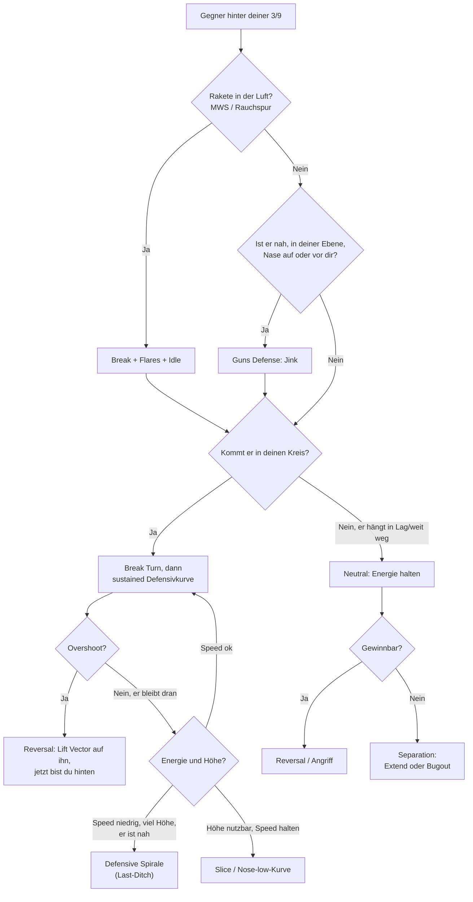

# Defensive Manöver – Prioritäten und Entscheidungslogik

> Er ist hinter dir. Erst überleben, dann neutralisieren, dann entweder umdrehen oder raus.

Defensiv heißt: Der Gegner steht hinter deiner 3/9-Linie und bestimmt das Tempo. Du gewinnst diesen Kampf nicht in einem Zug. Du arbeitest eine Prioritätenliste ab, und jede Stufe hat nur ein Ziel: die nächste Stufe zu erreichen.

## Die Prioritäten

1. **Bedrohung sehen.** Was du nicht siehst, kannst du nicht verteidigen. Kopf drehen, RWR und MWS (Raketenwarnung) beachten. Siehe [RWR & MWS](/avionik/rwr).
2. **Den Schuss schlagen.** Rakete in der Luft: [Break + Flares + Idle](/grundlagen/defensiv/break-turn#raketenabwehr-kurzfassung). Er ist mit der Kanone in Lösung: [Guns Defense](/grundlagen/defensiv/guns-defense). Alles andere wartet.
3. **Sicht halten.** Ab dem Moment, in dem du ihn verlierst, reagierst du nur noch auf Vermutungen. "Padlocked" (Blick nicht vom Gegner nehmen) ist in der Defensive normal.
4. **Seinen Eintritt in deinen Kurvenkreis und in die Control Zone verweigern.** Mit dem [Break Turn](/grundlagen/defensiv/break-turn) und der folgenden Defensivkurve hältst du ihn bei hoher AA (Aspect Angle), sodass er nicht ruhig hinter dir Platz nehmen kann.
5. **Overshoot erzwingen.** Ein Angreifer mit zu viel Closure schießt über deine Flugbahn oder an dir vorbei. Siehe [Overshoot](/grundlagen/offensiv/overshoot).
6. **Neutralisieren.** Ziel ist ein Zustand, in dem keiner von beiden einen Vorteil hat: er nicht mehr hinter dir, du noch nicht hinter ihm.
7. **Umkehren oder separieren.** Aus neutral entweder selbst angreifen (Reversal, Schere, Vertikale) oder den Kampf kontrolliert verlassen: [Separation](/grundlagen/defensiv/separation).

::: warning DIE REIHENFOLGE ZÄHLT
Wer gegen eine anfliegende Rakete an seine eigene Energie denkt, ist tot. Wer nach dem überlebten Schuss weiter Max-G zieht, obwohl keine Bedrohung mehr da ist, verliert die Energie für die nächste Stufe. Immer die oberste offene Priorität zuerst.
:::

## Entscheidungslogik

```mermaid
flowchart TD
    T["Gegner hinter deiner 3/9"] --> M{"Rakete in der Luft?<br/>MWS / Rauchspur"}
    M -->|Ja| MD["Break + Flares + Idle"]
    M -->|Nein| GU{"Ist er nah, in deiner Ebene,<br/>Nase auf oder vor dir?"}
    GU -->|Ja| J["Guns Defense: Jink"]
    GU -->|Nein| E{"Kommt er in deinen Kreis?"}
    E -->|Ja| B["Break Turn, dann<br/>sustained Defensivkurve"]
    E -->|"Nein, er hängt in Lag/weit weg"| N["Neutral: Energie halten"]
    MD --> E
    J --> E
    B --> O{"Overshoot?"}
    O -->|Ja| R["Reversal: Lift Vector auf ihn,<br/>jetzt bist du hinten"]
    O -->|"Nein, er bleibt dran"| L{"Energie und Höhe?"}
    L -->|"Speed niedrig, viel Höhe,<br/>er ist nah"| SP["Defensive Spirale<br/>(Last-Ditch)"]
    L -->|"Höhe nutzbar, Speed halten"| SL["Slice / Nose-low-Kurve"]
    L -->|"Speed ok"| B
    N --> S{"Gewinnbar?"}
    S -->|Ja| R2["Reversal / Angriff"]
    S -->|Nein| SEP["Separation:<br/>Extend oder Bugout"]
```

## Die Werkzeuge

| Situation | Werkzeug | Kurz |
|---|---|---|
| Er kommt rein, droht in Schussposition | [Break Turn](/grundlagen/defensiv/break-turn) | Lift Vector auf ihn, max Instant Rate nahe Corner Speed, dann Defensivkurve |
| Rakete in der Luft | [Break Turn, Raketenabwehr](/grundlagen/defensiv/break-turn#raketenabwehr-kurzfassung) | Break + Flares + Idle, Details unter [Gegenmaßnahmen](/avionik/gegenmassnahmen) |
| Er ist in Kanonen-Lösung | [Guns Defense](/grundlagen/defensiv/guns-defense) | Unload, rollen, max G aus seiner Ebene, wiederholen |
| Du brauchst Rate und willst Speed halten, Höhe ist da | [Slice Turn](/grundlagen/defensiv/slice-turn) | Überbankt, Nase unter Horizont, nahe max G |
| Langsam, er klebt hinter dir, viel Höhe | [Defensive Spirale](/grundlagen/defensiv/spirale) | Steil nose-low, geladen, langsam, Last-Ditch |
| Kein Sieg möglich, oder Überzahl | [Separation](/grundlagen/defensiv/separation) | Unload, volle Leistung, raus aus seiner WEZ |
| Er hat überschossen, ihr seid nah nebeneinander | [Scissors](/grundlagen/neutral/scissors) | Neutral-Thema, gezielt einsetzen oder vermeiden |

## VFM-Hinweise

- **Jet-Wahl prägt die Defensive.** Die T-15 hat laut Daten (Stand Okt 2026) die beste Instant Rate und den kleinsten Radius: Ihr Break ist der stärkste. Die T-16 hat die schwächste Instant Rate und den größten Radius, ist aber im Band ~420–500 KIAS in der sustained Kurve am stärksten: Sie verteidigt am besten, indem sie Speed hält. Die T-18 ist unterhalb ~380 KIAS stark und will den Kampf langsam machen. Siehe [Flugzeugvergleich](/flugzeuge/vergleich).
- **Ranked 1v1:** Bei Zeitablauf (Runde 8 min) gewinnt der Verfolger (seit v1.2.2). Defensiv nur zu überleben reicht dort nicht, du musst neutralisieren und umdrehen. Siehe [Separation](/grundlagen/defensiv/separation#vfm-separation-im-ranked-1v1-hat-einen-preis).

::: tip MERKE
- Sehen, Schuss schlagen, Sicht halten, Eintritt verweigern, Overshoot erzwingen, neutralisieren, umdrehen oder raus.
- Immer die oberste offene Priorität zuerst.
- Max G nur, solange eine Bedrohung da ist. Danach Energie halten.
- Der Overshoot des Angreifers ist dein Weg zurück, aber nicht durch Bremsen in seine Tracking-Lösung hinein.
:::

Weiter: [Break Turn](/grundlagen/defensiv/break-turn)
