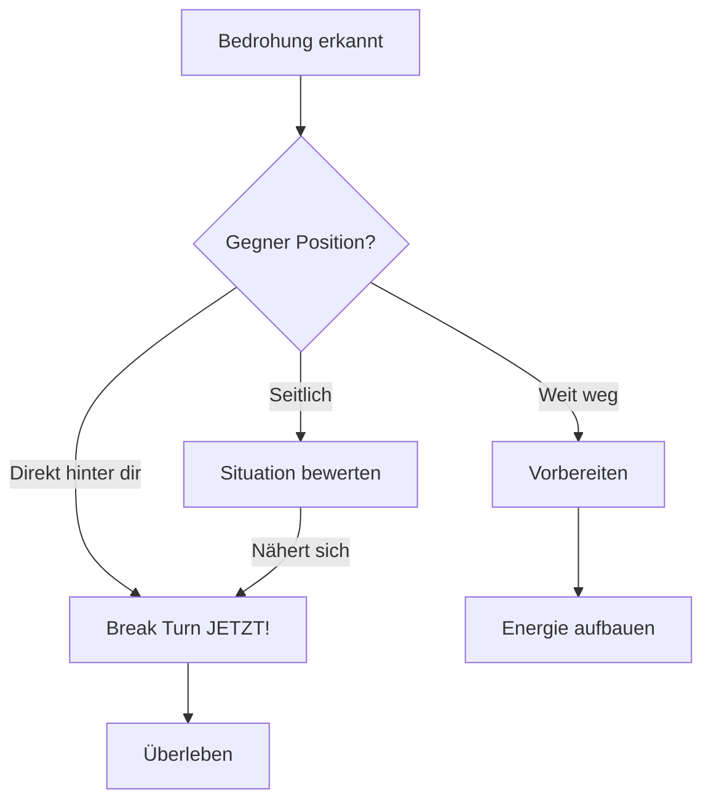

# Break Turn

Der härteste Turn, den du fliegen kannst. Nutze ihn als erste Reaktion auf einen Angriff.

## Wann Break Turn?

## Ausführung

1. **Max G** - Ziehe so hart du kannst
2. **Flares/Chaff** - **SOFORT!** Werfe Gegenmaßnahmen, sobald du den Turn beginnst. Ein Break ohne Flares hilft nicht gegen moderne Raketen.
3. **In Richtung Bedrohung** - Drehe ZUM Gegner
4. **Leichtes Sinken** - Hilft den Turn zu verschärfen
5. **Afterburner** - Halte Speed so gut es geht

::: warning ENERGIE-KOSTEN
Break Turns kosten enorm viel Energie. Nutze sie nur wenn nötig!
:::
