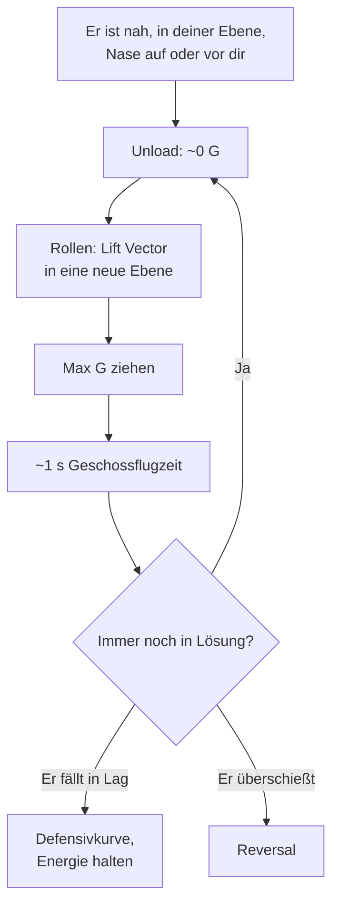

# Guns Defense: der Jink

> Er sitzt mit der Kanone hinter dir und hat (fast) eine Lösung. Jetzt zählt nur eins: nicht dort sein, wo die Geschosse ankommen.

Ein Kanonenschuss funktioniert, weil der Angreifer vorhersagt, wo du in etwa einer Sekunde Geschossflugzeit sein wirst. Er kann das nur, wenn du **in einer Ebene** und **vorhersehbar** kurvst. Der Jink zerstört genau diese Vorhersage: Du wechselst deine Bewegungsebene schneller, als er seinen Vorhalt nachführen kann.

## Wann

- Er ist **nah genug** für die Kanone,
- **in deiner Ebene** (sein Lift Vector liegt auf dir, er dreht mit dir mit),
- und seine Nase steht **auf dir oder vor dir** (Pure oder Lead).

Wenn diese drei Dinge zusammenkommen, ist er in einer **Tracking-Lösung** oder kurz davor. Das ist der Moment für den Jink. Hängt er dagegen weit in Lag oder außerhalb deiner Ebene, ist der Jink unnötig teuer: Dann gilt [Break Turn](/grundlagen/defensiv/break-turn) bzw. die Defensivkurve.

## Ausführung

1. **Unload.** Last kurz auf nahe null nehmen (etwa 0 bis 0,5 G). Damit rollst du schneller, und deine Flugbahn hört sofort auf, der Kurve zu folgen, die er vorausberechnet.
2. **Rollen.** Lift Vector in eine **neue Richtung**, aus seiner Ebene heraus. Nicht einfach von der linken in die gleiche rechte Kurve kippen, sondern deutlich anders: z.B. von einer Linkskurve in eine nose-low Rechtskurve, oder aus einer flachen Kurve über den Kopf in eine Kurve nach unten.
3. **Max G ziehen** in die neue Ebene.
4. **Nach etwa einer Geschossflugzeit (Richtwert ~1 s) wiederholen.** Bis dahin hat er seinen Vorhalt auf deine neue Ebene eingestellt. Genau dann bist du wieder woanders.
5. **Sicht halten** und erkennen, wann es vorbei ist: Er kann deine Wechsel nicht mitgehen, fällt in Lag oder [überschießt](/grundlagen/offensiv/overshoot).

### Worauf es ankommt

- **Unvorhersehbar.** Kein Rhythmus, keine immer gleiche Richtung. Wechsle Richtung, Querlage und den Anteil nach oben oder unten.
- **Aus der Ebene, nicht in der Ebene.** Härter in derselben Kurve ziehen hilft ihm, er muss nur etwas mehr Vorhalt nehmen. Erst der Ebenenwechsel zwingt ihn, neu zu rollen und neu zu zielen.
- **Energie im Blick.** Jeder Max-G-Pull kostet Speed. Nose-low-Jinks halten Speed besser, kosten aber Höhe. Wenn Höhe da ist, nutze sie.

## Nicht verlangsamen, während er trackt

::: danger DIE "NOTBREMSE" IST HIER FALSCH
Gas raus und Speed abbauen, damit er vorbeifliegt, klingt verlockend. Solange er aber in einer Tracking-Lösung hinter dir sitzt, hilft es nur ihm: Du wirst langsamer und berechenbarer, seine AA wird kleiner, er braucht weniger Vorhalt und ist näher. Bremsen, um einen Overshoot zu erzwingen, ist nur eine Option, wenn er **nicht** in Lösung ist und mit großer Closure kommt. Und auch dann ist es ein Risiko, das du bewusst eingehst.
:::

## Head-on Guns

Wenn in der Lobby Frontalschüsse erlaubt sind, kann er dich schon im Vorbeiflug beschießen. Dann gilt dasselbe Prinzip früher: Nicht geradeaus auf ihn zufliegen, sondern vor dem Merge aus seiner Ebene versetzen, sodass er dich nicht in Ruhe in den Funnel bekommt. Siehe [Der Merge](/grundlagen/neutral/der-merge) und [Schusslösung](/grundlagen/offensiv/schussloesung#head-on-guns).

## Typische Fehler

- **Links-rechts-Wackeln in derselben Ebene.** Kleine Korrekturen um dieselbe Kurve herum verschieben nur seinen Vorhalt ein wenig.
- **Rhythmisch jinken.** Wenn du alle zwei Sekunden dieselbe Bewegung machst, schießt er auf deine nächste.
- **Unter Last rollen.** Ohne Unload ist die Rolle langsam. Erst entladen, dann rollen, dann ziehen.
- **Nach dem Jink nicht umschalten.** Ist die Lösung weg, kostet weiteres Jinken nur Energie. Zurück in die Defensivkurve oder in den Reversal.
- **Bremsen in seine Lösung hinein.** Siehe oben.
- **Den Boden vergessen.** Nose-low-Jinks in Bodennähe enden im Gelände.

## VFM-Hinweise

- **Rollrate** ist nicht in den Leistungsdaten. Sie bestimmt, wie schnell du die Ebene wechselst. Test im Free Flight: Wie schnell kommst du entladen von einer Kurve in die Gegenrichtung?
- **G-Effekte:** Reviews berichten von Greyout/Blackout. Wiederholte Max-G-Pulls können dir die Sicht nehmen, und Sicht ist in der Guns Defense alles.
- **AoA-Override:** Als allerletzte Option kann ein kurzer Override die Nase schlagartig versetzen. Das kostet extrem viel Energie. Danach bist du langsam und hast kaum noch Optionen.

::: info IM SPIEL PRÜFEN
- Geschossflugzeit der Kanone auf typische Schussentfernungen (Replay: Abstand zwischen Abschuss und Einschlag).
- Wie schnell die G-Effekte (Greyout/Blackout) bei wiederholten Max-G-Pulls einsetzen.
:::

::: tip MERKE
- Jink, wenn er nah, in deiner Ebene und mit der Nase auf oder vor dir ist.
- Unload, rollen in eine neue Ebene, max G, nach ~1 s wiederholen.
- Ebene wechseln, nicht nur härter ziehen. Kein Rhythmus.
- Nicht bremsen, solange er in Tracking-Lösung ist.
- Lösung weg: sofort zurück in die Defensivkurve oder Reversal.
:::

Weiter: [Slice Turn](/grundlagen/defensiv/slice-turn)
