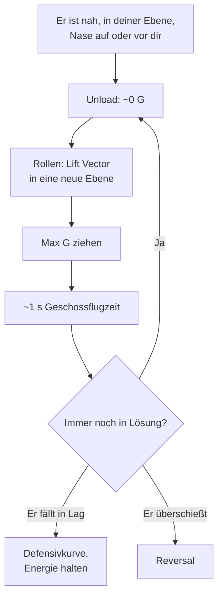

# Guns Defense: der Jink

> Er sitzt mit der Kanone hinter dir und hat (fast) eine Lösung. Jetzt zählt nur eins: nicht dort sein, wo die Geschosse ankommen.

Ein Kanonenschuss trifft, weil der Angreifer vorhersagt, wo du nach etwa einer Sekunde Geschossflugzeit sein wirst. Das geht nur, wenn du **in einer Ebene** und **vorhersehbar** kurvst. Der Jink zerstört diese Vorhersage: Du wechselst deine Bewegungsebene schneller, als er den Vorhalt nachführen kann.

## Wann

Wenn er **nah genug** für die Kanone ist, **in deiner Ebene** fliegt und seine Nase **auf oder vor dir** steht (Pure oder Lead), ist er in Tracking-Lösung oder kurz davor. Das ist der Moment für den Jink. Hängt er weit in Lag oder außerhalb deiner Ebene, ist der Jink unnötig teuer: Dann gelten [Break Turn](/grundlagen/defensiv/break-turn) und Defensivkurve.

## Ausführung

1. **Unload** auf etwa 0 bis 0,5 G. Du rollst schneller, und deine Flugbahn verlässt sofort die Kurve, die er vorausberechnet.
2. **Rollen**: Lift Vector in eine **deutlich neue Richtung** aus seiner Ebene, z. B. von einer Linkskurve in eine nose-low Rechtskurve.
3. **Max G** in die neue Ebene.
4. **Nach ~1 s wiederholen** (etwa eine Geschossflugzeit, Richtwert). Bis dahin hat er sich auf deine neue Ebene eingestellt – genau dann bist du wieder woanders.
5. **Erkennen, wann es vorbei ist:** Er fällt in Lag oder [überschießt](/grundlagen/offensiv/overshoot).

**Worauf es ankommt:**

- **Unvorhersehbar:** kein Rhythmus, wechselnde Richtung, Querlage und Anteil nach oben oder unten.
- **Aus der Ebene, nicht in der Ebene:** Härter in derselben Kurve ziehen kostet ihn nur etwas mehr Vorhalt. Erst der Ebenenwechsel zwingt ihn, neu zu rollen und zu zielen.
- **Energie:** Jeder Max-G-Pull kostet Speed. Nose-low-Jinks halten Speed besser, kosten aber Höhe.

::: danger NICHT VERLANGSAMEN, WÄHREND ER TRACKT
Gas raus, damit er vorbeifliegt, hilft ihm, solange er in Lösung sitzt: Du wirst langsamer und berechenbarer, er braucht weniger Vorhalt. Bremsen, um einen Overshoot zu erzwingen, ist nur eine Option, wenn er **nicht** in Lösung ist und mit großer Closure kommt – und auch dann ein bewusstes Risiko.
:::

## Head-on Guns

Sind Frontalschüsse in der Lobby erlaubt, gilt dasselbe Prinzip schon vor dem Merge: nicht geradeaus auf ihn zufliegen, sondern aus seiner Ebene versetzen. Siehe [Der Merge](/grundlagen/neutral/der-merge) und [Schusslösung](/grundlagen/offensiv/schussloesung#head-on-guns).

## Typische Fehler

- **Links-rechts-Wackeln in derselben Ebene.** Verschiebt nur seinen Vorhalt ein wenig.
- **Rhythmisch jinken.** Dann schießt er auf deine nächste Bewegung.
- **Unter Last rollen.** Erst entladen, dann rollen, dann ziehen.
- **Nach dem Jink nicht umschalten.** Ist die Lösung weg, zurück in die Defensivkurve oder in den Reversal.
- **Den Boden vergessen.** Nose-low-Jinks in Bodennähe enden im Gelände.

## VFM-Hinweise

- **Greyout/Blackout** ist simuliert. Wiederholte Max-G-Pulls können dir die Sicht nehmen, und Sicht ist hier alles ([G-Awareness](/grundlagen/golden-rules#g-awareness-greyout-und-blackout)).
- **AoA-Override** als allerletzte Option: versetzt die Nase schlagartig, kostet aber extrem Energie. Danach bist du langsam und hast kaum Optionen.

::: info IM SPIEL PRÜFEN
- Rollrate der Jets (nicht gemessen): Wie schnell kommst du entladen von einer Kurve in die Gegenrichtung?
- Geschossflugzeit auf typische Schussentfernungen (Replay: Abschuss bis Einschlag).
:::

::: tip MERKE
- Jink, wenn er nah, in deiner Ebene und mit der Nase auf oder vor dir ist.
- Unload, rollen in eine neue Ebene, max G, nach ~1 s wiederholen.
- Ebene wechseln, nicht nur härter ziehen. Kein Rhythmus.
- Nicht bremsen, solange er in Tracking-Lösung ist.
- Lösung weg: sofort zurück in die Defensivkurve oder Reversal.
:::

Weiter: [Slice Turn](/grundlagen/defensiv/slice-turn)
