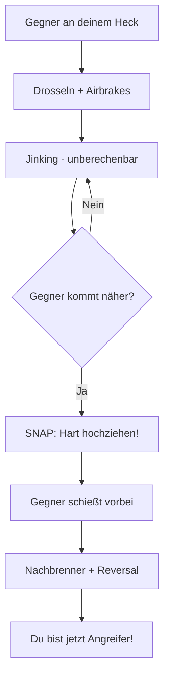

# Jinking & Overshoots

Wenn der Gegner direkt hinter dir ist oder sogar schießt.

## Overshoot erzwingen (Die "Notbremse")

Wenn ein Gegner an deinem Heck klebt (6 Uhr Position):

### Die Technik

1. **Drosseln**: Schub sofort auf **Leerlauf (Idle)**
2. **Airbrakes**: Ausfahren
3. **Jink**: Unregelmäßige Roll- und Ziehbewegungen um das Zielen zu erschweren, aber **keine konstante Kurve** fliegen
4. **Der Snap**: Sobald du siehst, dass der Gegner näher kommt und droht vorbeizufliegen:
   - Ziehe **hart in die Vertikale** oder
   - Führe eine **High Yo-Yo Defense** aus
5. **Reversal**: Wenn er vorbeigeflogen ist: **Nachbrenner rein**, Nase auf ihn drehen!

## Notfall: Gegner hat Schusslösung

::: danger SOFORTMASSNAHMEN
Wenn der Gegner gerade schießen will:

1. **Harter Break Turn** - Max G in seine Richtung
2. **Flares/Chaff** - Gegen Missiles
3. **Jink** - Unvorhersehbare Bewegungen
4. **Rollen** - Ändere Flugbahn ständig
:::

### Jinking

Kleine, schnelle Richtungsänderungen um Schusslösung zu stören:

- Links-rechts rollen
- Pitch up/down variieren
- **Nicht vorhersehbar** sein
- **Keine konstante Kurve** - das gibt dem Gegner einen Vorhaltewinkel
