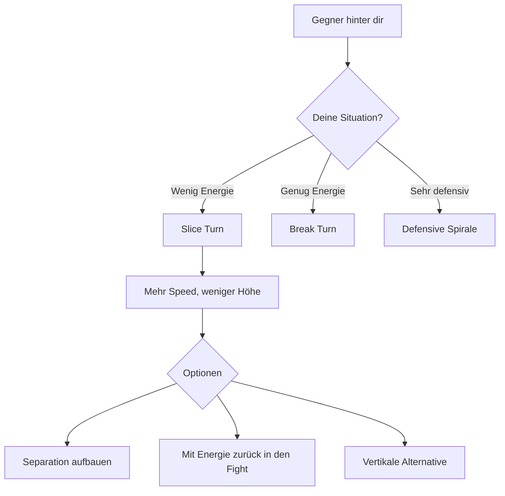
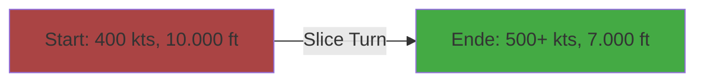

# Slice Turn

> Ein niedriger Turn mit Sinken - die Flucht, die keine Flucht ist.

Der Slice Turn ist ein defensives Manöver, das Höhe gegen Geschwindigkeit tauscht. Anders als beim Break Turn versuchst du nicht, den Gegner abzuschütteln, sondern baust Energie auf, um den Kampf unter besseren Bedingungen fortzusetzen.

---

## Das Konzept

Der Slice Turn nutzt die Schwerkraft zu deinem Vorteil:
- Du sinkst → Gravitation beschleunigt dich
- Du drehst → Du änderst deine Richtung
- Resultat: Mehr Speed + neue Flugrichtung

---

## Wann Slice Turn?

### Gute Situationen

| Situation | Warum Slice? |
|-----------|--------------|
| Du bist langsam (< 300 kts) | Brauchst Speed für weitere Manöver |
| Gegner ist höher | Slice bringt dich noch tiefer, öffnet vertikale Separation |
| Gegner hat committed | Er ist festgelegt, kann nicht schnell folgen |
| Du hast Höhenreserve | Kannst Höhe opfern |
| Du willst den Fight verlassen | Slice + Extend = Separation |

### Schlechte Situationen

| Situation | Warum NICHT Slice? |
|-----------|-------------------|
| Du bist schon tief (< 3000 ft) | Keine Höhe zum Tauschen |
| Gegner ist schneller UND tiefer | Er kann dich abschneiden |
| Du brauchst maximale Turn Rate | Slice ist kein harter Defensiv-Turn |
| Mehrere Gegner | Slice macht dich vorhersagbar |

---

## Ausführung

### Schritt für Schritt

1. **Einleitung**
   - Rolle auf 90° Bank (Messerflug-Position)
   - Halte den Gegner im Blick

2. **Der Turn**
   - Ziehe leicht am Stick (2-4 G)
   - Lass die Nase unter den Horizont fallen
   - NICHT maximal ziehen - du willst Speed, nicht maximale Turn Rate

3. **Beschleunigung**
   - Während des Turns beschleunigt die Gravitation dich
   - Halte den Bank-Winkel bis du deine neue Richtung hast

4. **Exit**
   - Level die Wings
   - Du hast jetzt mehr Speed
   - Entscheide: Extend (weiterfliehen) oder Reengage (zurückkämpfen)

### Geometrie

Du opferst ~2000-4000 ft Höhe, gewinnst ~100-150 kts Speed.

---

## Slice Turn vs Andere Defensive

| Manöver | Ziel | G-Last | Energiebilanz |
|---------|------|--------|---------------|
| **Break Turn** | Überleben, Winkel gewinnen | Maximum (7-9 G) | Sehr negativ |
| **Slice Turn** | Energie aufbauen, Separation | Moderat (2-4 G) | Positiv! |
| **Defensive Spirale** | Zeit gewinnen, Gegner ermüden | Moderat (3-5 G) | Neutral bis leicht negativ |
| **Jinking** | Schusslösung verweigern | Variabel | Negativ |

---

## Taktische Überlegungen

### Wann Slice → Extend?

Wenn du den Kampf verlassen willst:
1. Slice Turn weg vom Gegner
2. Wings level, volle Power
3. Baue Separation auf (3-5 km)
4. Optional: Reset und Reengage

### Wann Slice → Reengage?

Wenn du nur Energie brauchst:
1. Slice Turn (muss nicht 180° sein)
2. Mit gewonnener Speed in den Fight zurück
3. Nutze die Extra-Speed für einen Vorteil

### Die Falle

::: warning VORHERSAGBARKEIT
Ein Slice Turn ist VORHERSAGBAR. Der Gegner weiß, wohin du fliegst.

Wenn er schnell genug ist, kann er:
- Dir den Weg abschneiden (Cut-Off)
- Einen Lead Turn auf deinen Exit machen
- Dich mit einer Rakete verfolgen

**Lösung:** Kombiniere Slice mit unerwarteten Richtungswechseln nach dem Exit.
:::

---

## Kombination mit anderen Manövern

### Slice → Vertical

Nach dem Slice hast du Speed. Nutze sie:
1. Slice Turn (Energie aufbauen)
2. Mit der gewonnenen Speed vertikal hochziehen
3. Du bist jetzt ÜBER dem Gegner mit Energie

### Slice → Scissors

Wenn der Gegner zu aggressiv folgt:
1. Slice Turn beginnen
2. Gegner committed auf deinen Slice
3. Plötzlich reversal → Scissors einleiten
4. Seine Übergeschwindigkeit wird zum Nachteil

---

## Zusammenfassung

| Aspekt | Details |
|--------|---------|
| **Zweck** | Energie aufbauen durch Höhe-Speed-Tausch |
| **G-Last** | Moderat (2-4 G) |
| **Energiebilanz** | Positiv (+100-150 kts) |
| **Höhenverlust** | 2000-4000 ft |
| **Voraussetzung** | Genug Höhenreserve |
| **Gefahr** | Vorhersagbarkeit |

::: tip SLICE-MANTRA
> "Ich brauche Speed. Die Höhe ist mein Tresor - ich hebe ab, was ich brauche."
:::
