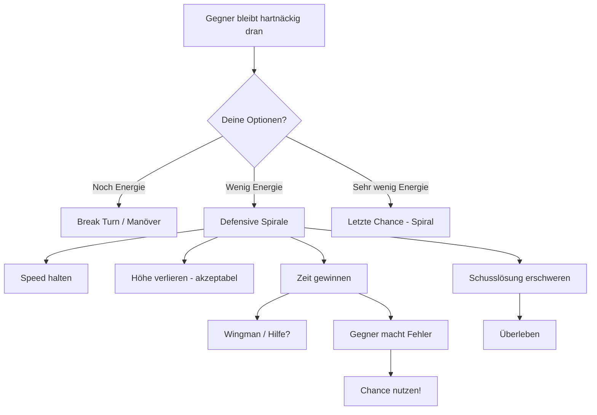
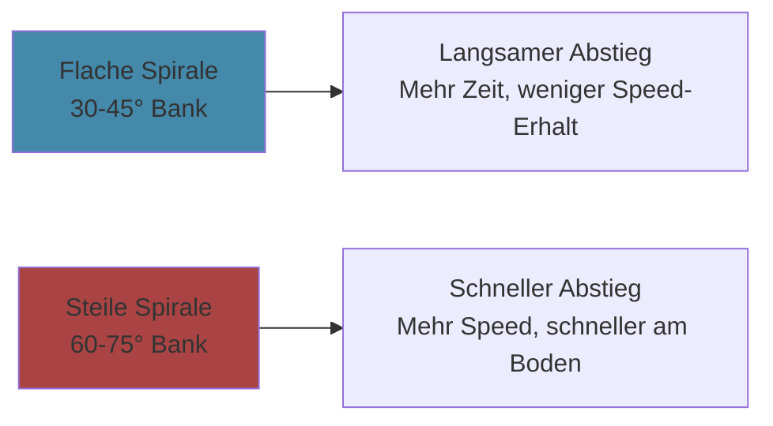

# Defensive Spirale

> Wenn alles andere versagt - kontrolliert abwärts, Zeit gewinnen, Fehler des Gegners nutzen.

Die Defensive Spirale ist das Manöver der letzten Zuflucht. Du hast Energie verloren, der Gegner sitzt dir im Nacken, und du brauchst Zeit. Die Spirale gibt dir diese Zeit - aber sie hat einen Preis.

---

## Das Konzept

### Warum funktioniert die Spirale?

1. **Du bewegst dich konstant** - Keine stabile Schusslösung für den Gegner
2. **Du verlierst KONTROLLIERT Höhe** - Nicht chaotisch, nicht vorhersagbar
3. **Du hältst Speed** - Durch das Sinken behältst du Manövrierenergie
4. **Der Gegner muss folgen** - Und dabei macht er vielleicht Fehler

---

## Wann Defensive Spirale?

### Die richtige Situation

| Zeichen | Was es bedeutet |
|---------|-----------------|
| Deine Speed unter 250 kts | Zu langsam für effektive Manöver |
| Gegner bleibt hinter dir | Break Turns haben nicht funktioniert |
| Du hast Höhe zum Opfern | Mindestens 5000+ ft über Hard Deck |
| Hilfe ist möglich | Wingman in der Nähe oder auf dem Weg |

### NICHT Spirale wenn...

| Situation | Warum nicht? |
|-----------|--------------|
| Du bist schon tief | Kein Raum für Spirale |
| Mehrere Gegner | Spirale macht dich zu einem einfachen Ziel für Nr. 2 |
| Gegner hat Missiles | Spirale hilft nicht gegen Fox-2 |
| Du hast noch Energie | Nutze sie für offensive Optionen! |

---

## Ausführung

### Der richtige Spiral-Winkel

**Empfehlung:** 45-60° Bank - Balance zwischen Speed-Erhalt und Zeit

### Schritt für Schritt

1. **Einleitung**
   - Rolle auf 45-60° Bank
   - Ziehe leicht (3-4 G)
   - Lass die Nase leicht unter Horizont fallen

2. **Die Spirale halten**
   - **Konstanter Bank-Winkel** - Nicht wild wechseln
   - **Konstante G-Last** - Smooth, nicht ruckartig
   - **Speed beobachten** - Nicht unter 180 kts fallen!
   - **Gegner beobachten** - Wo ist er? Was macht er?

3. **Auf Fehler warten**
   - Überschießt er?
   - Verliert er Sicht?
   - Wird er ungeduldig und macht aggressive Moves?

4. **Exit**
   - Wenn der Gegner Fehler macht → Sofort ausnutzen
   - Wenn Hilfe kommt → Separation suchen
   - Wenn Hard Deck naht → Entscheidung: Flatten oder Separation

---

## Die Gefahr: Der Boden

::: danger BODEN-AWARENESS
Die Spirale führt dich unweigerlich nach unten. Du MUSST deinen Höhenmesser beobachten.

**Faustregel:** Bei 2000 ft über Hard Deck → Exit-Plan aktivieren

Der Boden hat eine Kill Probability von 100%.
:::

### Höhen-Management

| Höhe über Hard Deck | Status |
|---------------------|--------|
| > 8000 ft | Komfortabel - Spirale fortsetzen |
| 5000-8000 ft | Okay - Exit-Plan vorbereiten |
| 3000-5000 ft | Kritisch - Bald handeln |
| < 3000 ft | SOFORT Exit - Spirale beenden! |

---

## Was macht der Gegner?

### Gegner-Reaktionen und deine Antwort

**Gegner folgt der Spirale:**
- Gut! Er verliert auch Energie und Höhe
- Warte auf seinen Fehler
- Er könnte Overshoot machen

**Gegner zieht hoch (Extension):**
- Er baut Energie auf für neuen Angriff
- Nutze die Pause für Separation
- Bereite dich auf seinen nächsten Pass vor

**Gegner schießt (Gun/Missile):**
- Spirale erschwert die Schusslösung
- Jinking innerhalb der Spirale (kleine Variationen)
- Flares bei IR-Raketen

**Gegner ist frustriert (aggressive Moves):**
- PERFEKT - Das ist deine Chance
- Overshoot provozieren
- Scissors-Möglichkeit?

---

## Kombination mit anderen Manövern

### Spirale → Scissors

Wenn der Gegner zu aggressiv wird:
1. Spirale halten, Gegner kommt näher
2. Plötzlicher Hard Reversal
3. Er schießt vorbei → Scissors beginnt

### Spirale → Slice Exit

Wenn du genug hast:
1. Aus der Spirale flach werden
2. Wings level, Nase runter
3. Volle Power, Separation aufbauen

### Spirale → Vertical Exit

Wenn du Speed gesammelt hast:
1. Aus Spirale Speed aufbauen
2. Plötzlich vertikal hochziehen
3. Überraschungsmoment nutzen

---

## Die Psychologie der Spirale

Die Spirale ist auch ein psychologisches Werkzeug:

1. **Du zeigst Kontrolle** - Du panikst nicht
2. **Du zwingst Geduld auf** - Der Gegner muss warten
3. **Du provozierst Fehler** - Ungeduld führt zu Overshoot
4. **Du kaufst Zeit** - Für Hilfe, für bessere Ideen

::: tip RUHE BEWAHREN
In der Spirale gewinnst du nicht durch Aktion, sondern durch kontrolliertes WARTEN. Der Gegner muss den Fehler machen - deine Aufgabe ist, ihm die Gelegenheit dazu zu geben.
:::

---

## Zusammenfassung

| Aspekt | Details |
|--------|---------|
| **Zweck** | Zeit gewinnen, Gegner-Fehler provozieren |
| **Bank-Winkel** | 45-60° |
| **G-Last** | Moderat (3-4 G) |
| **Speed-Ziel** | 200-250 kts halten |
| **Höhenverlust** | ~2000-4000 ft pro volle Spirale |
| **Exit-Trigger** | Gegner-Fehler, Hilfe, Höhe kritisch |

### Die Spirale-Regel

::: warning MERKE
Die Spirale ist KEINE Lösung - sie ist eine VERZÖGERUNG.

Du brauchst einen Exit-Plan:
- Wingman
- Gegner-Fehler
- Separation-Chance

Ohne Exit-Plan führt die Spirale nur zum Boden.
:::
