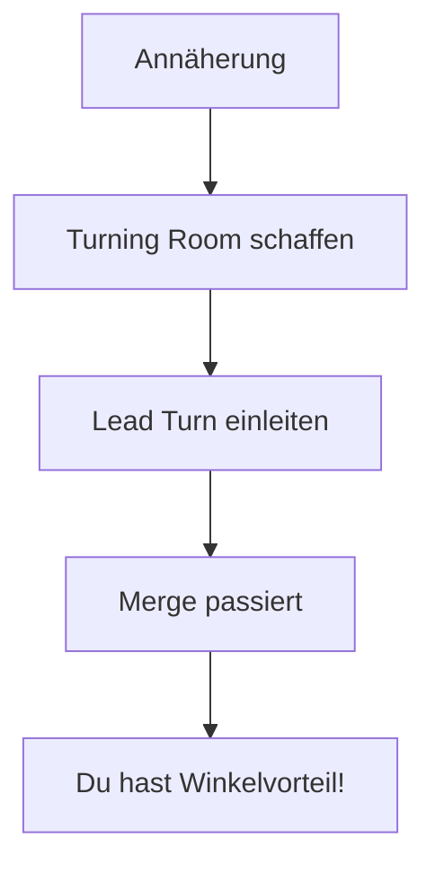

# Der Merge & Neutrale Phase

Der Luftkampf beginnt selten direkt hinter dem Gegner. Meist starten beide Flugzeuge neutral, indem sie aufeinander zufliegen. Dieser Moment des Vorbeiflugs nennt sich **The Merge**.

## Die Bedeutung des Merge

Am Merge wird entschieden, ob du offensiv oder defensiv in den Kampf startest. Wer hier den Fehler macht, verliert oft in den ersten 10 Sekunden.

### Grundregeln

1.  **High Speed:** Gehe schnell in den Merge (oft Mach 0.8 - 1.0+), um Energie für den ersten Turn zu haben.
2.  **Abstand halten:** Fliege nicht direkt in den Gegner (Kollisionskurs), sondern schaffe seitlichen Abstand (Turning Room).
3.  **Blickkontakt:** Verliere den Gegner niemals aus den Augen ("Lose Sight, Lose Fight").

---

## Der Lead Turn

Das wichtigste Konzept für den neutralen Start. Ein **Lead Turn** bedeutet, dass du deine Kurve einleitest, **bevor** du den Gegner passierst.

### Warum Lead Turn?

Wenn du erst drehst, wenn der Gegner an dir vorbei ist, hast du bereits Winkel verloren. Wenn du kurz vorher drehst, nutzt du den seitlichen Abstand, um deine Nase früher auf ihn zu richten.

::: tip TIMING IST ALLES
*   **Zu früh:** Du drehst vor den Gegner und gibst ihm eine Schusslösung (Face Shot).
*   **Zu spät:** Der Gegner dreht früher und sitzt dir im Nacken.
*   **Perfekt:** Kurz bevor er die 3/9-Linie passiert (ca. 1-2 Sekunden vor dem Passieren).
:::

---

## Flow-Entscheidung: One-Circle oder Two-Circle?

Am Merge musst du dich entscheiden. Diese Entscheidung diktiert den Rest des Kampfes.

### 1. Two-Circle (Nase auf Heck)
Du drehst **zum Gegner hin**, in Richtung seines Hecks.
*   **Wahl für:** Rate Fighter (schnelle Wenderate, größerer Radius).
*   **Ziel:** Rate War. Wer dreht schneller um den Kreis?

### 2. One-Circle (Nase auf Nase)
Du drehst **vom Gegner weg** (bzw. "in ihn hinein" nach oben), um ihn sofort wieder Frontal zu treffen.
*   **Wahl für:** Angles/Radius Fighter (kleine Wenderadien, hohe AoA-Fähigkeit).
*   **Ziel:** Radius Fight. Wer dreht enger?

::: warning KENNE DEIN FLUGZEUG
Versuche niemals, mit einem Rate Fighter One-Circle gegen einen Radius Fighter zu gehen. Du wirst verlieren. Zwinge den Gegner in DEINEN Flow.
:::

---

## Geometrie-Begriffe

Um die Situation am Merge zu bewerten, nutzen Piloten spezifische Winkel:

### Aspect Angle (AA)
Der Winkel zwischen dem Heck des Gegners und deiner Position.
*   **0° AA:** Du bist genau hinter ihm (Offensiv).
*   **180° AA:** Er kommt genau auf dich zu (Neutral/Merge).

### Antenna Train Angle (ATA)
Der Winkel, um den du schauen musst, um den Gegner zu sehen (relativ zu deiner Nase).
*   **0° ATA:** Er ist in deinem HUD.
*   **90° ATA:** Er ist genau rechts/links neben dir.
