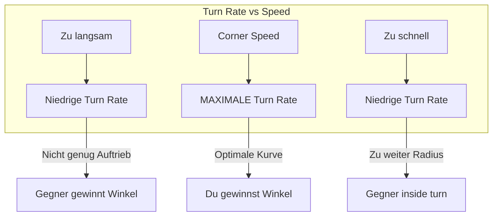
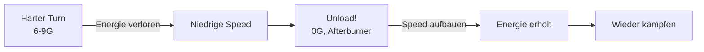
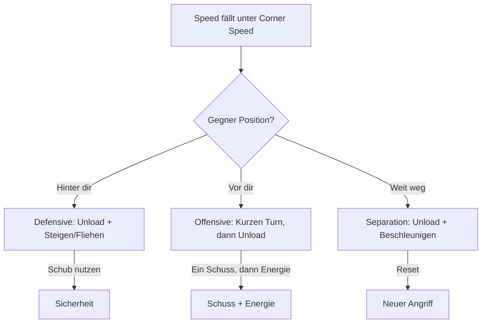

# Energie-Management

Energie ist die wichtigste Ressource im Luftkampf. Das Verständnis von Energie-Management unterscheidet erfahrene Piloten von Anfängern.

## Was ist Energie?

Energie = **Höhe** + **Geschwindigkeit**

```
Totale Energie = Potenzielle Energie (Höhe) + Kinetische Energie (Speed)
```

Du kannst Energie **umwandeln**:
- Steigen → Speed wird zu Höhe
- Sturzflug → Höhe wird zu Speed

Aber Energie geht **verloren** durch:
- Turns (induzierter Widerstand)
- Luftwiderstand
- Manöver bei hohem G

## Corner Speed

Die **Corner Speed** ist die Geschwindigkeit, bei der dein Flugzeug die **maximale Instantaneous Turn Rate** erreicht.

An diesem Punkt treffen zwei Grenzen aufeinander:
1. **Aerodynamische Grenze (Lift Limit)**: Darunter reicht der Auftrieb nicht für Max G
2. **Strukturelle Grenze (Load Limit)**: Darüber wäre mehr G möglich, aber das Flugzeug würde beschädigt

### Warum Corner Speed wichtig ist



::: tip WICHTIG
Die Corner Speed variiert je nach:
- **Höhe** - Höher = schnellere Corner Speed
- **Gewicht/Treibstoff** - Leichter = langsamere Corner Speed
- **Flugzeugtyp** - Jedes Muster hat andere Werte

Lerne die Corner Speed **deines** Flugzeugs auswendig!
:::

## Sustained vs Instantaneous Turn Rate

| Typ | Beschreibung | Energie-Effekt |
|-----|--------------|----------------|
| **Instantaneous** | Maximale Rate für kurze Zeit | Verliert Energie |
| **Sustained** | Rate die gehalten werden kann | Energie-neutral |

**Instantaneous Turn Rate** nutzt du für:
- Schnelle Snap-Shots
- Initiale Positionierung am Merge
- Kurzfristige Winkelvorteile

**Sustained Turn Rate** nutzt du für:
- Längere Kurvenkämpfe
- Energie-Management
- Kontrollierten Kampf

## Unloading (Entlasten)

::: tip DAS GEHEIMNIS ERFAHRENER PILOTEN
Unloading ist die Technik, die Anfänger von Experten unterscheidet!
:::

**Unloading** bedeutet: Den Stick neutral oder leicht nach vorne stellen (0-0.5G) um Energie zurückzugewinnen.

### Das Konzept

Widerstand (Drag) wird primär durch **G-Kräfte** (Anstellwinkel) erzeugt. Um schnell zu beschleunigen, musst du den Widerstand minimieren.

### Wann Unloaden?

- Nach einem harten Turn
- Wenn Energie niedrig ist
- Beim Repositionieren
- **Zwischen jedem Manöver!**

### Wie Unloaden?

1. Stick **leicht nach vorne** drücken (0-0.5G erreichen)
2. Die Flügel müssen "entlastet" sein
3. **Afterburner** aktivieren
4. **Leicht steigen** oder level fliegen
5. Warten bis Speed steigt

### Der Kampf-Rhythmus

::: warning WER PERMANENT ZIEHT, VERLIERT
Kämpfe im Rhythmus: **Pull - Unload - Pull**

1. **Pull**: Ziehen für die Schussposition
2. **Unload**: Sofort entlasten um verlorene Energie zurückzugewinnen
3. **Pull**: Dann erneut ziehen

Wer permanent zieht ("Gluing the stick back"), verliert alle Energie!
:::



## Spezifische Überschussleistung (Ps)

Die **E-M Theorie** (Energy-Maneuverability) beschreibt die Kampffähigkeit eines Flugzeugs mathematisch. Das Kernkonzept ist die **spezifische Überschussleistung** (Ps).

### Die Ps-Formel

```
Ps = (Schub - Widerstand) × Geschwindigkeit / Gewicht
```

Ps misst, wie schnell ein Flugzeug Energie gewinnen oder verlieren kann.

| Ps-Wert | Bedeutung | Flugzustand |
|---------|-----------|-------------|
| **Ps > 0** | Energieüberschuss | Beschleunigt oder steigt |
| **Ps = 0** | Energie-Neutral | Stationärer Flug (Sustained Turn) |
| **Ps < 0** | Energiedefizit | Wird langsamer oder sinkt |

### Praktische Anwendung

- **Ps > 0:** Du gewinnst Energie. Nutze es für Angriffe oder Positionierung.
- **Ps = 0:** Du hältst deine Energie. Ideal für Sustained Turn Rate Kämpfe.
- **Ps < 0:** Du verlierst Energie. Kurz akzeptabel für Positionsgewinn, aber gefährlich wenn dauerhaft.

::: tip SPEED IS LIFE
Ein langsames Flugzeug ist ein totes Flugzeug - es sei denn, du zwingst den Gegner, ebenfalls langsam zu fliegen (wie die T-18).
:::

---

## Das E-M Diagramm (vereinfacht)

Das Energy-Maneuverability-Diagramm zeigt, wo ein Flugzeug Energie gewinnt oder verliert.

### Allgemeines E-M Profil

| Zone | Beschreibung | Energie-Status |
|------|--------------|----------------|
| **High Speed + Low G** | Cruise | Energie-Gewinn (Ps > 0) |
| **Corner Speed + Medium G** | Optimal | Energie-Neutral (Ps ≈ 0) |
| **Low Speed + High G** | Gefahr | Energie-Verlust (Ps < 0) |
| **Any Speed + Max G** | Turn | Energie-Verlust (Ps < 0) |

::: warning GEFÄHRLICHE ZONE
Unter Corner Speed mit hohem G-Load = rapider Energie-Verlust (stark negativer Ps) = Gefahr!
:::

## Visuelle Cues: Energie-Zustand erkennen

Woher weißt du, wie viel Energie der Gegner hat? Achte auf diese Zeichen:

*   **Nachbrenner:** Brennt er? Wenn nicht, baut er wahrscheinlich Energie ab oder fliegt "Mil Power" (langsamer).
*   **Vapor Trails (Kondensstreifen):** Streifen an den Flügelspitzen bedeuten **hohe G-Last**. Wer viel zieht, verliert viel Energie ("He is bleeding speed").
*   **Wenderadius:** Wird sein Kreis enger, aber seine Nase bewegt sich langsamer? Er wird langsam.
*   **Nase:** Hängt seine Nase hoch, aber er steigt kaum? Er ist "slow and heavy".

## Praktische Anwendung

### Szenario: Du verlierst Energie im Kampf



### Die goldene Regel

> **Energie die du heute sparst, rettet dein Leben morgen.**

Jeder unnötige Turn, jede Sekunde bei Max-G kostet dich Energie. Verschwende sie nicht!

## Flugzeugtypen und Energie

| Flugzeugtyp | Energie-Stil |
|-------------|--------------|
| **Energy Fighter** | Hält Energie, nutzt Vertikale, Boom & Zoom |
| **Rate Fighter** | Konstante Geschwindigkeit, effiziente Kurven |
| **Angles Fighter** | Opfert Energie für Position, muss schnell töten |

## Zusammenfassung

| Konzept | Anwendung |
|---------|-----------|
| Corner Speed | Lerne sie für dein Flugzeug |
| Unloading | Regelmäßig Energie aufbauen |
| Energie-Budget | Nur ausgeben wenn nötig |
| Pull-Unload-Pull | Der Kampf-Rhythmus |

::: info PHILOSOPHIE
Energie ist wie Geld: Wer sparsam ist, hat mehr Optionen. Wer alles ausgibt, ist bankrott - und tot.
:::
