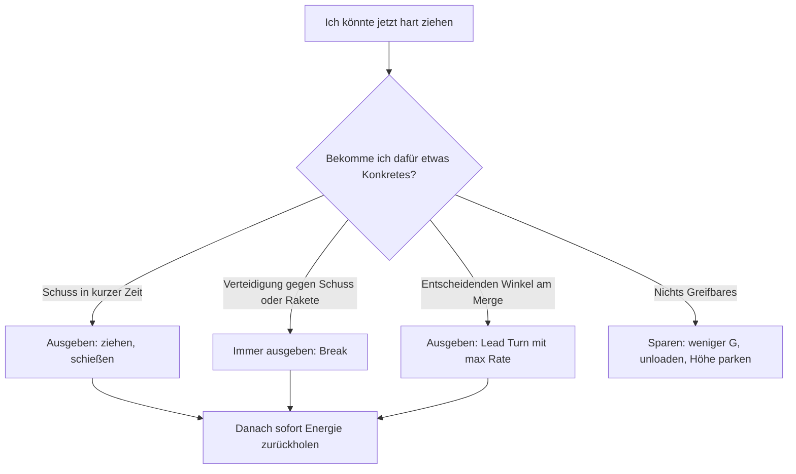

# Energie-Management

> Energie ist Speed plus Höhe. Wer sie bewusst ausgibt und wieder auffüllt, hat am Ende des Kampfes noch Optionen.

Jede Kurve kostet Energie, jeder Unload und jeder Sinkflug bringt welche. Hier lernst du, wie du das misst (Ps), wie du das Leistungsdiagramm liest und wann du Energie ausgibst. Grundlagen zu G, Rate und Radius: [Kurvenphysik](/grundlagen/kurvenphysik).

## Energie = Speed + Höhe

Deine Gesamtenergie rechnet man in **Energiehöhe** um – die Höhe, die du hättest, wenn du alle Speed verlustfrei in Höhe tauschen würdest:

```
Energiehöhe = Höhe + V² / (2 · g)        (V = wahre Speed)
```

| Wahre Speed | Speed-Anteil der Energiehöhe |
|---|---|
| 300 kt | ~4.000 ft |
| 400 kt | ~7.100 ft |
| 500 kt | ~11.100 ft |

Der Schritt von 400 auf 500 kt ist rund **4.000 ft Höhe wert**. Umgekehrt bringen 3.000 ft Sinkflug aus ~400 kt nur etwa **+77 kt** (ohne Schub und Widerstand).

- **Steigen vernichtet keine Energie, es wandelt sie um.** Speed, die du in Höhe parkst, holst du dir später zurück.
- **Verloren** geht Energie nur durch Widerstand – vor allem durch **G** und bei hoher Speed durch den [transsonischen Widerstand](/grundlagen/physik#transsonischer-widerstand). **Gewonnen** wird sie nur durch Schub.

## Ps: wie schnell du Energie gewinnst oder verlierst

Die **spezifische Überschussleistung Ps** sagt, wie schnell sich deine Energiehöhe ändert:

```
Ps = V · (T − D) / W        (T = Schub, D = Widerstand, W = Gewicht)
```

| Ps | Bedeutung | Was du siehst |
|---|---|---|
| **> 0** | Energiegewinn | Du beschleunigst oder steigst |
| **= 0** | Energie wird gehalten | Sustained Turn: Kurve ohne Speed- oder Höhenverlust |
| **< 0** | Energieverlust | Du wirst langsamer oder sinkst |

Bei **Corner Speed und 9 G** ist Ps stark negativ – maximale Rate, maximaler Preis. Bei **0–0,5 G und voller Leistung** ist Ps am größten – das ist der Unload.

::: tip IM REPLAY ANSCHAUEN
Der Debrief-Raum zeigt einen **Specific-Energy-Graph**. Schau nach jedem Kampf, wo deine Energie eingebrochen ist und ob sich der Preis gelohnt hat.
:::

## Das Leistungsdiagramm in VFM lesen

Die „Aircraft Performance Analysis“ im Spiel zeigt Turn Rate über KIAS, ein vereinfachtes **E-M-Diagramm**. Höhe und Fuel lassen sich einstellen.


*10.000 ft, 50 % Fuel. Orange = T-15, Blau = T-16, Pink = T-18.*

| Element | Bedeutung |
|---|---|
| **Gestrichelt, steigend (links)** | **Lift-Limit**: so viel Rate gibt der Flügel bei dieser Speed her |
| **Gestrichelt, fallend („9G LIMIT“)** | **G-Limit**: 9 G erreicht, mehr Speed heißt weniger Rate |
| **Spitze der gestrichelten Linie** | **Corner Speed**: höchste Instant Rate |
| **Durchgezogene Linie** | **Sustained Turn Rate (Ps = 0)** |
| **Gipfel der durchgezogenen Linie** | **Best Sustained Speed** |
| **Senkrechte Linien** | Corner und Best Sustained Speed je Jet |

Über der gestrichelten Linie ist alles unerreichbar. Zwischen gestrichelt und durchgezogen kurvst du mit **Ps < 0** und verlierst Energie, je weiter oben, desto schneller. Unter der durchgezogenen Linie ist **Ps > 0**: Du kannst so kurven und dabei noch beschleunigen.

Was das Diagramm über die drei Jets sagt (10.000 ft): Unter ~350 KIAS liegen T-15 und T-18 vorn, bei ~420–500 KIAS die T-16 (+1–2 °/s), über ~520 KIAS die T-15. Die T-18 bricht ab ~510 KIAS ein. Die Speedbänder im Detail und alle Höhen und Fuel-Stände: [Flugzeugvergleich](/flugzeuge/vergleich).

## Corner Speed vs. Best Sustained Speed

- **Corner Speed:** maximale Instant Rate, kleinster Radius – aber Ps stark negativ. Für **kurze** Momente: erster Turn, Break Turn, Schussgelegenheit.
- **Best Sustained Speed:** höchste Rate, die du **halten** kannst (Ps = 0). Für **lange** Kurvenkämpfe, vor allem Two-Circle.

| Diagramm, 10.000 ft, 50 % Fuel | T-15 | T-16 | T-18 |
|---|---|---|---|
| Corner | 360 KIAS / 24 °/s | 409 / 21 °/s | 385 / 22 °/s |
| Best Sustained | 495 KIAS / 17 °/s | 470 / 18 °/s | 470 / 16 °/s |

Best Sustained liegt bei allen Jets deutlich **über** der Corner Speed. In großer Höhe rücken beide eng zusammen. Wer ständig um Corner Speed kurvt, verliert Energie; wer mit Best Sustained kurvt, hält das lange durch, dreht aber langsamer als ein Gegner, der gerade Energie für Rate ausgibt.

## Was Energie im Flug kostet

Die Messflüge (10.000 ft, voller Tank) zeigen, wie verschieden die Jets mit Energie umgehen:

- **Voller Zug** ab ~450 KIAS: Die T-16 verliert am wenigsten, die T-15 rund 2,3-mal so schnell, die T-18 mit überzogenem α (35°) extrem. Die T-15 fällt im ersten Turn in 8 s von 450 auf ~286 KIAS.
- **Zurückholen:** Von 300 auf 500 KIAS braucht die T-15 ~8,4 s, die T-16 ~11,5 s, die T-18 ~12,3 s.

Details: [Voller Zug](/flugzeuge/vergleich#voller-zug-was-ohne-override-wirklich-geht), [Beschleunigung](/flugzeuge/vergleich#beschleunigung-gemessen).

### Wenn du zu langsam geworden bist

1. **Nicht weiter gegen die Schwerkraft ziehen.** Mehr Ziehen macht dich nur langsamer.
2. **Unloaden:** Nase an oder unter den Horizont, ≈ 0–0,5 G.
3. **Volle Leistung** (Nachbrenner).
4. **Erst wieder manövrieren**, wenn du in deinem Speedband bist – es sei denn, du musst einen Schuss verteidigen.

::: warning NICHT ZIEHEN
Der Instinkt sagt „Nase hoch, zieh!“. Ohne Speed bringt Ziehen keine Rate, nur noch weniger Speed.
:::

## Unload richtig gemacht

**Unload** heißt: Lift (und damit G) fast auf null nehmen, damit der induzierte Widerstand verschwindet und der Schub ganz in Beschleunigung geht.

1. **Rollen, wenn nötig:** Lift Vector so legen, dass die Bahn dorthin zeigt, wo du beschleunigen willst.
2. **Entlasten:** Stick nach vorne bis **≈ 0–0,5 G**. Nicht negativ drücken.
3. **Volle Leistung.**
4. **Nase am oder leicht unter dem Horizont** – dann hilft die Schwerkraft mit.

Dabei gilt:

- **Bei 0 G ist deine Bahn ballistisch** und krümmt sich nach unten. Auf die Höhe achten.
- **Nicht mit dem Gegner in Waffenreichweite hinter dir.** Ein unloadeter Jet fliegt gerade und berechenbar. Unload ist für Momente, in denen er dich nicht treffen kann: nach seinem Overshoot, auf großer Distanz, beim Extend.
- **Unload ist kein Dauerzustand.** Ziehen, solange es etwas bringt – unloaden, sobald es nichts mehr bringt.

## Energie-Entscheidungen

Energie ist Geld: Du gibst sie aus, um Position oder einen Schuss zu kaufen. Die Frage ist immer: **Was bekomme ich dafür?**


```mermaid
flowchart TD
    A[Ich könnte jetzt hart ziehen] --> B{Bekomme ich dafür etwas Konkretes?}
    B -->|Schuss in kurzer Zeit| C[Ausgeben: ziehen, schießen]
    B -->|Verteidigung gegen Schuss oder Rakete| D[Immer ausgeben: Break]
    B -->|Entscheidenden Winkel am Merge| E[Ausgeben: Lead Turn mit max Rate]
    B -->|Nichts Greifbares| F[Sparen: weniger G, unloaden, Höhe parken]
    C --> G[Danach sofort Energie zurückholen]
    D --> G
    E --> G
```

- **Gib Energie nur für Winkel aus, die du nutzen kannst.** Eine Nase auf dem Gegner, die nichts trifft, ist bezahlt und wertlos.
- **Defensiv gibt es kein Sparen.** Wer stirbt, braucht keine Energie mehr.
- **Parke Speed in Höhe**, wenn du sie gerade nicht brauchst (z. B. [High Yo-Yo](/grundlagen/offensiv/yo-yos)).
- **Vergleich dich mit dem Gegner:** Schneller und höher heißt, du entscheidest, ob und wie gekämpft wird.
- **Kenne dein Band:** Eine T-16 unter ~380 KIAS hat ihren Vorteil verloren. Eine T-18 über ~480 KIAS verschenkt Energie an den Widerstand.

**Den Gegner lesen:** Dreht seine Nase schnell, gibt er Energie aus. Wird sie über mehrere Sekunden langsamer oder steigt er nicht mehr, ist er langsam. Ein enger Kreis mit langsamer Nase heißt wenig Speed.

::: info IM SPIEL PRÜFEN
- Ab welcher Speed reagiert dein Jet nur noch träge? Unter ~280 KIAS ist im Flug nichts gemessen, die Diagramme beginnen bei ~170–200 KIAS. Übungen: [Trainingsplan](/grundlagen/uebungen)
- Wie gut zeigt der HUD-Beschleunigungskreis einen Unload an?
:::

::: tip MERKE
- **Energie = Speed + Höhe.** Steigen wandelt um, nur Widerstand (vor allem G) vernichtet.
- **Ps = 0 ist die Sustained-Linie.** Darüber verlierst du Energie, darunter gewinnst du.
- **Corner Speed** für kurze Momente, **Best Sustained** (~470–495 KIAS) für lange Kurven.
- **Unload = ≈ 0–0,5 G**, Nase am oder leicht unter dem Horizont, volle Leistung – nicht vor seiner Kanone.
- **Gib Energie nur aus, wenn du dafür etwas bekommst.**
:::

Weiter: [Das VFM-Flugmodell](/grundlagen/physik)
