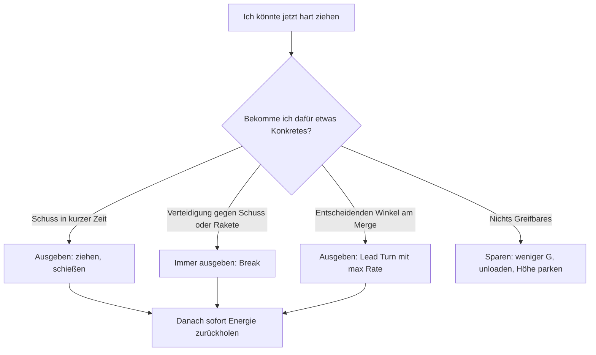

# Energie-Management

> Energie ist Speed plus Höhe. Wer sie bewusst ausgibt und wieder auffüllt, hat am Ende des Kampfes noch Optionen.

Jede Kurve kostet Energie, jeder Unload und jeder Sinkflug bringt welche. Diese Seite zeigt dir, wie du das misst (Ps), wie du das Leistungsdiagramm in VFM liest und welche Speeds für deinen Jet gelten. Grundlagen zu G, Rate und Radius: [Kurvenphysik](/grundlagen/kurvenphysik). Begriffe: [Glossar](/grundlagen/begriffe).

## Energie = Speed + Höhe

Deine Gesamtenergie besteht aus Bewegungsenergie (Speed) und Lageenergie (Höhe). Praktisch rechnet man sie in **Energiehöhe** um – die Höhe, die du hättest, wenn du alle Speed verlustfrei in Höhe tauschen würdest:

```
Energiehöhe = Höhe + V² / (2 · g)        (V = wahre Speed)
```

Beispiele (ohne Widerstand gerechnet):

| Wahre Speed | Speed-Anteil der Energiehöhe |
|---|---|
| 300 kt | ~4.000 ft |
| 400 kt | ~7.100 ft |
| 500 kt | ~11.100 ft |

Der Schritt von 400 auf 500 kt ist also rund **4.000 ft Höhe wert**. Umgekehrt bringen dir 3.000 ft Sinkflug aus ~400 kt nur etwa **+77 kt** – aus Schwerkraft allein, ohne Schub und Widerstand. Mehr gibt es nur mit Schub.

Zwei Dinge folgen daraus:

- **Steigen vernichtet keine Energie, es wandelt sie um.** Speed, die du in Höhe parkst, holst du dir später zurück.
- **Verloren** geht Energie nur durch Widerstand – vor allem durch **G** (induzierter Widerstand) und bei hoher Speed durch den [transsonischen Widerstand](/grundlagen/physik#transsonischer-widerstand). Gewonnen wird sie nur durch **Schub**.

## Ps: wie schnell du Energie gewinnst oder verlierst

Die **spezifische Überschussleistung Ps** (Specific Excess Power) sagt, wie schnell sich deine Energiehöhe ändert:

```
Ps = V · (T − D) / W        (T = Schub, D = Widerstand, W = Gewicht)
```

| Ps | Bedeutung | Was du siehst |
|---|---|---|
| **Ps > 0** | Energiegewinn | Du beschleunigst oder steigst bei gleicher Speed |
| **Ps = 0** | Energie wird gehalten | Sustained Turn: Kurve ohne Speed- oder Höhenverlust |
| **Ps < 0** | Energieverlust | Du wirst langsamer oder sinkst |

- Bei **Corner Speed und 9 G** ist Ps **stark negativ** – maximale Rate, maximaler Preis.
- Bei **0 bis 0,5 G und voller Leistung** ist Ps am größten – das ist der Unload.
- Jede Kurve, die du dauerhaft halten kannst, liegt auf oder unter der **Ps = 0-Linie**.

::: tip IM REPLAY ANSCHAUEN
Der 3D-Replay-/Debrief-Raum zeigt seit v1.2.0 einen **Specific-Energy-Graph**. Schau nach jedem Kampf, wo deine Energie eingebrochen ist und ob sich der Preis gelohnt hat (Schuss, Winkel, Überleben).
:::

## Das Leistungsdiagramm in VFM lesen

Im Spiel findest du die "Aircraft Performance Analysis" mit Turn Rate über KIAS. Das ist ein vereinfachtes **E-M-Diagramm** (Energy-Maneuverability). Höhe und Fuel lassen sich einstellen.


*10.000 ft, 50 % Fuel, Stand Okt 2026. Orange = T-15, Blau = T-16, Pink = T-18.*

So liest du es:

| Element | Bedeutung |
|---|---|
| **Gestrichelt, steigend (links)** | **Lift-Limit**: so viel Rate gibt der Flügel bei dieser Speed her. Langsam = wenig. |
| **Gestrichelt, fallend ("9G LIMIT")** | **G-Limit**: ab hier sind 9 G erreicht, mehr Speed bedeutet weniger Rate. |
| **Spitze der gestrichelten Linie** | **Corner Speed**: höchste Instant Rate. |
| **Durchgezogene Linie** | **Sustained Turn Rate (Ps = 0)**: die Rate, die du ohne Speedverlust halten kannst. |
| **Gipfel der durchgezogenen Linie** | **Best Sustained Speed**: hier ist die Dauerkurve am schnellsten. |
| **Senkrechte Linien** | markieren je Jet Corner Speed und Best Sustained Speed. |

Und die Flächen dazwischen:

- **Über der gestrichelten Linie:** unerreichbar.
- **Zwischen gestrichelt und durchgezogen:** möglich, aber **Ps < 0** – du verlierst Energie. Je weiter oben, desto schneller.
- **Unter der durchgezogenen Linie:** **Ps > 0** – du kannst so kurven und dabei noch beschleunigen oder steigen.

### Was das Diagramm über die drei Jets sagt

- **Unter ~350 KIAS:** Sustained T-15 ≈ T-18 > T-16.
- **~400–500 KIAS:** Die T-16 hat die beste Sustained Rate (rund 1–1,7 °/s Vorsprung).
- **Über ~520 KIAS:** Die T-15 ist klar am besten. Auf 10.000 ft kann sie 9 G bis etwa 700 KIAS halten (ihre durchgezogene Linie liegt dort auf der 9G-Linie) und hat am Diagrammende (~885 KIAS) noch 7 °/s. Die T-16 fällt ab und erreicht Sustained 0 bei ~835 KIAS; die T-18 fällt ab ~510 KIAS (etwa Mach 0,9) steil und erreicht 0 bei ~720 KIAS.
- **Instant Rate:** Die T-15 liegt bei jeder Speed unter Corner vorne und hat die niedrigste Corner Speed.

Alle Zahlen und Diagramme für andere Höhen und Fuel-Stände: [Flugzeugvergleich](/flugzeuge/vergleich).

## Corner Speed vs. Best Sustained Speed

Zwei verschiedene Speeds, zwei verschiedene Zwecke:

- **Corner Speed:** maximale Instant Rate, kleinster Radius bei 9 G – aber Ps stark negativ. Für **kurze** Momente: erster Turn am Merge, Break Turn, Schussgelegenheit.
- **Best Sustained Speed:** höchste Rate, die du **halten** kannst (Ps = 0). Für **lange** Kurvenkämpfe, vor allem Two-Circle.

Werte aus der Ingame-Analyse (Stand Okt 2026 – im Spiel gegenprüfen):

| Bedingung | | T-15 Excalibur | T-16 Falchion | T-18 Cutlass |
|---|---|---|---|---|
| Meereshöhe, 50 % | Corner | 337 KIAS / 29 °/s | 378 / 26 °/s | 365 / 27 °/s |
| | Best Sustained | 475 KIAS / 20 °/s | 447 / 22 °/s | 447 / 20 °/s |
| 10.000 ft, 50 % | Corner | 360 / 24 °/s | 409 / 21 °/s | 385 / 22 °/s |
| | Best Sustained | 495 / 17 °/s | 470 / 18 °/s | 470 / 16 °/s |
| 10.000 ft, 100 % | Corner | 385 / 23 °/s | 421 / 20 °/s | 409 / 21 °/s |
| | Best Sustained | 495 / 15 °/s | 470 / 16 °/s | 470 / 15 °/s |
| 20.190 ft, 49 % | Corner | 380 / 20 °/s | 434 / 18 °/s | 412 / 18 °/s |
| | Best Sustained | 412 / 13 °/s | 423 / 14 °/s | 423 / 13 °/s |

Was du daraus mitnimmst:

- Best Sustained liegt auf niedriger und mittlerer Höhe bei allen Jets **über** der Corner Speed – um 450–500 KIAS. Auf 20.190 ft rücken beide eng zusammen (bei der T-16 liegt Best Sustained dort sogar knapp darunter).
- Mit mehr Höhe und mehr Fuel steigt die Corner Speed; Best Sustained sinkt in großer Höhe auf ~410–425 KIAS.
- Wer ständig um Corner Speed herum kurvt, verliert Energie. Wer mit Best Sustained Speed kurvt, kann das lange tun – dreht aber langsamer als ein Gegner, der gerade Energie für Rate ausgibt.

## Speedbänder je Jet

Statt allgemeiner "nie unter X Knoten"-Regeln: Die Daten zeigen, in welchem Band jeder Jet stark ist. Die Werte gelten für ~10.000 ft; tiefer etwas niedriger, höher etwas höher.

| Jet | Stark | Kampf-Fenster (Corner bis Best Sustained) | Meiden |
|---|---|---|---|
| **T-15 Excalibur** | Instant Rate unter Corner, Sustained über ~520 KIAS | ~360–495 KIAS | Das Sustained-Duell bei 400–500 KIAS gegen die T-16 |
| **T-16 Falchion** | Sustained Rate bei ~420–500 KIAS, am stärksten tief | ~409–470 KIAS | Alles unter ~380 KIAS – dort ist sie der schwächste Jet |
| **T-18 Cutlass** | Langsam: Sustained gleichauf mit T-15 unter ~350 KIAS, Platz 2 bei Instant und Radius | ~385–470 KIAS | Alles über ~480 KIAS – dort bricht ihre Sustained Rate ein |

### Unterhalb der Daten

Die Ingame-Diagramme beginnen erst bei ~170–200 KIAS. Was darunter passiert – wie gut der Jet noch rollt, ob er wegkippt, was der AoA-Override bringt – ist **nicht durch Daten belegt**. Genau dort vermutet der Entwickler den Vorteil der T-18 (High-AoA, Low-Speed-One-Circle).

::: info IM SPIEL PRÜFEN
- Ab welcher Speed reagiert dein Jet nur noch träge? Im Free Flight langsam werden und notieren, bei welcher KIAS du die Nase nicht mehr halten kannst.
- Wie lange brauchst du mit Unload und voller Leistung von dieser Speed zurück auf Corner Speed?
- Was bringt der AoA-Override in diesem Bereich und wie viel Speed kostet er?
- Übungen dazu: [Trainingsplan](/grundlagen/uebungen)
:::

### Wenn du zu langsam geworden bist

1. **Lift Vector nicht weiter gegen die Schwerkraft ziehen.** Mehr Ziehen macht dich nur langsamer.
2. **Unloaden:** Nase an oder unter den Horizont, ≈ 0–0,5 G.
3. **Volle Leistung** (Nachbrenner).
4. **Erst wieder manövrieren**, wenn du in deinem Band bist – es sei denn, du musst gerade einen Schuss verteidigen.

::: warning NICHT ZIEHEN
Der Instinkt sagt "Nase hoch, zieh!". Ohne Speed bringt Ziehen keine Rate, nur noch weniger Speed. Du brauchst erst Energie.
:::

## Unload richtig gemacht

**Unload** heißt: Lift (und damit G) fast auf null nehmen, damit der induzierte Widerstand verschwindet und der Schub vollständig in Beschleunigung geht.

1. **Rollen, wenn nötig:** Lift Vector so legen, dass die Flugbahn dorthin zeigt, wo du beschleunigen willst – meist leicht unter den Horizont.
2. **Entlasten:** Stick nach vorne bis **≈ 0 bis 0,5 G**. Nicht negativ drücken.
3. **Volle Leistung.**
4. **Nase am oder leicht unter dem Horizont** – dann hilft die Schwerkraft mit.

Was du wissen musst:

- **Bei 0 G ist deine Bahn ballistisch** – sie krümmt sich nach unten. Auf Höhe achten, Hard Deck 2.000 ft.
- **Nicht mit dem Gegner in Waffenreichweite hinter dir.** Ein unloadeter Jet fliegt gerade und berechenbar – ein perfektes Ziel. Unload ist für Momente, in denen er dich nicht treffen kann: nach einem Overshoot von ihm, auf großer Distanz, beim Extend außer Reichweite.
- **Unload ist kein Dauerzustand.** Der Rhythmus im Kampf: ziehen, solange es etwas bringt (Winkel, Schuss, Verteidigung) – unloaden, sobald es nichts mehr bringt.

::: info IM SPIEL PRÜFEN
- Der HUD-Beschleunigungskreis (v1.2.7): Wie genau zeigt er Beschleunigung bzw. Verzögerung an? Damit könntest du einen Unload direkt ablesen.
- Rollen die Jets unloaded schneller als unter G?
:::

## Energie-Entscheidungen

Energie ist kein Selbstzweck. Sie ist Geld – du gibst sie aus, um Position oder einen Schuss zu kaufen. Die Frage ist immer: **Was bekomme ich für diese Energie?**


```mermaid
flowchart TD
    A[Ich könnte jetzt hart ziehen] --> B{Bekomme ich dafür etwas Konkretes?}
    B -->|Schuss in kurzer Zeit| C[Ausgeben: ziehen, schießen]
    B -->|Verteidigung gegen Schuss oder Rakete| D[Immer ausgeben: Break]
    B -->|Entscheidenden Winkel am Merge| E[Ausgeben: Lead Turn mit max Rate]
    B -->|Nichts Greifbares| F[Sparen: weniger G, unloaden, Höhe parken]
    C --> G[Danach sofort Energie zurückholen]
    D --> G
    E --> G
```

Faustregeln ohne Zahlenmagie:

- **Gib Energie nur für Winkel aus, die du auch nutzen kannst.** Eine Nase, die auf den Gegner zeigt, aber nichts trifft, ist bezahlt und wertlos.
- **Defensiv gilt das Gegenteil:** Gegen einen Schuss gibt es kein Sparen. Wer stirbt, braucht keine Energie mehr.
- **Parke Speed in Höhe**, wenn du sie gerade nicht brauchst (z. B. [High Yo-Yo](/grundlagen/offensiv/yo-yos)). Sie wartet dort auf dich.
- **Vergleiche dich mit dem Gegner:** Bist du schneller und höher als er, hast du die Wahl, ob und wie gekämpft wird. Bist du langsamer und tiefer, entscheidet er.
- **Kenne dein Band:** Eine T-16, die unter 380 KIAS gerät, hat nicht nur Energie verloren, sondern ihren Vorteil. Eine T-18 über 480 KIAS verschenkt Energie an den Widerstand.

### Den Energiezustand des Gegners einschätzen

- **Seine Nasenbewegung:** Dreht seine Nase schnell, gibt er Energie aus. Wird sie über mehrere Sekunden langsamer, ist er langsam geworden.
- **Seine Höhe:** Steigt er bei gleicher Nasenbewegung nicht mehr, ist er langsam.
- **Sein Kreis:** Ein enger Kreis mit langsamer Nase heißt: wenig Speed.

::: info IM SPIEL PRÜFEN
- Sind Nachbrenner-Flamme und Kondensstreifen an den Flügeln beim Gegner sichtbar, und auf welche Distanz?
:::

::: tip MERKE
- **Energie = Speed + Höhe.** Steigen wandelt um, nur Widerstand (vor allem G) vernichtet.
- **Ps = 0 ist die Sustained-Linie.** Darüber verlierst du Energie, darunter gewinnst du.
- **Corner Speed** (T-15 ~360, T-16 ~409, T-18 ~385 KIAS) für kurze Momente; **Best Sustained** (~470–495 KIAS) für lange Kurven.
- **Unload = ≈ 0–0,5 G**, Nase am oder leicht unter dem Horizont, volle Leistung – nicht vor seiner Kanone.
- **Gib Energie nur aus, wenn du dafür etwas bekommst.** Im Replay am Specific-Energy-Graph prüfen.
:::

Weiter: [Das VFM-Flugmodell](/grundlagen/physik)
