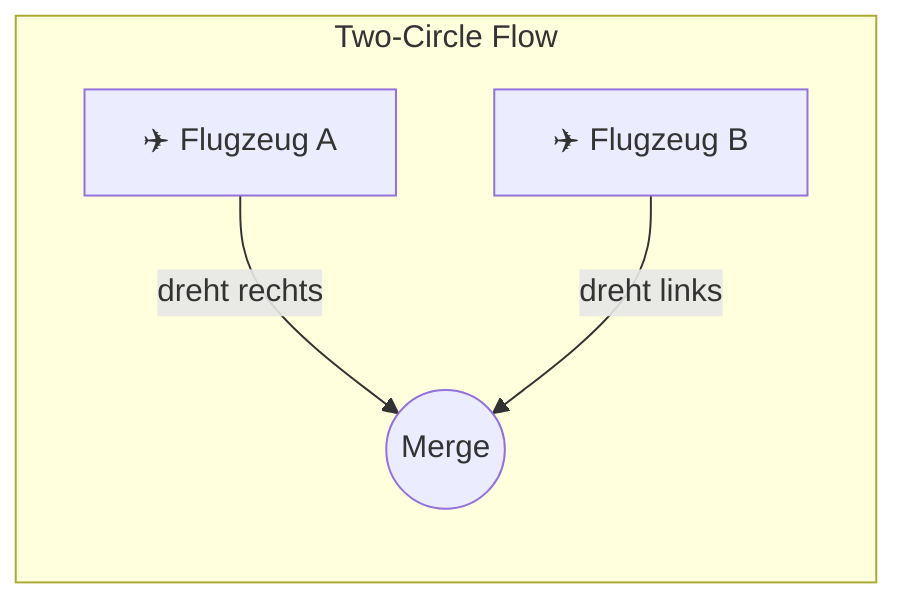
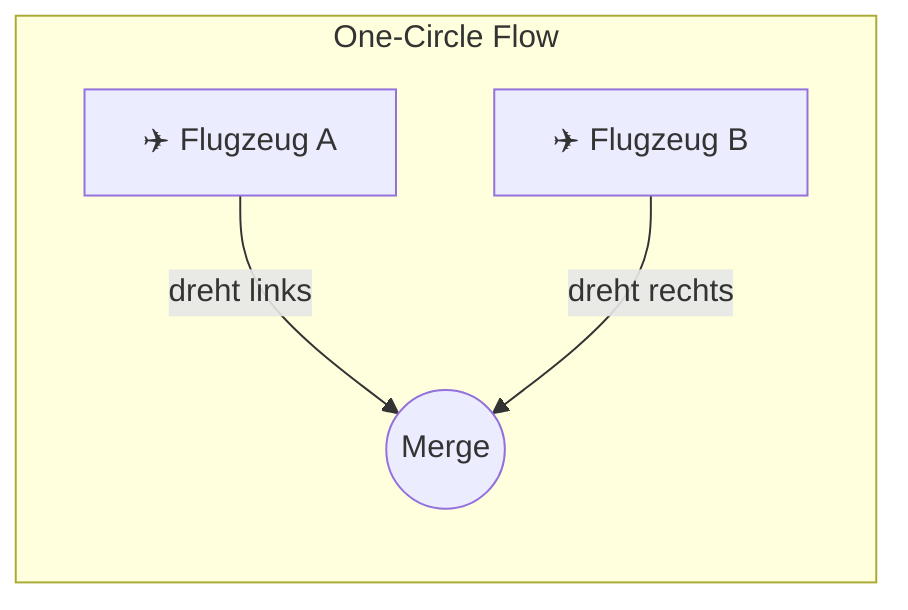
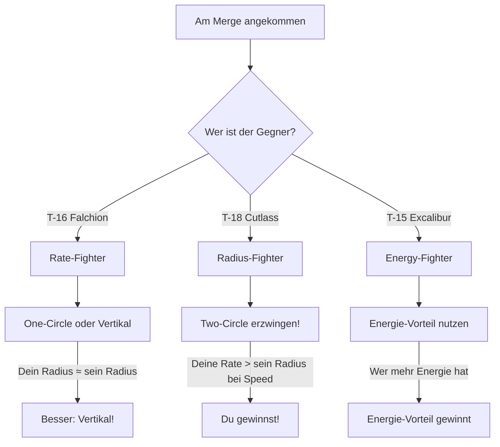

# Kampf-Geometrie: Der Flow

Die wichtigste Entscheidung im BFM passiert am **Merge** (Vorbeiflug). Die Wahl des "Flows" entscheidet oft über Sieg oder Niederlage.

## Die zwei Flows

### Two-Circle Flow (Nase-auf-Heck)

Beide Flugzeuge drehen **aufeinander zu**, in Richtung des gegnerischen Hecks.

**Wer gewinnt?** Das Flugzeug mit der besseren **Turn Rate**.

| Flugzeug | Two-Circle Performance |
|----------|------------------------|
| T-16 Falchion | Beste Turn Rate - dominiert |
| T-15 Excalibur | Gute Rate - kann mithalten |
| T-18 Cutlass | Schlechte Rate - verliert |

::: tip T-15 DOKTRIN
Two-Circle ist **zwingend erforderlich** gegen die T-18 Cutlass. Erzwinge diesen Flow um ihre Radius-Stärke zu negieren!
:::

::: warning WARNUNG
Vermeide Two-Circle gegen die T-16 Falchion - sie hat die bessere Rate!
:::

---

### One-Circle Flow (Nase-auf-Nase)

Beide Flugzeuge drehen **voneinander weg**, treffen sich wieder von vorne.

**Wer gewinnt?** Das Flugzeug mit dem kleinsten **Turn Radius**.

| Flugzeug | One-Circle Performance |
|----------|------------------------|
| T-18 Cutlass | Kleinster Radius - dominiert |
| T-16 Falchion | Mittlerer Radius - ausgeglichen |
| T-15 Excalibur | Großer Radius - verliert |

::: danger T-15 WARNUNG
One-Circle gegen die T-18 ist **Selbstmord**! Sie dreht die Nase schneller und schießt dir ins Gesicht, bevor du rum bist.
:::

---

## Flow-Entscheidung am Merge

## Die Vertikale Alternative

Wenn weder One-Circle noch Two-Circle vorteilhaft ist, gibt es eine dritte Option:

**Geh vertikal!**

Die T-15 Excalibur dominiert in der Vertikalen. Statt horizontal zu kämpfen, ziehe hoch und nutze dein besseres Schub/Gewicht-Verhältnis.

::: info MERKE
Flow-Wahl ist nicht binär. Die beste Option für die T-15 ist oft, den horizontalen Kampf komplett zu vermeiden und vertikal zu dominieren.
:::

## Zusammenfassung

| Situation | Flow-Wahl | Begründung |
|-----------|-----------|------------|
| vs T-16 | One-Circle / Vertikal | Two-Circle = Rate-Fight = Niederlage |
| vs T-18 | Two-Circle | One-Circle = Radius-Fight = Tod |
| vs T-15 | Energie-Vorteil | Wer mehr Energie hat, kontrolliert den Fight |
