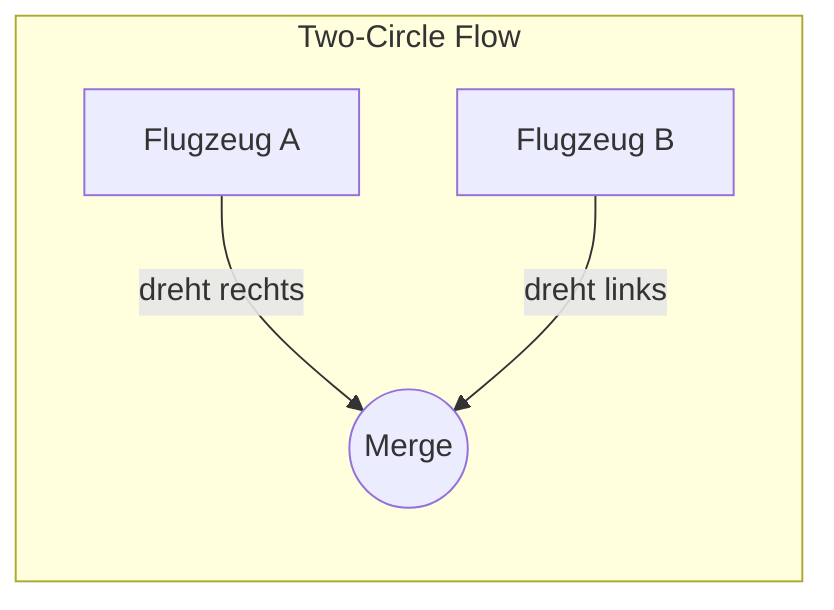
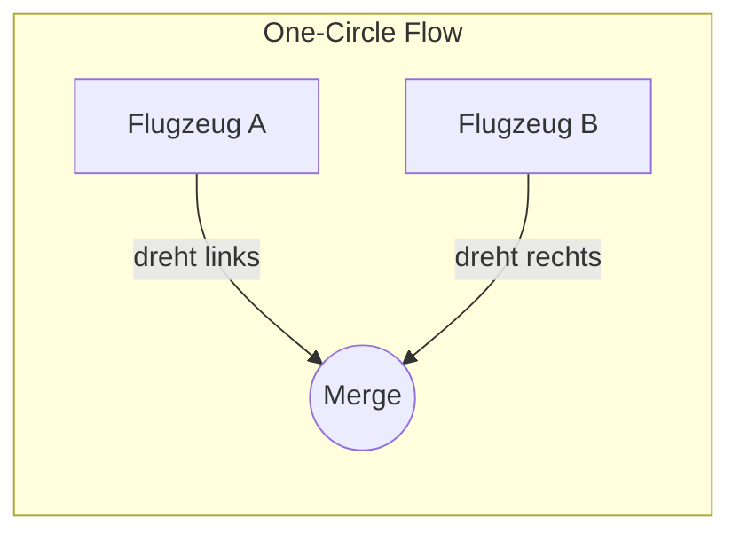
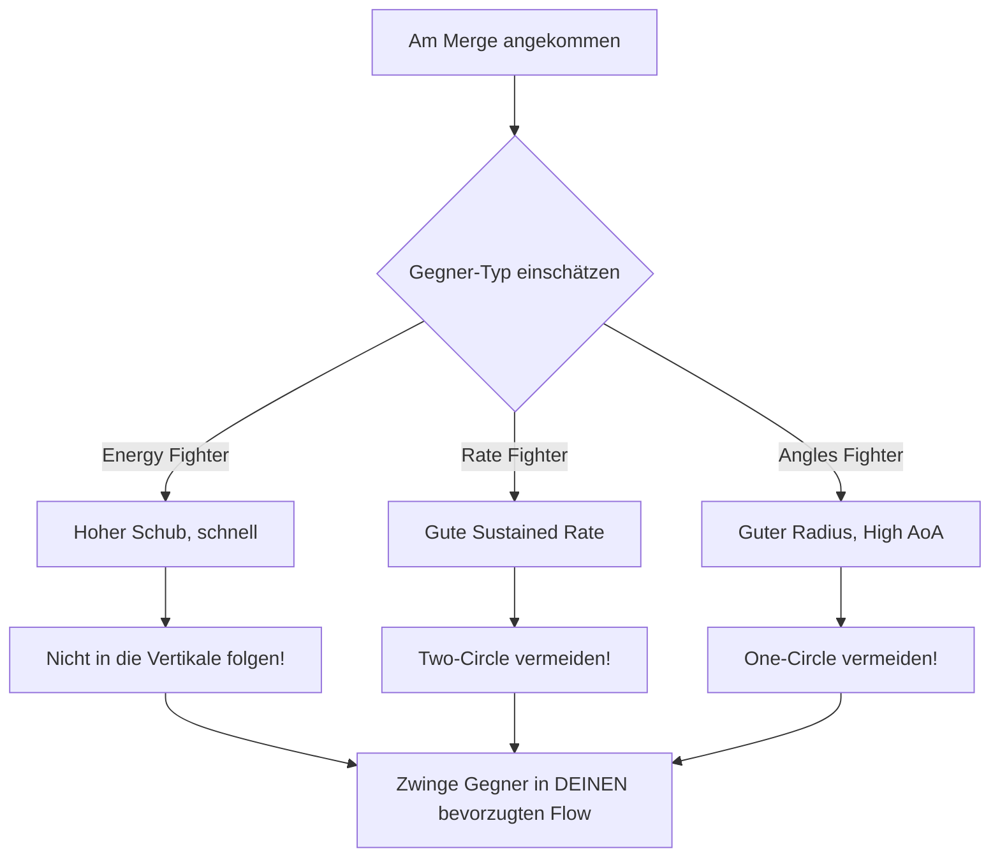

# Kampf-Geometrie: Der Flow

Die wichtigste Entscheidung im BFM passiert am **Merge** (Vorbeiflug). Die Wahl des "Flows" entscheidet oft über Sieg oder Niederlage.

## Wichtige Winkel

Um die Geometrie zu verstehen, sind zwei Begriffe essenziell:

### Aspect Angle (AA)
Der Winkel zwischen dem Heck des Gegners und deiner Position.
* **0-45°:** Offensiv (du bist hinter ihm).
* **180°:** Neutral (er kommt auf dich zu, z.B. am Merge).

### Antenna Train Angle (ATA)
Der Winkel von deiner Nase zum Gegner (wohin du schauen musst).
* **0°:** Er ist direkt in deinem HUD (Schusslösung!).
* **High ATA:** Er ist weit seitlich ("off boresight").

## Die zwei Flows

### Two-Circle Flow (Nase-auf-Heck)

Beide Flugzeuge drehen **aufeinander zu**, in Richtung des gegnerischen Hecks. Die Flugzeuge beschreiben zwei separate Kreise.

**Wer gewinnt?** Das Flugzeug mit der besseren **Sustained Turn Rate** (Grad pro Sekunde). Es ist ein Wettrennen um den eigenen Kreis - wer schneller "um den Kreis kommt", gewinnt Winkel.

**Vorteile für Rate Fighter:**
- Geschwindigkeit bleibt hoch
- Nutzt Sustained Turn Rate aus
- Energie-effizient

---

### One-Circle Flow (Nase-auf-Nase)

Beide Flugzeuge drehen **voneinander weg**, treffen sich wieder von vorne. Die Flugzeuge teilen sich einen gemeinsamen Kreis.

**Wer gewinnt?** Hier entscheidet der **Turn Radius** und die **Instantaneous Turn Rate**. Wer den engeren Kreis fliegt, kommt "inside" des Gegners.

**Vorteile für Angles/Radius Fighter:**
- Nutzt kleine Radien aus
- Erlaubt hohe AoA-Manöver
- Ideal für Snapshots

---

## Flugzeugtypen und Flow-Präferenz

Verschiedene Flugzeugtypen haben unterschiedliche Präferenzen:

| Flugzeugtyp | Bevorzugter Flow | Begründung |
|-------------|------------------|------------|
| **Energy Fighter** | Vertikal / Two-Circle | Nutzt Schub-Vorteil, vermeidet Slow-Speed |
| **Rate Fighter** | Two-Circle | Dominiert bei hoher Geschwindigkeit |
| **Angles/Radius Fighter** | One-Circle | Nutzt kleine Radien, High-AoA |

---

## Flow-Entscheidung am Merge

## Die Vertikale Alternative

Wenn weder One-Circle noch Two-Circle vorteilhaft ist, gibt es eine dritte Option:

**Geh vertikal!**

Flugzeuge mit hohem Schub-Gewichts-Verhältnis können den horizontalen Kampf vermeiden und in der Vertikalen dominieren. Die Vertikale ist ein "dritter Flow", der die Regeln des horizontalen Kampfes außer Kraft setzt.

::: info MERKE
Flow-Wahl ist nicht binär. Die beste Option hängt von deinem Flugzeugtyp, dem Gegnertyp und der aktuellen Energie-Situation ab. Ein erfahrener Pilot passt seinen Flow dynamisch an.
:::

## Zusammenfassung

| Flow | Entscheidender Faktor | Vorteilhaft für |
|------|----------------------|-----------------|
| **Two-Circle** | Sustained Turn Rate | Rate Fighter |
| **One-Circle** | Turn Radius / Instant Rate | Angles Fighter |
| **Vertikal** | Thrust-to-Weight Ratio | Energy Fighter |

::: tip GOLDENE REGEL
**Spiele niemals das Spiel des Gegners!**

Wenn du einen Rate Fighter fliegst, zwinge den Gegner in Two-Circle. Wenn du einen Angles Fighter fliegst, zwinge ihn in One-Circle. Wenn du einen Energy Fighter fliegst, nutze die Vertikale.
:::
