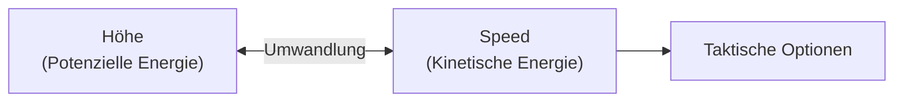

# Golden Rules

> Die universellen Prinzipien für Überlegenheit im Luftkampf.

Diese Regeln gelten für **jeden** Piloten und **jedes** Flugzeug. Sie sind das Fundament, auf dem alle spezifischen Taktiken aufbauen. Verinnerliche sie, bis sie Instinkt sind.

---

## Die 10 Gebote des Luftkampfs

### 1. Energy is Life

> **Energie ist Leben.**

Geschwindigkeit (kinetisch) und Höhe (potenziell) sind deine Währung im Kampf. Ohne Energie bist du ein statisches Ziel: Du kannst nicht manövrieren, nicht fliehen und nicht bestimmen, wann der Kampf endet.

::: danger MERKE
**Langsam = Tot.** Ein Flugzeug ohne Energie ist nur ein teurer Fallschirm.
:::

---

### 2. No Nose Fight

> **Kämpfe niemals das Spiel des Gegners.**

Gehe niemals in einen **One-Circle-Fight** (Nase-auf-Nase), wenn dein Gegner den besseren Kurvenradius (Angles Fighter) hat. Er wird seine Nase schneller auf dich richten und feuern, bevor du eine Lösung hast.

::: tip TAKTIK
Kenne den Archetyp deines Gegners. Wenn er einen engeren Radius hat: **Zwinge ihn in einen Two-Circle-Fight!**
:::

---

### 3. Speed is Life, Altitude is Life Insurance

> **Geschwindigkeit ist Leben, Höhe ist die Versicherung.**

- **Speed** gibt dir *sofortige* Optionen (Turn, Flucht, Angriff).
- **Höhe** ist *gespeicherte* Energie. Du kannst sie jederzeit durch einen Sturzflug in Geschwindigkeit umwandeln.

---

### 4. Lose Sight, Lose Fight

> **Verlierst du den Gegner aus den Augen, verlierst du den Kampf.**

Situational Awareness (SA) ist wichtiger als Aerodynamik. Meistens wirst du von dem Gegner abgeschossen, den du **nicht** gesehen hast.

::: warning PFLICHT
- Kopf permanent in Bewegung ("Check Six!")
- Gegner niemals aus dem Lock/Blick verlieren
- Wisse, wo er ist, **bevor** du manövrierst
:::

---

### 5. Fight in the Vertical

> **Nutze die dritte Dimension.**

Der Luftraum ist dreidimensional. Wer nur flach und horizontal kurvt, beraubt sich der Hälfte seiner Optionen. Die Vertikale erlaubt es dir, Kurvenradien zu verkleinern, Energie zu managen und Gegnern den Schusswinkel zu verwehren.

| Ebene | Charakteristik |
|-------|-------------|
| Horizontal | Reiner Leistungsvergleich (Wer dreht besser?) |
| **Vertikal** | **Taktischer Vorteil durch Gravitation & Energie** |

---

### 6. Don't Turn with a Turner

> **Drehe nicht mit einem Spezialisten.**

- Versuche nicht, einen **Rate Fighter** über die Zeit auszukurven.
- Versuche nicht, einen **Angles Fighter** im engen Radius zu schlagen.

Wenn du das Spiel deines Gegners spielst, hast du bereits verloren. Zwinge ihm **dein** Spiel auf.

---

### 7. Pull - Unload - Pull

> **Der Rhythmus des Energie-Managements.**

Wer permanent am Stick zieht, erzeugt induzierten Widerstand (Drag) und blutet Energie. Ein guter Pilot kennt den Rhythmus:
1. **Pull**: Manöver setzen (Energie investieren).
2. **Unload**: Stick neutral/entlasten (Energie zurückgewinnen).
3. **Pull**: Nächstes Manöver.

---

### 8. Overshoot is Opportunity

> **Ein Overshoot ändert alles.**

Wenn ein Flugzeug am anderen vorbeischießt, wechseln die Rollen von Jäger und Gejagtem oft in Sekundenbruchteilen.
- **Offensiv**: Wenn der Gegner overshootet, nutze den Fehler sofort (Switch Back).
- **Defensiv**: Wenn der Gegner hinter dir ist, erzwinge einen Overshoot, um die Situation zu neutralisieren.

---

### 9. Corner Speed or Die

> **Kenne deine Corner Speed.**

Jedes Flugzeug hat eine spezifische Geschwindigkeit, bei der es die **maximale Turn Rate** erreicht (Corner Velocity).

- **Zu langsam**: Du hast nicht genug Luftstrom für maximale Ruderwirkung.
- **Zu schnell**: Die G-Kräfte oder der Radius werden zu groß.
- **Corner Speed**: Das perfekte Optimum. Kenne diesen Wert für deine Maschine!

---

### 10. Patience Kills

> **Geduld tötet.**

Der Sieg gehört dem Piloten, der wartet. Erzwinge keine schlechte Schusslösung, die dich viel Energie kostet. Warte auf den Fehler des Gegners, behalte deine Energie und schlage dann tödlich zu, wenn die Wahrscheinlichkeit auf deiner Seite ist.

::: info MINDSET
Hektik führt zu Fehlern. Geduld führt zur Dominanz.
:::

---

## Das Piloten-Mantra

::: tip VOR JEDEM KAMPF
> Ich kenne mein **Flugzeug**.
> Ich kenne meinen **Gegner**.
> Ich kämpfe auf **meinem Terrain**.
> Ich kontrolliere meine **Energie**.
> Der Gegner macht den Fehler – **nicht ich**.
:::
