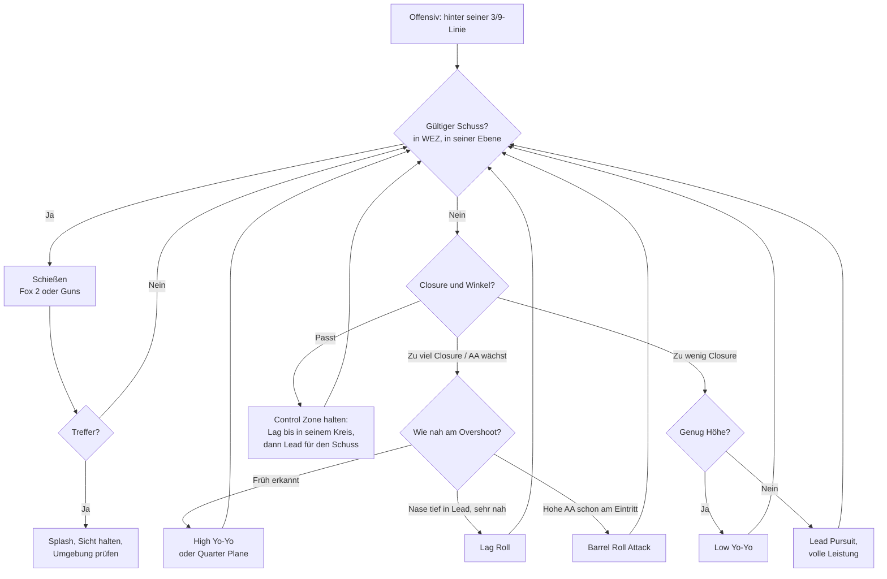

# Offensive Manöver – Ziele und Entscheidungslogik

> Du bist hinter ihm. Jetzt geht es darum, daraus einen Abschuss zu machen, ohne den Vorteil wieder herzuschenken.

Offensiv heißt: Du sitzt hinter seiner 3/9-Linie, er muss auf dich reagieren, du bestimmst das Tempo. Das ist ein Vorteil, kein Sieg. Die meisten offensiven Kämpfe gehen nicht verloren, weil der Verteidiger so gut ist, sondern weil der Angreifer zu schnell, zu gierig oder zu ungeduldig ist und überschießt.

Begriffe wie [Aspect Angle (AA)](/grundlagen/begriffe), Closure (Annäherungsgeschwindigkeit), Control Zone und [Lift Vector](/grundlagen/begriffe) setzen wir hier voraus. Wenn sie dir noch nicht sitzen: erst [Relative Geometrie](/grundlagen/geometrie) und [Verfolgungskurven](/grundlagen/verfolgungskurven).

## Deine Ziele, in dieser Reihenfolge

1. **Schießen, sobald ein gültiger Schuss da ist.** Nicht auf den "perfekten" Schuss warten. Jede Sekunde, die er lebt, ist eine Sekunde, in der er etwas richtig machen kann. Was ein gültiger Schuss ist, steht unter [Schusslösung](/grundlagen/offensiv/schussloesung).
2. **Sonst: Control Zone gewinnen und halten.** Die Control Zone ist die Position hinter ihm (Richtwert: grob 30–60° AA, einige tausend Fuß Abstand, je nach Jet), aus der du hinter ihm bleibst, egal was er macht. Sie ist **keine** Waffenreichweite, sondern eine Ausgangslage, aus der du den Schuss in Ruhe erarbeitest.
3. **Nie überschießen.** Ein [Overshoot](/grundlagen/offensiv/overshoot) über seine 3/9-Linie kostet dich die Offensive, oft sofort die Rollen.
4. **Energie behalten.** Ein Angreifer mit Energie kann Angriff um Angriff fliegen. Ein Angreifer ohne Energie wird bei der ersten Umkehr des Gegners selbst zum Ziel. Wer offensiv ist, aber langsamer wird als der Verteidiger, verliert den Vorteil schleichend.
5. **Tally halten** (Gegner in Sicht). Wer ihn im Out-of-Plane-Manöver aus den Augen verliert, ist nicht mehr offensiv, sondern blind.

::: warning DER HÄUFIGSTE FEHLER
Mit zu viel Speed und zu viel Lead (Nase vor dem Gegner) in seinen Kurvenkreis stechen, weil man "gleich schießen" will. Ergebnis: Er bricht ein, du kannst nicht mehr mitdrehen, schießt an ihm vorbei und bist vor ihm.
:::

## Die zwei Stellgrößen: Closure und Winkel

Fast jede offensive Entscheidung läuft auf zwei Fragen hinaus:

- **Closure:** Kommst du ihm zu schnell näher, gerade richtig oder fällst du zurück?
- **Winkel (AA und Sichtlinienrate):** Kannst du deine Nase dorthin bringen, wo du sie brauchst, oder dreht er schneller, als du folgen kannst?

Deine Werkzeuge dafür sind die Verfolgungskurven (Lead, Pure, Lag) in seiner Ebene und Manöver **aus seiner Ebene heraus**, bei denen du den Lift Vector über oder unter ihn legst. Der Wechsel in die dritte Dimension ist der Kern: Wer nur in der Ebene des Gegners kämpft, kann Closure nur über Gas und Kurvenradius steuern. Wer die Vertikale nutzt, kann Speed in Höhe "parken" (High Yo-Yo) oder mit Hilfe der Schwerkraft Winkel und Closure holen (Low Yo-Yo).

| Problem | Typisches Anzeichen | Werkzeug | Kosten |
|---|---|---|---|
| Zu viel Closure, AA wird groß | Er wird schnell größer, die Sichtlinienrate steigt, du musst immer mehr ziehen | [High Yo-Yo](/grundlagen/offensiv/yo-yos) bzw. Quarter Plane, Gas raus, Lag | Etwas Zeit; Speed wird zu Höhe |
| Zu viel Closure **und** Nase deutlich in Lead, kurz vor dem Overshoot | Du kannst nicht mehr so viel ziehen, wie nötig wäre | [Lag Roll](/grundlagen/offensiv/lag-roll) | Schussgelegenheit für den Moment |
| Sehr hohe AA am Eintritt, hohe Closure | Er kreuzt vor dir, du kommst von der Seite | [Barrel Roll Attack](/grundlagen/offensiv/lag-roll) | Zeit, Sicht kann kurz verloren gehen |
| Zu wenig Closure, Abstand wächst | Er wird kleiner, du kommst nicht in Lead | [Low Yo-Yo](/grundlagen/offensiv/yo-yos), Lead Pursuit, volle Leistung | Höhe |
| In Waffenreichweite, Parameter passen | Funnel/Seeker auf ihm | [Schießen](/grundlagen/offensiv/schussloesung) | – |

## Entscheidungslogik

Lies den Baum von oben nach unten und stell dir die Fragen jede Sekunde neu. Offensives BFM ist ein Regelkreis, keine Abfolge von Manövern.

```mermaid
flowchart TD
    A["Offensiv: hinter seiner 3/9-Linie"] --> B{"Gültiger Schuss?<br/>in WEZ, in seiner Ebene"}
    B -->|Ja| S["Schießen<br/>Fox 2 oder Guns"]
    B -->|Nein| C{"Closure und Winkel?"}
    C -->|"Zu viel Closure / AA wächst"| D{"Wie nah am Overshoot?"}
    D -->|"Früh erkannt"| HY["High Yo-Yo<br/>oder Quarter Plane"]
    D -->|"Nase tief in Lead, sehr nah"| LR["Lag Roll"]
    D -->|"Hohe AA schon am Eintritt"| BRA["Barrel Roll Attack"]
    C -->|"Zu wenig Closure"| E{"Genug Höhe?"}
    E -->|Ja| LY["Low Yo-Yo"]
    E -->|Nein| LP["Lead Pursuit,<br/>volle Leistung"]
    C -->|"Passt"| CZ["Control Zone halten:<br/>Lag bis in seinem Kreis,<br/>dann Lead für den Schuss"]
    HY --> B
    LR --> B
    BRA --> B
    LY --> B
    LP --> B
    CZ --> B
    S --> F{"Treffer?"}
    F -->|Nein| B
    F -->|Ja| G["Splash, Sicht halten,<br/>Umgebung prüfen"]
```

### Turn Circle Entry

Bevor du in seiner Kurve sitzt, gilt: **Lag Pursuit, bis du in seinem Kurvenkreis bist, dann Lead.** Wer zu früh Lead zieht, schneidet seine Kurve von innen an, mit hoher AA und hoher Closure. Genau das ist die Ausgangslage für einen Overshoot. Details unter [Verfolgungskurven](/grundlagen/verfolgungskurven).

### Energie im Blick

Als Angreifer brauchst du nicht die maximale Turn Rate, sondern **genau so viel, wie nötig ist, um hinter ihm zu bleiben**. Mehr ziehen als nötig kostet Speed ohne Gegenwert. Die Specific-Energy-Kurve im 3D-Replay-Raum des Spiels zeigt dir hinterher, wo du Energie verschenkt hast.

## Die Manöver-Seiten

- [Yo-Yos: High, Low, Quarter Plane](/grundlagen/offensiv/yo-yos) – Closure und Winkel über die Vertikale steuern.
- [Lag Roll und Barrel Roll Attack](/grundlagen/offensiv/lag-roll) – aus zu viel Lead oder zu hoher AA heraus hinter ihn fallen.
- [Overshoot](/grundlagen/offensiv/overshoot) – Flight-Path- vs. 3/9-Line-Overshoot, aus Sicht von Angreifer und Verteidiger.
- [Schusslösung](/grundlagen/offensiv/schussloesung) – Guns und Fox 2 richtig einsetzen.

::: tip MERKE
- Gültiger Schuss da? Schießen. Alles andere dient nur dazu, diesen Moment herbeizuführen.
- Control Zone ist Position, nicht Reichweite. Erst Position, dann Schuss.
- Zu viel Closure: aus der Ebene nach oben (High Yo-Yo, Lag Roll). Zu wenig: nach unten (Low Yo-Yo).
- Lag bis in seinem Kreis, dann Lead.
- Nie über seine 3/9-Linie schießen, nie langsamer werden als er, nie das Tally verlieren.
:::

Weiter: [Yo-Yos](/grundlagen/offensiv/yo-yos)
