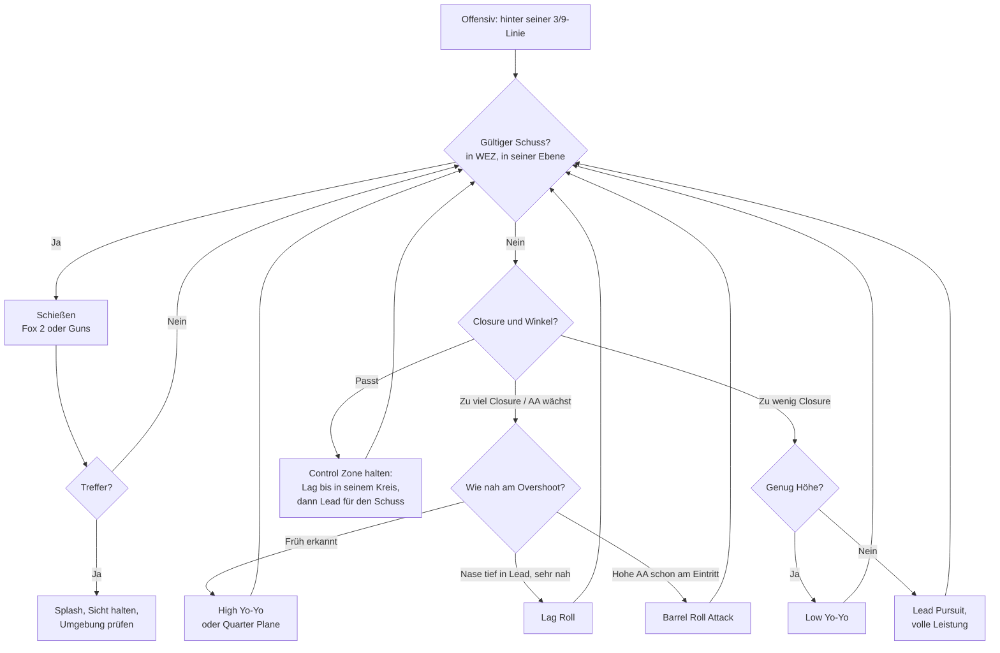

# Offensive Manöver – Ziele und Entscheidungslogik

> Du bist hinter ihm. Jetzt machst du daraus einen Abschuss, ohne den Vorteil wieder herzuschenken.

Offensiv heißt: Du sitzt hinter seiner 3/9-Linie, er muss reagieren, du bestimmst das Tempo. Das ist ein Vorteil, kein Sieg. Die meisten offensiven Kämpfe gehen verloren, weil der Angreifer zu schnell, zu gierig oder zu ungeduldig ist und überschießt.

Vorausgesetzt: [Aspect Angle, Closure, Control Zone, Lift Vector](/grundlagen/begriffe), [Relative Geometrie](/grundlagen/geometrie) und [Verfolgungskurven](/grundlagen/verfolgungskurven).

## Deine Ziele, in dieser Reihenfolge

1. **Schießen, sobald ein gültiger Schuss da ist.** Nicht auf den perfekten Schuss warten. Was gültig ist: [Schusslösung](/grundlagen/offensiv/schussloesung).
2. **Sonst: [Control Zone](/grundlagen/geometrie#control-zone) gewinnen und halten.** Sie ist eine Position hinter ihm, aus der du dranbleibst, egal was er macht – keine Waffenreichweite.
3. **Nie überschießen.** Ein [Overshoot](/grundlagen/offensiv/overshoot) über seine 3/9-Linie kostet dich die Offensive.
4. **Energie behalten.** Zieh nur so viel, wie nötig ist, um hinter ihm zu bleiben. Wer langsamer wird als der Verteidiger, verliert den Vorteil schleichend.
5. **Tally halten.** Wer ihn im Out-of-Plane-Manöver aus den Augen verliert, ist nicht mehr offensiv, sondern blind.

::: warning DER HÄUFIGSTE FEHLER
Mit zu viel Speed und zu viel Lead in seinen Kurvenkreis stechen, weil man gleich schießen will. Er bricht ein, du kannst nicht mitdrehen und stehst vor ihm. Deshalb am Eintritt: **Lag, bis du in seinem Kreis bist, dann Lead** (siehe [Turn Circle Entry](/grundlagen/verfolgungskurven#turn-circle-entry)).
:::

## Closure und Winkel steuern

Fast jede offensive Entscheidung hängt an zwei Fragen: Kommst du ihm zu schnell näher oder fällst du zurück (**Closure**)? Und bekommst du deine Nase dorthin, wo du sie brauchst (**Winkel**)? In seiner Ebene steuerst du beides nur über Gas und Kurve. Aus der Ebene heraus kannst du Speed in Höhe parken (High Yo-Yo) oder mit der Schwerkraft Winkel und Closure holen (Low Yo-Yo).

Stell dir die Fragen jede Sekunde neu. Offensives BFM ist ein Regelkreis, keine Abfolge von Manövern.

```mermaid
flowchart TD
    A["Offensiv: hinter seiner 3/9-Linie"] --> B{"Gültiger Schuss?<br/>in WEZ, in seiner Ebene"}
    B -->|Ja| S["Schießen<br/>Fox 2 oder Guns"]
    B -->|Nein| C{"Closure und Winkel?"}
    C -->|"Zu viel Closure / AA wächst"| D{"Wie nah am Overshoot?"}
    D -->|"Früh erkannt"| HY["High Yo-Yo<br/>oder Quarter Plane"]
    D -->|"Nase tief in Lead, sehr nah"| LR["Lag Roll"]
    D -->|"Hohe AA schon am Eintritt"| BRA["Barrel Roll Attack"]
    C -->|"Zu wenig Closure"| E{"Genug Höhe?"}
    E -->|Ja| LY["Low Yo-Yo"]
    E -->|Nein| LP["Lead Pursuit,<br/>volle Leistung"]
    C -->|"Passt"| CZ["Control Zone halten:<br/>Lag bis in seinem Kreis,<br/>dann Lead für den Schuss"]
    HY --> B
    LR --> B
    BRA --> B
    LY --> B
    LP --> B
    CZ --> B
    S --> F{"Treffer?"}
    F -->|Nein| B
    F -->|Ja| G["Splash, Sicht halten,<br/>Umgebung prüfen"]
```

## Die Werkzeuge

| Problem | Werkzeug | Kosten |
|---|---|---|
| Zu viel Closure, AA wächst | [High Yo-Yo / Quarter Plane](/grundlagen/offensiv/yo-yos), Gas raus | Etwas Zeit, Speed wird zu Höhe |
| Zu viel Closure, Nase tief in Lead, Overshoot droht | [Lag Roll](/grundlagen/offensiv/lag-roll) | Die Schussgelegenheit im Moment |
| Hohe AA und hohe Closure am Eintritt | [Barrel Roll Attack](/grundlagen/offensiv/lag-roll) | Zeit, Sicht kurz gefährdet |
| Zu wenig Closure, Abstand wächst | [Low Yo-Yo](/grundlagen/offensiv/yo-yos), Lead Pursuit, volle Leistung | Höhe |
| Overshoot verstehen und vermeiden | [Overshoot](/grundlagen/offensiv/overshoot) | – |
| In WEZ, Parameter passen | [Schusslösung](/grundlagen/offensiv/schussloesung) | – |

::: tip MERKE
- Gültiger Schuss da? Schießen. Alles andere dient nur dazu, diesen Moment herbeizuführen.
- Control Zone ist Position, nicht Reichweite.
- Zu viel Closure: aus der Ebene nach oben (High Yo-Yo, Lag Roll). Zu wenig: nach unten (Low Yo-Yo).
- Lag bis in seinem Kreis, dann Lead.
- Nie über seine 3/9-Linie schießen, nie langsamer werden als er, nie das Tally verlieren.
:::

Weiter: [Yo-Yos](/grundlagen/offensiv/yo-yos)
