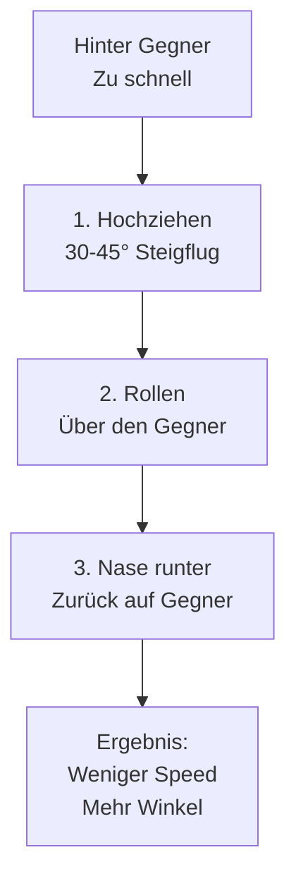
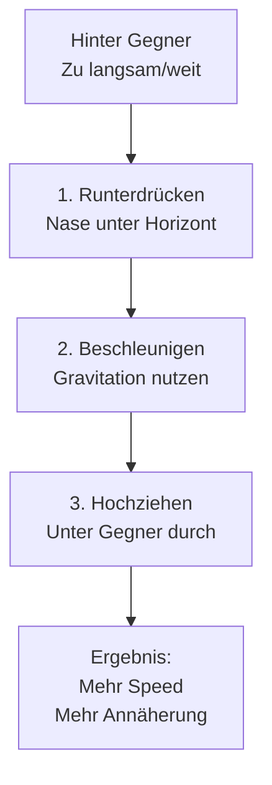
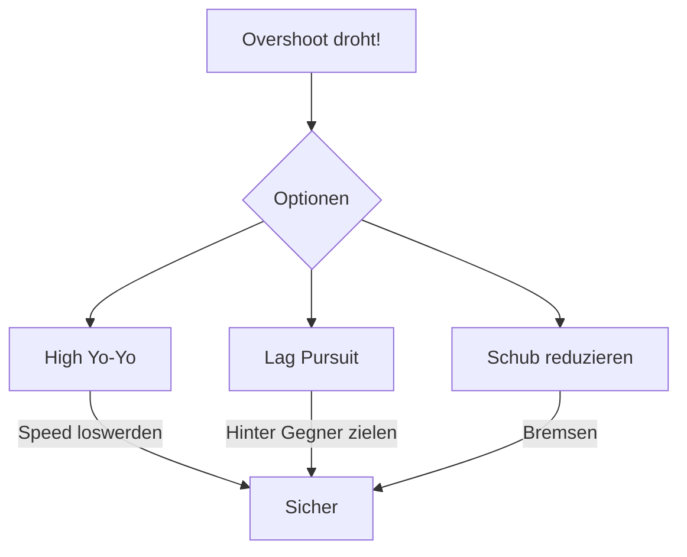
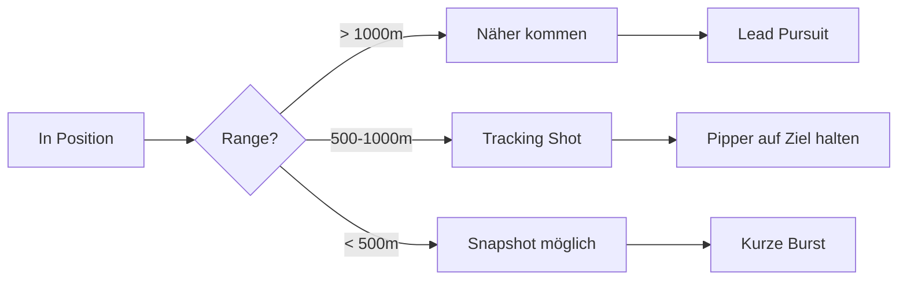

# Offensive Manöver

Offensive Manöver nutzt du, wenn du hinter dem Gegner bist und die Schusslösung suchst - ohne zu overshooten.

## High Yo-Yo

Das wichtigste offensive Manöver. Nutze es, wenn du zu schnell bist und Overshoot droht.

### Wann nutzen?

- Du bist schneller als der Gegner
- Gegner ist in hartem Turn
- Overshoot droht

### Ausführung

**Schritt für Schritt:**

1. **Hochziehen** - Ziehe 30-45° in die Vertikale
2. **Rollen** - Rolle so dass du den Gegner siehst (über die Schulter)
3. **Nase runter** - Drücke die Nase zurück auf den Gegner
4. **Ergebnis** - Du hast Speed verloren und Winkel gewonnen

::: tip VORTEILE
- Verhindert Overshoot
- Hält dich in der "Control Zone"
- Nutzt die Vertikale um Energie zu managen
:::

---

## Low Yo-Yo

Das Gegenteil des High Yo-Yo. Nutze es, wenn du zu langsam bist oder der Gegner entkommt.

### Wann nutzen?

- Gegner gewinnt Separation
- Du bist zu langsam
- Du brauchst mehr Annäherung

### Ausführung

**Schritt für Schritt:**

1. **Runterdrücken** - Drücke Nase 20-30° unter Horizont
2. **Beschleunigen** - Lass Gravitation Speed aufbauen
3. **Hochziehen** - Ziehe unter dem Gegner durch, zurück auf seine Höhe
4. **Ergebnis** - Mehr Speed und näher am Gegner

::: warning VORSICHT
Low Yo-Yo bringt dich näher - aber mit mehr Speed. Overshoot-Gefahr steigt!
:::

---

## Overshoot verhindern

Overshoot ist der häufigste Fehler. So vermeidest du ihn:

### Erkenne die Warnsignale

| Warnsignal | Bedeutung |
|------------|-----------|
| Sehr hohe Closure Rate | Du näherst dich zu schnell |
| Gegner wird größer im HUD | Annäherung zu aggressiv |
| Gegner beginnt Break Turn | Er will dich overshooten lassen |

### Gegen-Maßnahmen

### Lag Displacement Roll

Ein Manöver gegen extremen Geschwindigkeitsüberschuss oder um eine Schussposition zu erzwingen, wenn der High Yo-Yo nicht ausreicht.

**Ausführung:**
1. Wechsle zu **Lag Pursuit** (hinter den Gegner zielen)
2. Rolle **weg** von der Kurvenrichtung des Gegners und ziehe hoch
3. Nutze die **Vertikale** um massiv Vektorgeschwindigkeit zu vernichten
4. Falle hinter den Gegner zurück

::: tip ANWENDUNG
Ideal, um einen drohenden Overshoot in eine offensive Position umzuwandeln, ohne Energie sinnlos wegzuwerfen. Besonders effektiv für Flugzeuge mit gutem Schub-Gewichts-Verhältnis.
:::

---

## Schusslösung herstellen

Du bist hinter dem Gegner - jetzt musst du treffen.

### Gun Solution

### Fox 2 (IR-Missile)

- Halte Gegner im Seeker-Kreis
- Warte auf Tone (Aufschaltton)
- Schuss aus ~1-2km optimal
- **Achtung:** Gegner kann Flares werfen

::: tip GEDULD
Nimm dir Zeit für die Schusslösung. Ein sicherer Treffer ist besser als drei verpasste Bursts. Hektisches Feuern verschwendet nur Munition.
:::

## Zusammenfassung

| Manöver | Situation | Effekt |
|---------|-----------|--------|
| High Yo-Yo | Zu schnell | Speed verlieren, Winkel gewinnen |
| Low Yo-Yo | Zu langsam | Speed gewinnen, näher kommen |
| Lag Pursuit | Overshoot droht | Annäherung verlangsamen |
| Lag Displacement Roll | Extremer Überschuss | Repositionierung von oben |
