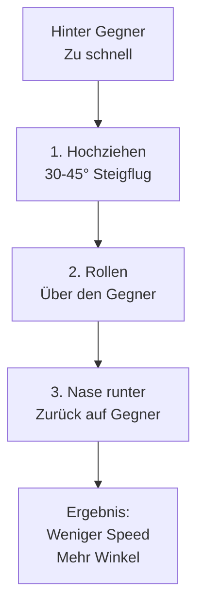

# High Yo-Yo

Das wichtigste offensive Manöver. Nutze es, wenn du zu schnell bist und Overshoot droht.

## Wann nutzen?

- Du bist schneller als der Gegner
- Gegner ist in hartem Turn
- Overshoot droht

## Ausführung

**Schritt für Schritt:**

1. **Hochziehen** - Ziehe 30-45° in die Vertikale
2. **Rollen** - Rolle so dass du den Gegner siehst (über die Schulter)
3. **Nase runter** - Drücke die Nase zurück auf den Gegner
4. **Ergebnis** - Du hast Speed verloren und Winkel gewonnen

::: tip VORTEILE
- Verhindert Overshoot
- Hält dich in der "Control Zone"
- Nutzt die Vertikale um Energie zu managen
:::

## Quarter Plane (Die aggressive Alternative)

Wenn du **viel zu schnell** bist und ein normales High Yo-Yo nicht reicht, nutze die Quarter Plane.

**Ausführung:**
1. Ziehe extrem steil hoch (bis zu 90° Bank, fast vertikal).
2. Fliege eine "Kippkurve" weg vom Gegner.
3. Lasse dich hinter ihn zurückfallen.

Dies ist aggressiver und vernichtet mehr Energie als ein Yo-Yo, verhindert aber garantiert einen Overshoot.
